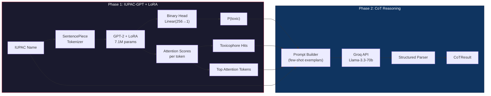
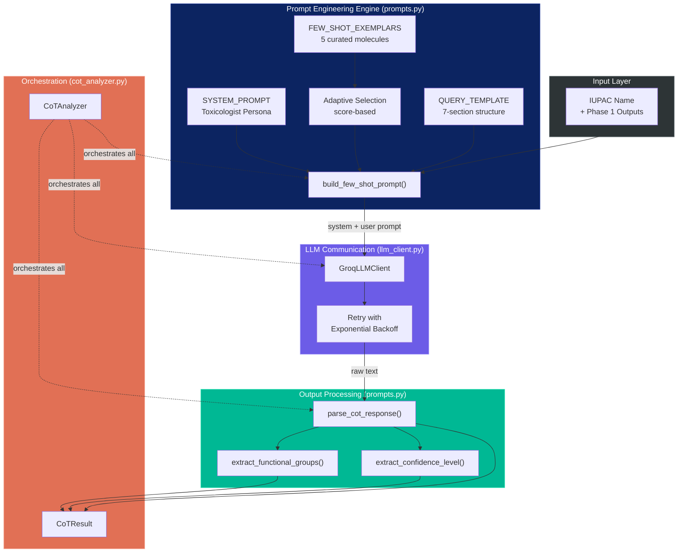
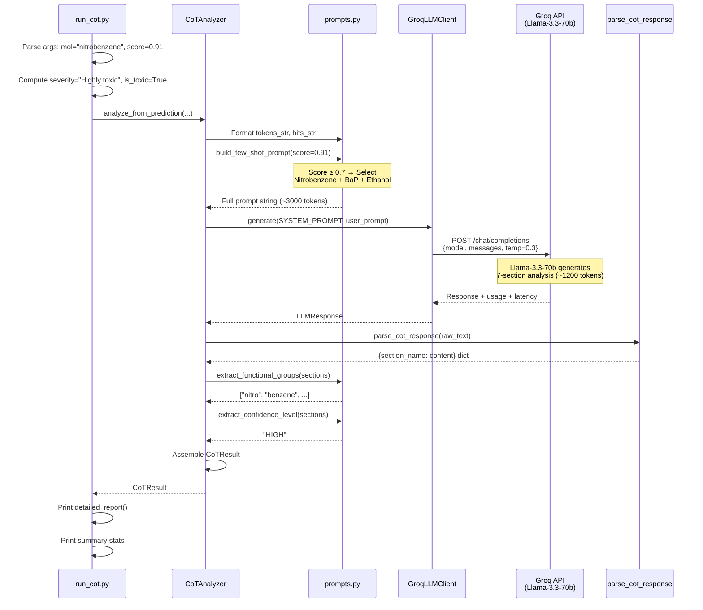

# Phase 2 — Chain-of-Thought (CoT) Toxicity Reasoning: Complete Walkthrough

> [!NOTE]
> This walkthrough covers every file, every class, every function, and the full scientific and engineering rationale behind Phase 2 of ToxGuard. Read this end-to-end for a complete understanding.

---

## Table of Contents

1. [What Is Phase 2 and Why Does It Exist?](#1-what-is-phase-2-and-why-does-it-exist)
2. [How Phase 2 Relates to Phase 1](#2-how-phase-2-relates-to-phase-1)
3. [Architecture Overview](#3-architecture-overview)
4. [File-by-File Deep Dive](#4-file-by-file-deep-dive)
   - [`__init__.py`](#41-__init__py--package-definition)
   - [`prompts.py`](#42-promptspy--the-brain-of-phase-2)
   - [`llm_client.py`](#43-llm_clientpy--the-api-communication-layer)
   - [`cot_analyzer.py`](#44-cot_analyzerpy--the-orchestration-engine)
   - [`run_cot.py`](#45-run_cotpy--the-cli-entry-point)
   - [`evaluate_cot.py`](#46-evaluate_cotpy--the-quality-assurance-framework)
5. [The Complete Data Flow](#5-the-complete-data-flow)
6. [Scientific Rationale](#6-scientific-rationale)
7. [Key Design Decisions](#7-key-design-decisions)

---

## 1. What Is Phase 2 and Why Does It Exist?

### The Problem Phase 2 Solves

Phase 1 (IUPAC-GPT + LoRA) gives you a number: **P(toxic) = 0.91**. But that number alone is a black box. A toxicologist, a drug developer, or a regulatory reviewer needs to understand **why** a molecule is predicted as toxic:

- *What structural features make it toxic?*
- *What is the biological mechanism of toxicity?*
- *Which organs are at risk?*
- *How confident can we be in this prediction?*

Phase 2 exists to **transform a numerical prediction into a mechanistic explanation**. It takes the quantitative output of Phase 1 and generates a structured, human-readable, scientifically-grounded chain-of-thought analysis.

### The Approach: Few-Shot Chain-of-Thought (CoT) Prompting

The core technique is **few-shot CoT prompting** — a prompt engineering strategy where you provide an LLM with several worked examples of the reasoning task you want it to perform, then ask it to apply the same reasoning pattern to a new input. This is inspired by the **CoTox paper** (Park et al., BIBM 2025).

Instead of fine-tuning an LLM on toxicology data (which would be extremely expensive), you:
1. Curate a set of gold-standard reasoning examples from real toxicology knowledge bases (T3DB, IARC, EPA)
2. Show these examples to a powerful general-purpose LLM (Llama-3.3-70b via Groq)
3. Ask the LLM to follow the same reasoning pattern for a new molecule

> [!IMPORTANT]
> Phase 2 does NOT re-predict toxicity — it **explains** the Phase 1 prediction. The LLM is given the P(toxic) score and asked to reason about why that score is appropriate or inappropriate for the molecule's chemistry.

---

## 2. How Phase 2 Relates to Phase 1



### What Phase 1 Produces (and Phase 2 Consumes)

Phase 1's `ToxGuardPredictor.predict()` returns a `ToxGuardPrediction` dataclass with:

| Field | Type | Purpose | Used by Phase 2? |
|-------|------|---------|:-:|
| `iupac_name` | `str` | The molecule's IUPAC name | ✅ **Primary input** |
| `toxicity_score` | `float` | P(toxic) from sigmoid(binary_logit) | ✅ **Drives exemplar selection** |
| `severity_label` | `str` | "Non-toxic", "Unlikely toxic", "Moderately toxic", "Highly toxic" | ✅ **Included in prompt** |
| `is_toxic` | `bool` | Binary: P(toxic) ≥ 0.5 | ✅ **Stored in result** |
| `top_tokens` | `List[dict]` | Tokens with highest attention scores, e.g. `[{token: "nitro", score: 0.42}]` | ✅ **Critical for toxicophore reasoning** |
| `toxicophore_hits` | `List[dict]` | Known toxicophore pattern matches (nitro, chloro, epoxy, etc.) | ✅ **Validates LLM reasoning** |
| `egnn_vector` | `List[float]` | 256-dim molecular representation | ❌ Not used in Phase 2 |
| `confidence` | `float` | Same as toxicity_score | ❌ Redundant |

### The Handoff Mechanism

Phase 2 can connect to Phase 1 in **two ways**:

**1. Automatic (Full Pipeline):** The `CoTAnalyzer` loads the `ToxGuardPredictor` directly and calls `predict()` internally:
```python
analyzer = CoTAnalyzer(
    llm_client=llm,
    checkpoint_dir="iupacGPT/iupac-gpt/checkpoints/iupac",
    lora_weights_path="outputs/best_run/lora_weights.pt"
)
result = analyzer.analyze("nitrobenzene")  # Calls Phase 1 internally
```

**2. Manual (Standalone):** You can pass Phase 1 results directly, useful when the model isn't available or during testing:
```python
result = analyzer.analyze_from_prediction(
    iupac_name="nitrobenzene",
    toxicity_score=0.91,
    severity_label="Highly toxic",
    is_toxic=True,
    top_tokens=[{"token": "nitro", "score": 0.42}],
    toxicophore_hits=[{"pattern": "nitro", "fragment": "nitro", "score": 0.42}],
)
```

---

## 3. Architecture Overview



---

## 4. File-by-File Deep Dive

### 4.1 [`__init__.py`](file:///c:/Users/PAVAN%20K%20AITHAL/OneDrive/Desktop/Toxgaurd/Phase2-CoT/__init__.py) — Package Definition

**Lines:** 26 | **Purpose:** Makes `Phase2-CoT` an importable Python package and defines the public API.

```python
"""Phase 2: Chain-of-Thought Toxicity Reasoning."""

__version__ = "0.1.0"

from .cot_analyzer import CoTAnalyzer, CoTResult
from .llm_client import GroqLLMClient, LLMClient

__all__ = ["CoTAnalyzer", "CoTResult", "GroqLLMClient", "LLMClient"]
```

**What this does:**
- **Exposes exactly 4 symbols** to external code: `CoTAnalyzer`, `CoTResult`, `GroqLLMClient`, `LLMClient`
- The docstring documents the complete pipeline in 4 steps — this is the "elevator pitch" of Phase 2
- The `__version__` tracks the module version (currently `0.1.0`)
- References **CoTox (Park et al., BIBM 2025)** as the scientific citation

**Why it matters:** This is the public API. Any other module in ToxGuard (or future Phase 3) imports from here:
```python
from Phase2_CoT import CoTAnalyzer, GroqLLMClient
```

---

### 4.2 [`prompts.py`](file:///c:/Users/PAVAN%20K%20AITHAL/OneDrive/Desktop/Toxgaurd/Phase2-CoT/prompts.py) — The Brain of Phase 2

**Lines:** 590 | **Purpose:** Contains all prompt engineering logic — the system prompt, the curated few-shot exemplars, the query template, the prompt builder with adaptive exemplar selection, and all output parsers.

This is the **most important file** in Phase 2. The quality of the entire CoT reasoning depends on the quality of this file.

---

#### 4.2.1 `SYSTEM_PROMPT` (Lines 20–41)

```python
SYSTEM_PROMPT = """\
You are an expert computational toxicologist with deep knowledge of:
- Organic chemistry and IUPAC nomenclature
- Structure-activity relationships (SAR) in toxicology
- Toxicophore identification (reactive functional groups)
- Biological pathways of toxicity (NR, SR, oxidative stress)
- Organ-specific toxicity mechanisms
- Gene Ontology (GO) annotations for toxicity endpoints
...
"""
```

**What it does:** Defines the **persona** and **behavioral rules** for the LLM. This is the `system` message in the chat API call.

**Design details:**
- **Persona:** "Expert computational toxicologist" — this primes the LLM to use domain-specific vocabulary and reasoning patterns
- **Knowledge domains listed explicitly:** IUPAC nomenclature, SAR, toxicophores, biological pathways (NR = Nuclear Receptor, SR = Stress Response), organ toxicity, Gene Ontology (GO)
- **5 strict rules:**
  1. Base analysis on established knowledge, not speculation
  2. Use "uncertain" when mechanisms are unknown (prevents hallucination)
  3. Distinguish KNOWN vs HYPOTHESIZED mechanisms
  4. Reference specific pathways (NR-AhR, mitochondrial dysfunction, hERG blockade)
  5. Follow the exact 7-section output format

> [!TIP]
> Rule #2 is critical for scientific credibility. Without it, LLMs tend to fabricate plausible-sounding mechanisms. By explicitly instructing "state uncertain rather than guessing," you get more honest and scientifically useful outputs.

---

#### 4.2.2 `FEW_SHOT_EXEMPLARS` (Lines 48–369)

This is a **list of 5 carefully curated molecule analyses**, each stored as a Python dictionary. These are the "worked examples" that teach the LLM how to reason.

| # | Molecule | IUPAC Name | Score | Category | Why Selected |
|---|----------|-----------|-------|----------|:------------|
| 0 | Nitrobenzene | nitrobenzene | 0.91 | Highly toxic | Classic aromatic nitro compound; well-studied toxicophore (nitro group) |
| 1 | Formaldehyde | methanal | 0.85 | Highly toxic | Simplest aldehyde; reactive electrophile; IARC Group 1 carcinogen |
| 2 | Ethanol | ethanol | 0.28 | Unlikely toxic | Common non-toxic molecule; low acute toxicity counterexample |
| 3 | Benzo[a]pyrene | benzo[a]pyrene | 0.94 | Highly toxic | PAH; metabolic activation; prototypical procarcinogen |
| 4 | Aspirin | 2-(acetyloxy)benzoic acid | 0.42 | Unlikely toxic | Borderline; dose-dependent toxicity; nuanced borderline |

Each exemplar contains:
- **Input fields:** `iupac_name`, `toxicity_score`, `severity_label`, `top_tokens`, `toxicophore_hits`
- **Analysis sections (7):** `structural_analysis`, `toxicophore_identification`, `mechanism_of_action`, `biological_pathways`, `organ_toxicity`, `confidence`, `verdict`

**Deep dive into Exemplar 0 — Nitrobenzene:**

This exemplar teaches the LLM the **gold standard** of CoT toxicity reasoning:

1. **Structural Analysis:** Identifies the benzene ring + nitro group. Mentions electron-withdrawing properties.
2. **Toxicophore Identification:** Labels `-NO₂` as a "CONFIRMED TOXICOPHORE." References the Benigni-Bossa structural alert SA_28 (this is a real alert from the OECD QSAR Toolbox).
3. **Mechanism of Action:** A 4-step metabolic pathway:
   - CYP450 nitroreduction → nitrosobenzene → phenylhydroxylamine
   - Methemoglobinemia (Fe²⁺ → Fe³⁺ in hemoglobin)
   - Nitroso intermediate → DNA/protein adducts → genotoxicity
   - GSH depletion → oxidative stress
4. **Biological Pathways:** References Tox21 assay endpoints (NR-AhR, SR-ARE, SR-p53) and Gene Ontology terms (GO:0006979, GO:0006281, GO:0019825)
5. **Organ Toxicity:** Blood (primary), liver, spleen, CNS — each with specific mechanisms
6. **Confidence:** HIGH — cites IARC, EPA, ATSDR assessments
7. **Verdict:** References GHS Category 3, LD50 values, NTP (2002) carcinogenicity data

> [!IMPORTANT]
> These exemplars are NOT generated by an LLM — they are **manually curated from real toxicology databases** (T3DB, IARC monographs, EPA assessments). This is critical: the few-shot examples must be scientifically accurate because the LLM will pattern-match against them.

**Why 5 exemplars?**
- 2 highly toxic (nitrobenzene, benzo[a]pyrene) — different mechanisms
- 1 non-toxic (ethanol) — counterexample to prevent toxic bias
- 1 borderline (aspirin) — teaches nuanced dose-dependent reasoning
- 1 simple-but-toxic (formaldehyde) — small molecule, different mechanism

---

#### 4.2.3 `QUERY_TEMPLATE` (Lines 376–392)

```python
QUERY_TEMPLATE = """\
MOLECULE: {iupac_name}
TOXICITY SCORE: {toxicity_score:.3f} ({severity_label})
HIGH-ATTENTION TOKENS: {top_tokens}
TOXICOPHORE PATTERN MATCHES: {toxicophore_hits}

Provide a complete chain-of-thought toxicity analysis following this exact \
structure. Be specific and cite known mechanisms where possible.

1. STRUCTURAL ANALYSIS:
2. TOXICOPHORE IDENTIFICATION:
3. MECHANISM OF ACTION:
4. BIOLOGICAL PATHWAYS:
5. ORGAN TOXICITY:
6. CONFIDENCE:
7. VERDICT:
"""
```

**What it does:** Formats the actual query for the target molecule. Includes all Phase 1 outputs as context.

**Key design choices:**
- **`{toxicity_score:.3f}`** — 3 decimal places for precision (e.g., `0.910` not `0.91`)
- **HIGH-ATTENTION TOKENS** — From Phase 1's attention mechanism. These tell the LLM which parts of the IUPAC name the model focused on. If the model attended heavily to "nitro," the LLM knows to focus its analysis on the nitro group.
- **TOXICOPHORE PATTERN MATCHES** — From Phase 1's `detect_toxicophore_attention()`. These are regex-based pattern matches against known toxicophore names.
- **Numbered section headers** — Forces the LLM to produce structured output that can be parsed by `parse_cot_response()`

---

#### 4.2.4 `build_few_shot_prompt()` (Lines 399–495)

This is the **adaptive prompt builder** — the most sophisticated function in the file.

```python
def build_few_shot_prompt(
    iupac_name, toxicity_score, severity_label,
    top_tokens="", toxicophore_hits="",
    num_exemplars=3, exemplar_indices=None,
) -> str:
```

**The Adaptive Selection Logic (Lines 431–453):**

This is where the intelligence lives. Instead of always showing the same 3 examples, the builder **selects exemplars based on the query molecule's toxicity score**:

| Score Range | Selected Exemplars | Rationale |
|:---:|:---|:---|
| ≥ 0.7 (Highly toxic) | Nitrobenzene, Benzo[a]pyrene, Ethanol | Show toxic mechanisms + one non-toxic counterexample to prevent bias |
| ≤ 0.3 (Likely safe) | Ethanol, Aspirin, Nitrobenzene | Show non-toxic reasoning + one toxic contrast to sharpen the distinction |
| 0.3–0.7 (Borderline) | Aspirin, Nitrobenzene, Ethanol | Show borderline case first + extremes for calibration |

**Why adaptive selection matters:** If you're analyzing a suspected carcinogen, seeing examples of other carcinogenic mechanisms (PAHs, nitro compounds) is more useful than seeing ethanol. Conversely, if the molecule is likely safe, seeing how ethanol is correctly classified as non-toxic is more instructive.

**Prompt assembly (Lines 457–495):**
1. Each exemplar is formatted into a numbered block: `--- EXAMPLE 1 ---`, `--- EXAMPLE 2 ---`, etc.
2. The query is appended after `--- YOUR ANALYSIS ---`
3. The full prompt is: `exemplars + query`

The system prompt is sent separately (as the `system` message in the chat API).

---

#### 4.2.5 `parse_cot_response()` (Lines 514–539)

```python
def parse_cot_response(raw_text: str) -> Dict[str, str]:
```

**What it does:** Takes the raw LLM response text and extracts the 7 named sections using regex.

**The regex pattern (Line 534):**
```python
pattern = rf"(?:\d+\.\s*)?{re.escape(section)}[:\s]*\n?(.*?)(?=(?:\d+\.\s*)?(?:{'|'.join(re.escape(s) for s in COT_SECTIONS[i+1:])})[:\s]|\Z)"
```

This matches:
- An optional number + dot (e.g., `1.` or `2.`)
- The section name (e.g., `STRUCTURAL ANALYSIS`)
- An optional colon
- Everything until the *next* section header or end of string

**Example:** Given LLM output:
```
1. STRUCTURAL ANALYSIS:
Nitrobenzene contains a benzene ring...

2. TOXICOPHORE IDENTIFICATION:
The nitro group is a confirmed toxicophore...
```

It produces:
```python
{
    "STRUCTURAL ANALYSIS": "Nitrobenzene contains a benzene ring...",
    "TOXICOPHORE IDENTIFICATION": "The nitro group is a confirmed toxicophore...",
    ...
}
```

---

#### 4.2.6 `extract_functional_groups()` (Lines 542–577)

```python
def extract_functional_groups(cot_sections: Dict[str, str]) -> List[str]:
```

**What it does:** Scans the `STRUCTURAL ANALYSIS` and `TOXICOPHORE IDENTIFICATION` sections for mentions of **44 known functional groups** (nitro, amino, hydroxyl, carbonyl, epoxide, halide, quinone, Michael acceptor, etc.).

**The group vocabulary (Lines 551–565):** A curated list of toxicologically relevant functional groups, organized by category:
- **Reactive groups:** nitro, nitroso, azide, isocyanate, acyl halide, epoxide
- **Heteroatom groups:** amino, hydroxyl, thiol, disulfide, phosphate
- **Aromatic systems:** benzene, naphthalene, anthracene, furan, pyridine
- **Reactivity types:** Michael acceptor, alkylating agent

Uses `dict.fromkeys()` for deduplication while preserving order — a classic Python idiom.

---

#### 4.2.7 `extract_confidence_level()` (Lines 580–589)

```python
def extract_confidence_level(cot_sections: Dict[str, str]) -> str:
```

Parses the CONFIDENCE section text for keywords "HIGH", "MEDIUM"/"MODERATE", or "LOW". Returns a standardized string. This enables downstream filtering and evaluation.

---

### 4.3 [`llm_client.py`](file:///c:/Users/PAVAN%20K%20AITHAL/OneDrive/Desktop/Toxgaurd/Phase2-CoT/llm_client.py) — The API Communication Layer

**Lines:** 218 | **Purpose:** Abstracts LLM API communication behind a clean interface, with Groq as the primary provider.

---

#### 4.3.1 `LLMResponse` Dataclass (Lines 26–40)

```python
@dataclass
class LLMResponse:
    content: str              # The actual text response
    model: str                # Which model was used
    usage: Dict[str, int]     # {prompt_tokens, completion_tokens, total_tokens}
    latency_ms: float         # Round-trip time in milliseconds
    finish_reason: str        # "stop" (normal), "length" (truncated), etc.
```

**Why `finish_reason` matters:** If `finish_reason == "length"`, the response was truncated — the LLM ran out of `max_tokens` before completing the analysis. This means the VERDICT section might be missing or cut off.

---

#### 4.3.2 `LLMClient` Abstract Base Class (Lines 43–60)

```python
class LLMClient(ABC):
    @abstractmethod
    def generate(self, system_prompt, user_prompt, temperature, max_tokens) -> LLMResponse: ...
    
    @abstractmethod
    def is_available(self) -> bool: ...
```

**Design pattern:** This is the **Strategy pattern** — it defines a contract that any LLM provider must follow. If you later want to use OpenAI, Anthropic, or a local model, you'd implement another subclass of `LLMClient`. The `CoTAnalyzer` doesn't care which LLM is behind the interface.

---

#### 4.3.3 `GroqLLMClient` (Lines 63–217)

**Why Groq?**
- **Speed:** Groq uses custom LPU (Language Processing Unit) hardware. Llama-3.3-70b on Groq achieves ~800 tokens/second output — 3-5× faster than traditional GPU inference.
- **Free tier:** 6,000 requests/day for the 70b model — enough for research.
- **Model quality:** Llama-3.3-70b is one of the best open-source models for reasoning tasks.

**Available models (Lines 77–81):**

| Shorthand | Full Name | Use Case |
|:---------:|:---------:|:--------:|
| `"70b"` | `llama-3.3-70b-versatile` | Production CoT reasoning |
| `"8b"` | `llama-3.1-8b-instant` | Fast development/testing |
| `"mixtral"` | `mixtral-8x7b-32768` | 32K context window alternative |

**Initialization (Lines 83–121):**
- Reads API key from parameter → `GROQ_API_KEY` env var → hardcoded fallback (for development convenience)
- Resolves model shorthands (e.g., `"70b"` → `"llama-3.3-70b-versatile"`)
- Lazy imports the `groq` package (only imported when `GroqLLMClient` is instantiated)

**`generate()` method (Lines 123–194) — The core API call:**

```python
def generate(self, system_prompt, user_prompt, temperature=0.3, max_tokens=2048):
```

**Key parameters:**
- **`temperature=0.3`** — Low temperature for more deterministic, focused reasoning. Higher values (0.7–1.0) would produce more creative but less reliable outputs. For scientific reasoning, low temperature is correct.
- **`max_tokens=2048`** — Sufficient for a complete 7-section analysis (typically 800–1500 tokens).
- **`top_p=0.9`** — Nucleus sampling: only consider tokens in the top 90% probability mass. Combined with low temperature, this tightly constrains the output distribution.

**Retry logic (Lines 147–194):**

```python
for attempt in range(self.max_retries):  # default: 3
    try:
        # API call
    except Exception as e:
        is_retryable = any(kw in str(e).lower() for kw in [
            "rate_limit", "429", "503", "timeout", "connection", "overloaded"
        ])
        if is_retryable and attempt < self.max_retries - 1:
            delay = self.retry_delay * (2 ** attempt)  # exponential backoff
            time.sleep(delay)
```

- **Exponential backoff:** Wait 2s, 4s, 8s on successive retries
- **Only retries transient errors:** Rate limits (429), server overload (503), timeouts, connection drops
- **Non-retryable errors** (authentication, invalid model, etc.) immediately raise

**`is_available()` (Lines 196–208):** Health check — sends a minimal "Reply with OK" request to verify the API is reachable. Used before starting batch analysis.

**`switch_model()` (Lines 210–217):** Hot-swap between models without creating a new client. Useful for switching from 8b (dev) to 70b (production) at runtime.

---

### 4.4 [`cot_analyzer.py`](file:///c:/Users/PAVAN%20K%20AITHAL/OneDrive/Desktop/Toxgaurd/Phase2-CoT/cot_analyzer.py) — The Orchestration Engine

**Lines:** 457 | **Purpose:** The central pipeline class that connects Phase 1 → Prompts → LLM → Parser → Result.

---

#### 4.4.1 `CoTResult` Dataclass (Lines 29–153)

This is the **unified output container** for the entire Phase 1 + Phase 2 pipeline. It holds:

**Phase 1 fields (Lines 33–39):**
```python
iupac_name: str          # The input molecule
toxicity_score: float    # P(toxic) from Phase 1
severity_label: str      # Severity category
is_toxic: bool           # Binary classification
top_tokens: List[dict]   # Attention-highlighted tokens
toxicophore_hits: List[dict]  # Known pattern matches
```

**Phase 2 CoT fields (Lines 41–48):**
```python
structural_analysis: str = ""
toxicophore_identification: str = ""
mechanism_of_action: str = ""
biological_pathways: str = ""
organ_toxicity: str = ""
confidence: str = ""
verdict: str = ""
```

**Extracted features (Lines 50–52):**
```python
functional_groups: List[str]   # Parsed from CoT text
confidence_level: str          # "HIGH" / "MEDIUM" / "LOW" / "UNKNOWN"
```

**Metadata (Lines 54–57):**
```python
llm_model: str          # Which LLM was used
llm_latency_ms: float   # How long the API call took
raw_response: str        # Full LLM text (optional, for debugging)
```

**Three output methods:**

1. **`summary()` (Lines 59–68):** One-line output for quick scanning:
   ```
   nitrobenzene: TOXIC (P=0.910, Highly toxic) | Functional groups: nitro, benzene | Confidence: HIGH
   ```

2. **`to_dict()` (Lines 70–90):** JSON-serializable dictionary for saving to files.

3. **`detailed_report()` (Lines 92–153):** A full multi-line formatted report with separators, indentation, and all 7 sections displayed. This is what you see when running with `--verbose`:
   ```
   ======================================================================
     CoT TOXICITY ANALYSIS: nitrobenzene
   ======================================================================

     Phase 1 Prediction:  P(toxic) = 0.910
     Severity:            Highly toxic
     Classification:      TOXIC

     Top Attention Tokens: nitro (0.42), benz (0.28), ene (0.15)
     Toxicophore Matches:  nitro in 'nitro'

   ----------------------------------------------------------------------
     CHAIN-OF-THOUGHT ANALYSIS
   ----------------------------------------------------------------------

     1. STRUCTURAL ANALYSIS:
       Nitrobenzene contains a benzene ring with a nitro (-NO₂) ...
     ...
   ```

---

#### 4.4.2 `CoTAnalyzer` Class (Lines 156–456)

**Constructor (Lines 173–193):**

```python
def __init__(self, llm_client, predictor=None, checkpoint_dir=None,
             lora_weights_path=None, temperature=0.3, max_tokens=2048,
             num_exemplars=3):
```

- `llm_client` — The LLM communication object (required)
- `predictor` — An existing `ToxGuardPredictor` (optional)
- `checkpoint_dir` / `lora_weights_path` — Auto-load Phase 1 model if predictor not provided
- `temperature`, `max_tokens`, `num_exemplars` — LLM generation parameters

**`_load_predictor()` (Lines 195–222) — Phase 1 Integration:**

This method shows exactly how Phase 2 dynamically imports and loads Phase 1:

```python
def _load_predictor(self, checkpoint_dir, lora_weights_path=None):
    # Calculate the path to Phase1-IUPACGPT
    project_root = os.path.dirname(os.path.dirname(os.path.abspath(__file__)))
    phase1_path = os.path.join(project_root, "Phase1-IUPACGPT")
    sys.path.insert(0, phase1_path)

    from iupacGPT_finetune.inference import ToxGuardPredictor
    
    predictor = ToxGuardPredictor.from_checkpoint(
        checkpoint_dir=checkpoint_dir,
        lora_weights_path=lora_weights_path,
        tokenizer_path=spm_path,
        device="cpu",  # Intel Arc — use CPU
    )
```

> [!NOTE]
> The `device="cpu"` comment reveals that this was developed on an Intel Arc GPU system where CUDA isn't available, so CPU inference is used. On a CUDA system, you'd change this to `"cuda"`.

**`analyze()` (Lines 224–262) — Full Pipeline Method:**

```python
def analyze(self, iupac_name, return_raw=False) -> CoTResult:
    # Step 1: Call Phase 1
    prediction = self.predictor.predict(
        iupac_name,
        return_attention=True,    # Get attention scores
        attention_top_k=10,       # Top 10 tokens
    )
    
    # Step 2: Pass to CoT reasoning
    return self.analyze_from_prediction(
        iupac_name=iupac_name,
        toxicity_score=prediction.toxicity_score,
        severity_label=prediction.severity_label,
        is_toxic=prediction.is_toxic,
        top_tokens=prediction.top_tokens or [],
        toxicophore_hits=prediction.toxicophore_hits or [],
    )
```

This is the 2-step pipeline: **Phase 1 predict → Phase 2 reason**.

**`analyze_from_prediction()` (Lines 264–372) — The Core CoT Pipeline:**

This is where all the pieces come together. Let me trace the execution step by step:

```
Step 1: Format Phase 1 attention tokens into a comma-separated string
        "nitro, benz, ene"

Step 2: Format toxicophore hits
        "nitro (score=0.42)"

Step 3: Build the few-shot prompt
        build_few_shot_prompt(iupac_name, toxicity_score, severity_label,
                              top_tokens=..., toxicophore_hits=..., num_exemplars=3)
        → Selects exemplars based on score
        → Formats exemplars + query into a single prompt string

Step 4: Query the LLM
        response = self.llm.generate(
            system_prompt=SYSTEM_PROMPT,
            user_prompt=user_prompt,
            temperature=0.3, max_tokens=2048
        )

Step 5: Parse the structured output
        sections = parse_cot_response(response.content)
        → Dict with 7 section keys

Step 6: Extract features
        functional_groups = extract_functional_groups(sections)
        confidence_level = extract_confidence_level(sections)

Step 7: Assemble CoTResult
        → Combines Phase 1 outputs + Phase 2 CoT sections + metadata
```

**`analyze_batch()` (Lines 374–456) — Batch Processing with Crash Recovery:**

This method is designed for analyzing datasets (50–1000+ molecules):

```python
def analyze_batch(self, iupac_names, delay_between=1.0, save_path=None):
```

**Key features:**

1. **Rate limiting (Line 453):** `time.sleep(delay_between)` between API calls. Default 1 second. Prevents hitting Groq's rate limit of 6,000 tokens/min.

2. **Incremental saving (Lines 430–438):** After each molecule, results are saved to JSON. If the process crashes at molecule #47 of 100, you keep the first 47 results.

3. **Resume from cache (Lines 394–413):** If `save_path` already exists, it loads previous results and skips already-analyzed molecules. This means you can Ctrl+C and restart without losing work.

4. **Graceful error handling (Lines 440–450):** If a single molecule fails (e.g., invalid IUPAC name → LLM error), it creates an error result and continues to the next molecule instead of crashing the entire batch.

5. **Fallback without predictor (Lines 420–427):** If no Phase 1 predictor is loaded, uses `analyze_from_prediction()` with a default score of 0.5.

---

### 4.5 [`run_cot.py`](file:///c:/Users/PAVAN%20K%20AITHAL/OneDrive/Desktop/Toxgaurd/Phase2-CoT/run_cot.py) — The CLI Entry Point

**Lines:** 220 | **Purpose:** Command-line interface for running Phase 2 analysis.

**Usage modes:**

```bash
# Single molecule (standalone mode — provide score manually)
python run_cot.py "nitrobenzene" --score 0.91

# Multiple molecules
python run_cot.py "nitrobenzene" "ethanol" "methanal" --score 0.91 0.28 0.85

# With Phase 1 model integration (automatic scoring)
python run_cot.py "nitrobenzene" --checkpoint iupacGPT/iupac-gpt/checkpoints/iupac

# Batch from CSV
python run_cot.py --csv data/t3db_processed.csv --limit 10 --output results/cot_results.json

# Use faster 8b model for development
python run_cot.py "nitrobenzene" --score 0.91 --model 8b
```

**CLI arguments:**

| Argument | Default | Purpose |
|:---------|:--------|:--------|
| `molecules` | — | Space-separated IUPAC names |
| `--score` | 0.5 | P(toxic) scores (one per molecule) |
| `--csv` | — | Path to CSV with `iupac_name` column |
| `--limit` | 10 | Max molecules from CSV |
| `--model` | `70b` | Groq model shorthand |
| `--api-key` | env var | Groq API key |
| `--temperature` | 0.3 | LLM sampling temperature |
| `--num-exemplars` | 3 | Number of few-shot examples |
| `--checkpoint` | — | IUPAC-GPT checkpoint (enables Phase 1) |
| `--lora-weights` | — | Trained LoRA weights file |
| `--output` / `-o` | — | Save results to JSON |
| `--verbose` / `-v` | False | Show full detailed reports |
| `--delay` | 1.0 | Seconds between API calls |

**Severity label computation (Lines 156–172):**

When running in standalone mode (no Phase 1 model), severity labels are computed from the manually provided score:

| Score Range | Severity Label |
|:----------:|:--------------|
| < 0.20 | Non-toxic |
| 0.20 – 0.50 | Unlikely toxic |
| 0.50 – 0.65 | Likely toxic |
| 0.65 – 0.80 | Moderately toxic |
| ≥ 0.80 | Highly toxic |

**Summary statistics (Lines 207–215):**

At the end, prints:
```
============================================================
  Analyzed: 10/10 molecules
  Toxic: 7 | Non-toxic: 3
  High confidence analyses: 8/10
============================================================
```

---

### 4.6 [`evaluate_cot.py`](file:///c:/Users/PAVAN%20K%20AITHAL/OneDrive/Desktop/Toxgaurd/Phase2-CoT/evaluate_cot.py) — The Quality Assurance Framework

**Lines:** 267 | **Purpose:** Evaluates the quality of CoT analyses across a batch of results.

**Evaluation Dimensions:**

#### Metric 1: Section Completeness (Lines 37–57)

Checks whether each of the 7 CoT sections has meaningful content (> 10 characters). Reports:
- **Per-section fill rate:** e.g., "Structural Analysis: 100%, Biological Pathways: 92%"
- **Fully complete rate:** How many molecules have all 7 sections populated

#### Metric 2: Functional Group Extraction (Lines 59–67)

- What fraction of molecules had at least one functional group identified?
- Average number of groups per molecule
- Most common groups across the dataset (e.g., "benzene (47), hydroxyl (32), nitro (18)")

#### Metric 3: Verdict Consistency (Lines 69–98)

**This is the most important evaluation metric.** It checks whether the LLM's **qualitative verdict** (e.g., "TOXIC (confirmed)") aligns with the **quantitative P(toxic)** from Phase 1.

| Phase 1 | LLM Verdict | Consistent? |
|:-------:|:-----------:|:-----------:|
| P=0.91 (toxic) | "TOXIC (confirmed)" | ✅ Yes |
| P=0.28 (safe) | "UNLIKELY TOXIC" | ✅ Yes |
| P=0.91 (toxic) | "UNLIKELY TOXIC" | ❌ No — LLM disagrees with model |
| P=0.28 (safe) | "TOXIC" | ❌ No — LLM disagrees with model |

When inconsistencies occur, they're flagged with the molecule name, score, and verdict snippet — this helps identify cases where either the model or the LLM may be wrong.

#### Metric 4: Confidence Distribution (Lines 100–101)

How many results are HIGH / MEDIUM / LOW confidence? A healthy distribution should have mostly HIGH, with some MEDIUM for ambiguous molecules.

#### Metric 5: Latency Statistics (Lines 103–106)

Average and max API call latency. Useful for capacity planning:
- Groq 70b typically: 1,000–3,000 ms per molecule
- Groq 8b typically: 500–1,500 ms per molecule

#### Metric 6: Error Rate (Lines 108–109)

How many molecules had "ERROR" in their verdict (failed API calls, parsing failures, etc.).

**Pretty-printed report (Lines 140–186):**

```
======================================================================
  PHASE 2 COT EVALUATION REPORT
======================================================================

  Total molecules analyzed: 50
  Success rate: 98.0%
  Errors: 1

  Section Completeness:
    Fully complete analyses: 47/50 (94.0%)
    Structural Analysis              ████████████████████ 100%
    Toxicophore Identification       ████████████████████ 100%
    Mechanism Of Action              ██████████████████░░ 96%
    Biological Pathways              ██████████████████░░ 92%
    Organ Toxicity                   ████████████████████ 100%
    Confidence                       ████████████████████ 100%
    Verdict                          ████████████████████ 100%

  Functional Group Extraction:
    Molecules with groups identified: 48 (96.0%)
    Avg groups per molecule: 3.2
    Top groups: benzene(47), hydroxyl(32), nitro(18), carbonyl(15), amino(12)

  Verdict ↔ P(toxic) Consistency:
    Consistent: 46/50 (92.0%)
    ...
======================================================================
```

---

## 5. The Complete Data Flow

Here is the **complete trace** of what happens when you run:
```bash
python run_cot.py "nitrobenzene" --score 0.91 --verbose
```



---

## 6. Scientific Rationale

### Why Chain-of-Thought for Toxicology?

Traditional QSAR (Quantitative Structure-Activity Relationship) models produce a number but no explanation. This is a fundamental limitation for:

1. **Regulatory submissions** — The FDA, EPA, and EMA require mechanistic understanding, not just a prediction score
2. **Drug development** — Chemists need to know *which* structural feature to modify to reduce toxicity
3. **Scientific trust** — A prediction without reasoning can't be peer-reviewed

### Why Few-Shot Instead of Fine-Tuning?

| Approach | Cost | Time | Quality | Flexibility |
|:---------|:----:|:----:|:-------:|:-----------:|
| Fine-tuning on toxicology data | $$$$ | Weeks | High (if enough data) | Low (fixed to training data) |
| Few-shot prompting | $ | Hours | High (leverages LLM knowledge) | High (change exemplars to change behavior) |

Few-shot prompting is ideal because:
- Toxicology knowledge already exists in LLM training data (PubMed, EPA documents, IARC monographs)
- The exemplars **guide** the LLM to retrieve and apply that knowledge in a structured way
- You can add new exemplars (e.g., for organophosphates or heavy metals) without retraining anything

### The 7-Section Analysis Structure

Modeled after real toxicological assessments (e.g., EPA IRIS profiles):

| Section | Maps to Real Toxicology Practice |
|:--------|:-------------------------------|
| Structural Analysis | Chemical characterization in a safety data sheet |
| Toxicophore Identification | OECD QSAR Toolbox structural alerts |
| Mechanism of Action | Adverse Outcome Pathway (AOP) key events |
| Biological Pathways | Tox21 assay endpoints and GO annotations |
| Organ Toxicity | Target organ toxicity in ATSDR toxicological profiles |
| Confidence | Weight-of-evidence assessment |
| Verdict | Regulatory classification (GHS, IARC) |

---

## 7. Key Design Decisions

### Decision 1: Groq over OpenAI/Anthropic
- **Speed:** 3-5× faster inference on same model size
- **Cost:** Free tier sufficient for research
- **Reproducibility:** Open-source models (Llama) vs. proprietary APIs

### Decision 2: Low Temperature (0.3)
Scientific reasoning demands consistency. At temperature 1.0, the same molecule might get a different analysis each time. At 0.3, you get near-deterministic outputs that are reproducible.

### Decision 3: Adaptive Exemplar Selection
Showing all non-toxic examples to a toxic molecule wastes context window tokens. The adaptive strategy maximizes the information density of the few-shot examples.

### Decision 4: Structured Output Parsing
Instead of asking for free-form text, the 7-section format with numbered headers enables reliable regex parsing. This converts unstructured LLM output into structured data that can be programmatically evaluated.

### Decision 5: Two Entry Points (analyze vs analyze_from_prediction)
- `analyze()` for production (automatic Phase 1)
- `analyze_from_prediction()` for testing, debugging, and environments without GPU/model access

### Decision 6: Crash-Safe Batch Processing
Toxicology datasets can have thousands of compounds. The incremental save + resume-from-cache design means you never lose progress, even if the API goes down or the process is killed.

---

> [!TIP]
> **Quick mental model:** Phase 1 is the "eyes" (it *sees* molecular structure and outputs numbers). Phase 2 is the "brain" (it *reasons* about why those numbers make sense given known toxicology). Together, they form a system that both predicts AND explains.
