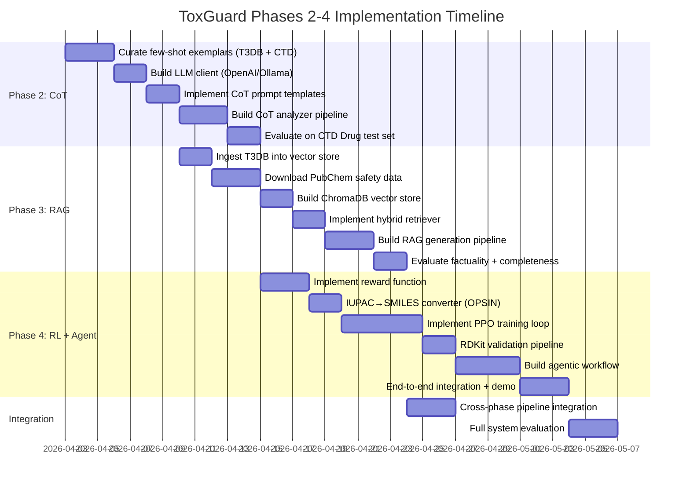

# ToxGuard Phases 2–4: Detailed Research & Implementation Plan

## Project Context

ToxGuard Phase 1 is complete: a LoRA-finetuned IUPAC-GPT (GPT-2, 7.1M params) for binary toxicity prediction. The model takes IUPAC names → P(toxic) with AUC-ROC 0.84 / AUC-PRC 0.88, trained on 7 datasets (~23,800 compounds). Phase 1 includes scaffold splitting, focal loss, temperature calibration, and attention-based interpretability.

**Remaining phases:**
- **Phase 2 — CoT:** Chain-of-Thought reasoning for mechanistic toxicity explanation
- **Phase 3 — RAG:** Retrieval-Augmented Generation for in-depth toxicological profiles
- **Phase 4 — RL + Agentic Workflow:** Reinforcement learning for detoxified molecule generation

---

## Phase 2: Chain-of-Thought (CoT) Toxicity Reasoning

### 2.1 Objective

Given a molecule classified as toxic by Phase 1, identify **which functional groups or structural motifs** cause the toxicity and provide a **step-by-step mechanistic explanation** — following the CoTox paper methodology.

### 2.2 Reference: CoTox (BIBM 2025)

> [!NOTE]
> **Paper:** Park et al., "CoTox: Chain-of-Thought-Based Molecular Toxicity Reasoning and Prediction", IEEE BIBM 2025
> **GitHub:** [dmis-lab/CoTox](https://github.com/dmis-lab/CoTox)
> **Key insight:** IUPAC names work better than SMILES when interfacing with LLMs for toxicity reasoning, thanks to their human-readable format.

#### CoTox Architecture (adapted for ToxGuard)

```
┌─────────────────────────────────────────────────────────────────────┐
│                    Phase 2: CoT Pipeline                           │
│                                                                     │
│  IUPAC Name ──→ ToxGuard Phase 1 ──→ P(toxic) + attention scores   │
│       │                                      │                      │
│       ▼                                      ▼                      │
│  ┌──────────────────────────────────────────────────────┐           │
│  │ Few-Shot CoT Prompt Construction                     │           │
│  │                                                      │           │
│  │  System: "You are a computational toxicologist..."   │           │
│  │  Example 1: {molecule, IUPAC, functional groups,     │           │
│  │              pathway, GO terms, reasoning, verdict}  │           │
│  │  Example 2: ...                                      │           │
│  │  Query: {input molecule + ToxGuard P(toxic) +        │           │
│  │           top-attention tokens}                       │           │
│  └────────────────────┬─────────────────────────────────┘           │
│                       ▼                                             │
│              LLM (GPT-4o / Llama-3 / Mistral)                      │
│                       │                                             │
│                       ▼                                             │
│  ┌──────────────────────────────────────────────────────┐           │
│  │ Structured CoT Output:                               │           │
│  │  1. Identified functional groups                     │           │
│  │  2. Known toxicity mechanisms                        │           │
│  │  3. Biological pathways affected                     │           │
│  │  4. Gene Ontology (GO) terms                         │           │
│  │  5. Step-by-step reasoning chain                     │           │
│  │  6. Confidence + final verdict                       │           │
│  └──────────────────────────────────────────────────────┘           │
└─────────────────────────────────────────────────────────────────────┘
```

### 2.3 Implementation Details

#### 2.3.1 Data Preparation — Few-Shot Exemplars

CoTox uses the **CTD (Comparative Toxicogenomics Database)** and **UniTox** datasets for grounding. For ToxGuard:

| Data Source | What It Provides | Usage |
|---|---|---|
| **CTD** (ctdbase.org) | Chemical → Gene → Disease associations | Ground-truth functional group → pathway mappings |
| **Gene Ontology (GO)** | Biological process / molecular function terms | Mechanistic context for toxicity pathways |
| **T3DB** (already in project) | Health effects, LD50, toxicity mechanisms | Existing toxicological annotations |
| **ToxGuard attention scores** | Top-attended IUPAC subword tokens | Structural motif identification |
| **PubChem BioAssay** | Assay-level activity data | Endpoint-specific toxicity evidence |

**Exemplar curation process:**
1. Select 20–30 well-characterized toxic molecules from T3DB with known mechanisms
2. For each, manually curate: (a) reactive functional groups, (b) known mechanism of action, (c) affected biological pathway, (d) GO terms
3. Structure as few-shot prompts following CoTox format

#### 2.3.2 Prompt Engineering Strategy

Following CoTox, use a **3–5 shot prompt** with structured reasoning:

```python
SYSTEM_PROMPT = """You are an expert computational toxicologist. Given a molecule's 
IUPAC name, its predicted toxicity score, and attention-weighted structural features, 
provide a chain-of-thought toxicity analysis following this exact structure:

1. STRUCTURAL ANALYSIS: Identify all functional groups and reactive motifs
2. TOXICOPHORE IDENTIFICATION: Flag known toxicity-causing substructures
3. MECHANISM OF ACTION: Explain the biochemical mechanism of toxicity
4. BIOLOGICAL PATHWAYS: List affected biological pathways with GO terms
5. ORGAN TOXICITY: Specify which organs/systems are at risk
6. CONFIDENCE: Rate confidence (HIGH/MEDIUM/LOW) with justification
7. VERDICT: Final toxicity assessment with severity"""

FEW_SHOT_TEMPLATE = """
MOLECULE: {iupac_name}
TOXICITY SCORE: {tox_score:.3f} ({severity_label})
HIGH-ATTENTION TOKENS: {top_tokens}

CHAIN-OF-THOUGHT ANALYSIS:
1. STRUCTURAL ANALYSIS: {structural_analysis}
2. TOXICOPHORE IDENTIFICATION: {toxicophores}
3. MECHANISM OF ACTION: {mechanism}
4. BIOLOGICAL PATHWAYS: {pathways}
5. ORGAN TOXICITY: {organ_effects}
6. CONFIDENCE: {confidence}
7. VERDICT: {verdict}
"""
```

#### 2.3.3 LLM Integration Options

| Option | Model | API Cost | Latency | Quality |
|---|---|---|---|---|
| **A. GPT-4o** (recommended by CoTox) | OpenAI API | ~$0.005/molecule | ~3s | Highest |
| **B. Llama-3.1-70B** | Local/vLLM or Together AI | Free (local) / ~$0.001 | ~5s | High |
| **C. Mistral-Large** | Mistral API | ~$0.003 | ~3s | High |
| **D. Gemini 2.0 Flash** | Google API | ~$0.001 | ~2s | High |

> [!IMPORTANT]
> **Design Decision Required:** CoTox uses GPT-4o exclusively. For cost-effectiveness and reproducibility, I recommend **Option B (Llama-3.1-70B via local inference or API)** as the primary model, with GPT-4o as validation baseline. This also avoids API dependency for the core pipeline.

#### 2.3.4 Integration with Phase 1

The key integration point is using Phase 1's existing `interpretability.py` outputs as CoT input features:

```python
# Phase 2 pipeline pseudocode
class CoTAnalyzer:
    def __init__(self, toxguard_predictor, llm_client):
        self.predictor = toxguard_predictor  # Phase 1 model
        self.llm = llm_client
    
    def analyze(self, iupac_name):
        # Step 1: Get Phase 1 prediction + attention
        prediction = self.predictor.predict(
            iupac_name, 
            return_attention=True, 
            attention_top_k=10
        )
        
        # Step 2: Build CoT prompt with few-shot examples
        prompt = self.build_cot_prompt(
            iupac_name=iupac_name,
            tox_score=prediction.toxicity_score,
            severity=prediction.severity_label,
            top_tokens=prediction.top_tokens,
            toxicophore_hits=prediction.toxicophore_hits,
        )
        
        # Step 3: Query LLM for CoT reasoning
        cot_response = self.llm.generate(prompt)
        
        # Step 4: Parse structured output
        return self.parse_cot_output(cot_response)
```

#### 2.3.5 Evaluation

Following CoTox's evaluation methodology:
- **Toxicity prediction accuracy** on CTD Drug test set (UniTox benchmark)
- **Reasoning quality** via human evaluation or LLM-as-judge
- Compare CoT predictions vs. ToxGuard-alone predictions
- Ablation: IUPAC vs. SMILES input to the LLM

### 2.4 Files to Create

| File | Description |
|---|---|
| `Phase2-CoT/cot_analyzer.py` | Main CoT analysis pipeline |
| `Phase2-CoT/prompts.py` | Prompt templates and few-shot exemplars |
| `Phase2-CoT/llm_client.py` | Unified LLM API client (OpenAI / Ollama / vLLM) |
| `Phase2-CoT/exemplar_curation.py` | Script to curate few-shot examples from T3DB/CTD |
| `Phase2-CoT/evaluate_cot.py` | Evaluation script |
| `Phase2-CoT/data/ctd_chemical_gene.csv` | CTD chemical-gene interaction data |
| `Phase2-CoT/data/go_annotations.json` | GO term mappings for toxicity pathways |

### 2.5 Similar Methodologies / References

| Paper | Relevance |
|---|---|
| **CoTox** (Park et al., BIBM 2025) | Direct reference — CoT for molecular toxicity |
| **Mol-Instructions** (Fang et al., 2024) | Few-shot molecular instruction tuning |
| **ChemCrow** (Bran et al., 2024) | LLM agent with chemistry tools |
| **LlaSMol** (Yu et al., 2024) | LLM for molecular understanding |
| **DrugAssist** (Ye et al., 2024) | Interactive drug molecule generation via LLM |

---

## Phase 3: RAG for In-Depth Toxicological Profiles

### 3.1 Objective

For a toxic molecule, retrieve and synthesize **comprehensive safety information**:
- Which **organs/body systems** are affected
- What **harmful biological reactions** occur
- **Safety measures** and handling protocols
- **Antidotes** and emergency procedures
- **Regulatory classification** (GHS, WHO, EPA)

### 3.2 Architecture

```
┌─────────────────────────────────────────────────────────────────────┐
│                    Phase 3: RAG Pipeline                            │
│                                                                     │
│  Molecule (IUPAC / SMILES / CAS#)                                  │
│       │                                                             │
│       ▼                                                             │
│  ┌──────────────────────────────────────────────────────┐           │
│  │ Query Construction                                    │           │
│  │  - IUPAC name                                        │           │
│  │  - Phase 1 toxicity score + severity                 │           │
│  │  - Phase 2 CoT: identified functional groups,        │           │
│  │    mechanisms, pathways                               │           │
│  └────────────────────┬─────────────────────────────────┘           │
│                       ▼                                             │
│  ┌──────────────────────────────────────────────────────┐           │
│  │ RETRIEVAL: Multi-Source Knowledge Base                │           │
│  │                                                      │           │
│  │  ┌─────────┐  ┌──────────┐  ┌───────────┐           │           │
│  │  │ PubChem │  │ LiverTox │  │   T3DB    │           │           │
│  │  │ BioAssay│  │  (NIH)   │  │(existing) │           │           │
│  │  └────┬────┘  └────┬─────┘  └─────┬─────┘           │           │
│  │       │            │              │                   │           │
│  │  ┌────┴────┐  ┌────┴─────┐  ┌────┴──────┐           │           │
│  │  │   SDS   │  │ HSDB/    │  │  CTD      │           │           │
│  │  │ Sheets  │  │ ToxNet   │  │ Diseases  │           │           │
│  │  └────┬────┘  └────┬─────┘  └─────┬─────┘           │           │
│  │       │            │              │                   │           │
│  │       ▼            ▼              ▼                   │           │
│  │  ┌──────────────────────────────────────────┐        │           │
│  │  │ Vector Store (ChromaDB / FAISS)          │        │           │
│  │  │  - Chunk + Embed documents               │        │           │
│  │  │  - Semantic search by molecule name,     │        │           │
│  │  │    functional group, mechanism           │        │           │
│  │  └──────────────────┬───────────────────────┘        │           │
│  └─────────────────────┼────────────────────────────────┘           │
│                        ▼                                            │
│  ┌──────────────────────────────────────────────────────┐           │
│  │ GENERATION: LLM Synthesis                             │           │
│  │                                                      │           │
│  │  Context: Retrieved chunks + Phase 2 CoT output      │           │
│  │  Task: Generate comprehensive safety profile          │           │
│  │                                                      │           │
│  │  Output:                                              │           │
│  │  ┌────────────────────────────────────────────────┐  │           │
│  │  │ 1. Toxicity Mechanism (from CoT)               │  │           │
│  │  │ 2. Affected Organs & Systems                   │  │           │
│  │  │ 3. Symptoms of Exposure                        │  │           │
│  │  │ 4. LD50 / LC50 / Dose-Response                 │  │           │
│  │  │ 5. First Aid & Emergency Procedures            │  │           │
│  │  │ 6. Handling & Storage Precautions              │  │           │
│  │  │ 7. Regulatory Classification                   │  │           │
│  │  │ 8. Related Toxic Compounds (structural)        │  │           │
│  │  │ 9. References (traceable to source docs)       │  │           │
│  │  └────────────────────────────────────────────────┘  │           │
│  └──────────────────────────────────────────────────────┘           │
└─────────────────────────────────────────────────────────────────────┘
```

### 3.3 Knowledge Base Construction

#### 3.3.1 Data Sources and Ingestion

| Source | Content | Format | Ingestion Method |
|---|---|---|---|
| **T3DB** (in-project) | ~3,500 toxins with health effects, LD50, mechanisms | CSV | Direct parse — already available |
| **PubChem** | Compound safety summaries, bioassay data | REST API / JSON | API download + chunking |
| **LiverTox (NIH)** | Drug-induced liver injury profiles | HTML pages | Web scrape → chunk → embed |
| **CTD** | Chemical-Gene-Disease associations | TSV bulk download | Parse and index |
| **HSDB (Hazardous Substances Data Bank)** | Comprehensive hazard data | API / XML | Parse and embed |
| **GHS SDS sheets** | Safety Data Sheets | PDF | Parse with pdfplumber → chunk |
| **DrugBank** (open data) | Drug safety, pharmacology | XML | Parse structured fields |

#### 3.3.2 Vector Store Design

```python
# Knowledge base schema
class ToxDocument:
    molecule_name: str        # IUPAC / common name
    smiles: str               # canonical SMILES
    cas_number: str           # CAS registry number
    source: str               # "T3DB", "PubChem", "LiverTox", etc.
    section: str              # "mechanism", "organs", "first_aid", etc.
    content: str              # actual text content
    embedding: List[float]    # vector embedding (384-dim or 768-dim)

# Embedding model options:
# - all-MiniLM-L6-v2 (384-dim, fast, good for chemical text)
# - BiomedBERT (768-dim, better for biomedical content)
# - PubMedBERT (768-dim, specialized for life sciences)
```

**Chunking strategy:**
- Split documents by section (mechanism, symptoms, first aid, etc.)
- Chunk size: 512 tokens with 64-token overlap
- Include molecule identifiers (IUPAC, SMILES, CAS) as metadata for hybrid search

#### 3.3.3 Retrieval Strategy

Use **hybrid retrieval** (semantic + keyword):

1. **Primary query**: Molecule IUPAC name + identified functional groups (from Phase 2)
2. **Semantic search**: Embed query with same model → cosine similarity in vector store
3. **Metadata filter**: Filter by CAS number or SMILES if available
4. **Re-ranking**: Cross-encoder re-ranking of top-20 results → select top-5

#### 3.3.4 Generation Prompt

```python
RAG_GENERATION_PROMPT = """
Based on the following retrieved toxicological information and the chain-of-thought
analysis from Phase 2, generate a comprehensive safety profile for the molecule.

MOLECULE: {iupac_name}
PHASE 1 PREDICTION: P(toxic) = {tox_score}, Severity: {severity}
PHASE 2 COT ANALYSIS:
{cot_summary}

RETRIEVED DOCUMENTS:
{retrieved_chunks}

Generate a structured safety profile with these sections:
1. TOXICITY MECHANISM
2. AFFECTED ORGANS & SYSTEMS 
3. SYMPTOMS OF EXPOSURE (acute and chronic)
4. DOSE-RESPONSE DATA (LD50, LC50 if available)
5. FIRST AID MEASURES
6. HANDLING PRECAUTIONS
7. REGULATORY CLASSIFICATION (GHS, WHO, EPA)
8. STRUCTURALLY RELATED TOXIC COMPOUNDS
9. REFERENCES

For each claim, cite the source document. If information is not available in 
the retrieved documents, explicitly state "Data not available" rather than 
speculating.
"""
```

### 3.4 Implementation Details

#### Technology Stack

| Component | Technology | Rationale |
|---|---|---|
| **Vector Store** | ChromaDB (local) or FAISS | ChromaDB for simplicity; FAISS for scale |
| **Embedding Model** | `sentence-transformers/all-MiniLM-L6-v2` | Fast, good quality, 384-dim |
| **Generation LLM** | Same as Phase 2 (Llama-3.1 / GPT-4o) | Consistency across pipeline |
| **Document Parsing** | `pdfplumber` + `beautifulsoup4` | For SDS PDFs and HTML pages |
| **Orchestration** | LangChain or custom pipeline | Custom recommended for simplicity |

### 3.5 Files to Create

| File | Description |
|---|---|
| `Phase3-RAG/knowledge_base.py` | Knowledge base construction and ingestion |
| `Phase3-RAG/vector_store.py` | ChromaDB/FAISS vector store wrapper |
| `Phase3-RAG/retriever.py` | Hybrid retrieval (semantic + keyword) |
| `Phase3-RAG/rag_generator.py` | RAG generation pipeline |
| `Phase3-RAG/ingest_t3db.py` | Ingest existing T3DB data into KB |
| `Phase3-RAG/ingest_pubchem.py` | Download and ingest PubChem safety data |
| `Phase3-RAG/ingest_livertox.py` | Scrape and ingest LiverTox profiles |
| `Phase3-RAG/ingest_ctd.py` | Parse CTD chemical-disease associations |
| `Phase3-RAG/safety_profile.py` | Safety profile data model and formatting |
| `Phase3-RAG/evaluate_rag.py` | Evaluation: factuality, completeness, citation accuracy |

### 3.6 Similar Methodologies / References

| Paper/System | Relevance |
|---|---|
| **RAG-LLM for SDS Analysis** (CNAIP, 2025) | RAG pipeline for Safety Data Sheets |
| **LiverTox RAG** (NIH, 2024) | RAG for drug hepatotoxicity assessment |
| **MoleculeQA** (2024) | Question answering over molecular databases |
| **ChemRAG** (2025) | RAG system for chemistry Q&A |
| **SafetyRAG** (JAIT, 2025) | RAG with safety-aware retrieval |

---

## Phase 4: RL-Guided Molecule Detoxification + Agentic Workflow

### 4.1 Objective

Given a toxic molecule, **generate a structurally similar but less toxic variant** using:
1. IUPAC-GPT's **autoregressive generation** capability
2. **Reinforcement Learning** with P(toxic) as a reward signal
3. **RDKit validation** for chemical plausibility
4. **Agentic loop** for iterative refinement until a feasible molecule is found

### 4.2 Reference Papers

| Paper | Key Contribution |
|---|---|
| **MT-Mol** (Multi-Agent Tool-based Mol. Optimization) | Multi-agent system with RDKit tool integration for molecule optimization |
| **REINVENT 4** (AstraZeneca, 2024) | RL-based molecular design with customizable reward functions |
| **RLMolLM** (ACS, 2025) | PPO + genetic algorithms for multi-property ADMET optimization |
| **ReMol** (KDD, 2025) | LLM-guided optimization with SFT + multi-turn RL |
| **AgentDrug** (ACL, 2025) | Nested refinement loop for valid molecule generation |
| **iupacGPT** (Mol. Diversity, 2024) | Base model — autoregressive IUPAC name generation |

### 4.3 Architecture

```
┌─────────────────────────────────────────────────────────────────────────────┐
│                 Phase 4: RL + Agentic Detoxification Pipeline              │
│                                                                             │
│  Input: Toxic Molecule (IUPAC name)                                        │
│       │                                                                     │
│       ▼                                                                     │
│  ┌────────────────────────────────┐                                        │
│  │ Step 1: Encode Seed Molecule   │                                        │
│  │  - Tokenize IUPAC name        │                                        │
│  │  - Extract ToxGuard embedding  │                                        │
│  │  - Get P(toxic) baseline       │                                        │
│  └──────────────┬─────────────────┘                                        │
│                 ▼                                                            │
│  ┌──────────────────────────────────────────────────────────┐              │
│  │ Step 2: RL-Guided Generation (PPO)                        │              │
│  │                                                          │              │
│  │  Policy Network: IUPAC-GPT (frozen backbone + LoRA)      │              │
│  │  Reference Model: IUPAC-GPT (frozen, for KL penalty)     │              │
│  │                                                          │              │
│  │  ┌────────────────────────────────────────┐              │              │
│  │  │ Reward Function R(molecule):           │              │              │
│  │  │                                        │              │
│  │  │  R = w₁ × (1 - P(toxic))              │  ← detox     │              │
│  │  │    + w₂ × Tanimoto(mol, seed)          │  ← similarity│              │
│  │  │    + w₃ × QED(mol)                     │  ← drug-like │              │
│  │  │    + w₄ × SA_score(mol)                │  ← synthesize│              │
│  │  │    + w₅ × validity_bonus               │  ← valid mol │              │
│  │  │    - λ_KL × KL(π_θ || π_ref)          │  ← stability │              │
│  │  └────────────────────────────────────────┘              │              │
│  │                                                          │              │
│  │  Generate N candidate IUPAC names via sampling           │              │
│  │  (temperature=0.7–1.2, top-p=0.9)                       │              │
│  └───────────────────────┬──────────────────────────────────┘              │
│                          ▼                                                  │
│  ┌──────────────────────────────────────────────────────────┐              │
│  │ Step 3: Validation via RDKit                              │              │
│  │                                                          │              │
│  │  For each generated IUPAC name:                          │              │
│  │   1. Convert IUPAC → SMILES (PubChem API / OPSIN)       │              │
│  │   2. Parse SMILES with RDKit                             │              │
│  │   3. Check: valid molecule? correct valence?             │              │
│  │   4. Compute: Tanimoto similarity to seed                │              │
│  │   5. Compute: QED, SA score, Lipinski violations         │              │
│  │   6. Compute: P(toxic) from ToxGuard Phase 1             │              │
│  │                                                          │              │
│  │  Filter: keep molecules where:                           │              │
│  │   - RDKit.MolFromSmiles(sm) is not None (valid)         │              │
│  │   - Tanimoto(mol, seed) > 0.3 (structurally related)    │              │
│  │   - P(toxic) < seed_P(toxic)  (less toxic)              │              │
│  └───────────────────────┬──────────────────────────────────┘              │
│                          ▼                                                  │
│  ┌──────────────────────────────────────────────────────────┐              │
│  │ Step 4: Agentic Loop (if no valid candidates)             │              │
│  │                                                          │              │
│  │  IF no valid less-toxic molecule found:                  │              │
│  │    ┌──────────────────────────────────────────┐          │              │
│  │    │ Agent Iteration (max K rounds):          │          │              │
│  │    │                                          │          │              │
│  │    │  1. Analyze failure reason               │          │              │
│  │    │     (invalid SMILES? too similar?         │          │              │
│  │    │      still toxic? not synthesizable?)     │          │              │
│  │    │                                          │          │              │
│  │    │  2. Adjust generation parameters         │          │              │
│  │    │     (↑ temperature, modify seed prefix,  │          │              │
│  │    │      relax similarity threshold)          │          │              │
│  │    │                                          │          │              │
│  │    │  3. Re-generate with updated strategy    │          │              │
│  │    │                                          │          │              │
│  │    │  4. Re-validate with RDKit               │          │              │
│  │    │                                          │          │              │
│  │    │  5. If valid → return                    │          │              │
│  │    │     If max_rounds reached → report       │          │              │
│  │    │     "no feasible detoxification found"   │          │              │
│  │    └──────────────────────────────────────────┘          │              │
│  └───────────────────────┬──────────────────────────────────┘              │
│                          ▼                                                  │
│  ┌──────────────────────────────────────────────────────────┐              │
│  │ Output: Detoxified Molecule Report                        │              │
│  │                                                          │              │
│  │  - Original: {iupac, smiles, P(toxic)=0.89}             │              │
│  │  - Proposed:  {iupac, smiles, P(toxic)=0.23}            │              │
│  │  - Changes: "replaced nitro group with amino group"      │              │
│  │  - Similarity: Tanimoto = 0.72                           │              │
│  │  - QED: 0.68, SA: 3.2                                   │              │
│  │  - Validation: RDKit valid ✓, Lipinski ✓                │              │
│  └──────────────────────────────────────────────────────────┘              │
└─────────────────────────────────────────────────────────────────────────────┘
```

### 4.4 Implementation Details

#### 4.4.1 RL Training with PPO

The key innovation is using **IUPAC-GPT as the policy network** and **ToxGuard's P(toxic) as the reward signal**:

```python
# PPO training loop pseudocode
class ToxGuardRL:
    def __init__(self):
        self.policy = load_iupacgpt_with_lora()     # Trainable (new LoRA)
        self.ref_model = load_iupacgpt_frozen()      # Frozen reference
        self.toxguard = load_toxguard_phase1()        # Frozen reward model
        self.optimizer = AdamW(self.policy.lora_params(), lr=1e-5)
    
    def generate_candidates(self, seed_iupac, n=16, temperature=0.9):
        """Generate N candidate IUPAC names conditioned on seed prefix."""
        # Option A: Unconditional generation (sample from scratch)
        # Option B: Prefix-conditioned (start with seed prefix tokens)
        # Option C: Infilling (mask toxic substructure, generate replacement)
        candidates = []
        for _ in range(n):
            tokens = self.policy.generate(
                prompt=seed_iupac[:prefix_len],  # partial IUPAC prefix
                max_length=128,
                temperature=temperature,
                top_p=0.9,
                do_sample=True,
            )
            candidates.append(self.tokenizer.decode(tokens))
        return candidates
    
    def compute_reward(self, candidate_iupac, seed_smiles):
        """Multi-objective reward function."""
        # 1. Toxicity reduction reward
        tox_pred = self.toxguard.predict(candidate_iupac)
        detox_reward = 1.0 - tox_pred.toxicity_score  # higher = less toxic
        
        # 2. Convert to SMILES and check validity
        candidate_smiles = iupac_to_smiles(candidate_iupac)
        if candidate_smiles is None:
            return -1.0  # Invalid molecule penalty
        
        mol = Chem.MolFromSmiles(candidate_smiles)
        if mol is None:
            return -1.0  # RDKit invalid
        
        # 3. Structural similarity to seed
        seed_mol = Chem.MolFromSmiles(seed_smiles)
        tanimoto = DataStructs.TanimotoSimilarity(
            AllChem.GetMorganFingerprintAsBitVect(mol, 2),
            AllChem.GetMorganFingerprintAsBitVect(seed_mol, 2)
        )
        
        # 4. Drug-likeness
        qed = QED.qed(mol)
        
        # 5. Synthetic accessibility
        sa = sascorer.calculateScore(mol)
        sa_normalized = (10 - sa) / 10  # normalize to [0, 1]
        
        # Weighted combination
        reward = (
            0.40 * detox_reward +      # Primary: reduce toxicity
            0.25 * tanimoto +           # Maintain structure
            0.20 * qed +               # Drug-likeness
            0.15 * sa_normalized        # Synthesizability
        )
        return reward
    
    def ppo_step(self, seed_iupac, seed_smiles):
        """One PPO training step."""
        # Generate candidates
        candidates = self.generate_candidates(seed_iupac)
        
        # Compute rewards
        rewards = [self.compute_reward(c, seed_smiles) for c in candidates]
        
        # Compute log probs under policy and reference
        policy_logprobs = self.policy.log_prob(candidates)
        ref_logprobs = self.ref_model.log_prob(candidates)
        
        # KL penalty
        kl_div = policy_logprobs - ref_logprobs
        
        # PPO loss with clipping
        advantages = torch.tensor(rewards) - baseline
        ratio = torch.exp(policy_logprobs - old_logprobs)
        clipped_ratio = torch.clamp(ratio, 1-eps, 1+eps)
        policy_loss = -torch.min(ratio * advantages, clipped_ratio * advantages)
        
        # Total loss
        loss = policy_loss.mean() + beta_kl * kl_div.mean()
        
        self.optimizer.zero_grad()
        loss.backward()
        self.optimizer.step()
```

#### 4.4.2 IUPAC → SMILES Conversion

A critical step — options for converting generated IUPAC names to SMILES:

| Method | Accuracy | Speed | Offline |
|---|---|---|---|
| **OPSIN** (Java library) | ~95% for valid IUPAC | Fast | ✓ |
| **PubChem API** | ~90% (depends on DB) | Slow (network) | ✗ |
| **NCI CIR (Chemical Identifier Resolver)** | ~85% | Medium | ✗ |
| **Stout (neural translator)** | ~88% | Fast | ✓ |

> [!IMPORTANT]
> **Recommendation:** Use **OPSIN** as primary (offline, high accuracy), with PubChem API as fallback. OPSIN is a rule-based IUPAC parser written in Java, callable via Python's `subprocess` or `py4j`. Alternatively, use the existing `step3_smiles_to_iupac.py` cascade resolver in reverse.

#### 4.4.3 Agentic Workflow Design

```python
class DetoxificationAgent:
    """Iterative agent for molecule detoxification."""
    
    MAX_ROUNDS = 5
    
    def __init__(self, rl_generator, toxguard, llm_reasoner):
        self.generator = rl_generator
        self.toxguard = toxguard
        self.reasoner = llm_reasoner  # Phase 2 CoT for analysis
    
    def detoxify(self, toxic_iupac, toxic_smiles):
        """Main agentic loop."""
        
        seed_tox = self.toxguard.predict(toxic_iupac).toxicity_score
        best_candidate = None
        best_reward = -float('inf')
        
        # Strategy parameters (adjusted each round)
        temperature = 0.8
        similarity_threshold = 0.3
        prefix_fraction = 0.5  # fraction of seed tokens to keep
        
        for round_idx in range(self.MAX_ROUNDS):
            # Generate candidates
            candidates = self.generator.generate_candidates(
                seed_iupac=toxic_iupac,
                n=32,
                temperature=temperature,
                prefix_fraction=prefix_fraction,
            )
            
            # Validate and score each candidate
            valid_results = []
            for cand in candidates:
                result = self.validate_candidate(cand, toxic_smiles, seed_tox)
                if result['valid'] and result['less_toxic']:
                    valid_results.append(result)
            
            if valid_results:
                # Found valid less-toxic molecules
                best = max(valid_results, key=lambda r: r['reward'])
                if best['reward'] > best_reward:
                    best_reward = best['reward']
                    best_candidate = best
                
                # If good enough, return early
                if best['toxicity_score'] < 0.3:  # clearly non-toxic
                    return self.build_report(toxic_iupac, best_candidate)
            
            # Adjust strategy for next round
            failure_analysis = self.analyze_failures(candidates, valid_results)
            temperature, similarity_threshold, prefix_fraction = (
                self.adjust_strategy(failure_analysis, round_idx)
            )
        
        if best_candidate:
            return self.build_report(toxic_iupac, best_candidate)
        else:
            return {"status": "failed", 
                    "message": "No feasible detoxification found after "
                              f"{self.MAX_ROUNDS} rounds"}
    
    def analyze_failures(self, candidates, valid_results):
        """Use LLM to analyze why candidates failed."""
        # Count failure modes
        stats = {
            "invalid_smiles": 0,
            "still_toxic": 0, 
            "too_dissimilar": 0,
            "low_qed": 0,
        }
        # ... categorize failures
        
        # Use Phase 2 CoT to reason about what structural changes 
        # would reduce toxicity while maintaining function
        return stats
    
    def adjust_strategy(self, failure_analysis, round_idx):
        """Dynamically adjust generation parameters."""
        if failure_analysis["invalid_smiles"] > 0.5:
            # Too many invalid molecules — reduce creativity
            temperature = max(0.5, 0.8 - 0.1 * round_idx)
        elif failure_analysis["still_toxic"] > 0.5:
            # Valid but still toxic — increase diversity
            temperature = min(1.5, 0.8 + 0.15 * round_idx)
        elif failure_analysis["too_dissimilar"] > 0.5:
            # Too different — keep more of the seed
            prefix_fraction = min(0.8, 0.5 + 0.1 * round_idx)
        
        return temperature, similarity_threshold, prefix_fraction
```

### 4.5 Files to Create

| File | Description |
|---|---|
| `Phase4-RL/rl_trainer.py` | PPO training loop for IUPAC-GPT generation |
| `Phase4-RL/reward_function.py` | Multi-objective reward: detox + similarity + QED + SA |
| `Phase4-RL/molecule_generator.py` | IUPAC name generation with seed conditioning |
| `Phase4-RL/molecule_validator.py` | RDKit validation, Tanimoto, QED, SA scoring |
| `Phase4-RL/iupac_to_smiles.py` | IUPAC → SMILES conversion (OPSIN + PubChem fallback) |
| `Phase4-RL/detox_agent.py` | Agentic workflow orchestrator |
| `Phase4-RL/ppo_config.py` | PPO hyperparameters and reward weights |
| `Phase4-RL/evaluate_detox.py` | Evaluation: validity rate, tox reduction, similarity |
| `Phase4-RL/demo_detox.py` | Interactive demo: input toxic molecule → get detoxified variant |

### 4.6 RL Training Configuration

| Parameter | Value | Rationale |
|---|---|---|
| PPO clip ε | 0.2 | Standard PPO clipping |
| KL coefficient β | 0.05 | Prevent policy collapse |
| Learning rate | 1e-5 | Conservative for RL fine-tuning |
| Batch size | 32 | candidates per seed molecule |
| Epochs per seed | 4 | PPO epochs per batch |
| LoRA rank (new) | 8 | Smaller than Phase 1 — less capacity needed |
| Temperature range | 0.5–1.5 | Dynamically adjusted |
| Reward weights | (0.4, 0.25, 0.2, 0.15) | (detox, similarity, QED, SA) |
| Max agent rounds | 5 | Convergence typically by round 3 |
| Valid molecule threshold | Tanimoto > 0.3, P(toxic) < seed | Minimum criteria |

### 4.7 Similar Methodologies / References

| Paper | Key Technique | Relevance |
|---|---|---|
| **RLMolLM** (ACS, 2025) | PPO + genetic algorithms for ADMET optimization | Direct inspiration for reward design |
| **REINVENT 4** (AstraZeneca) | RL for molecular design with scoring functions | Scoring function architecture |
| **AgentDrug** (ACL, 2025) | Nested inner/outer loop: validity then property | Agentic loop design |
| **MT-Mol** (EmergentMind, 2025) | Multi-agent system with RDKit tools | Multi-agent architecture |
| **ReMol** (KDD, 2025) | SFT → RL two-stage molecular optimization | Training strategy |
| **MOLRL** (2025) | PPO in latent space of generative models | Latent-space RL approach |
| **DrugAssist** (2024) | Interactive LLM-guided molecule generation | Interactive workflow |
| **VALID-Mol** (2025) | Systematic chemical verification framework | Validation pipeline |

---

## Cross-Phase Integration

### End-to-End Pipeline

```
User inputs IUPAC name
        │
        ▼
┌─ Phase 1: ToxGuard ─────────────────────────────┐
│  P(toxic) = 0.87, Severity = "Highly toxic"      │
│  Top attention: "nitro", "benz", "ene"            │
└───────────────────────┬──────────────────────────┘
                        │
                        ▼
┌─ Phase 2: CoT Reasoning ────────────────────────┐
│  Functional groups: nitro (-NO₂), benzene ring   │
│  Mechanism: nitro reduction → reactive amines     │
│  Pathway: NR-AhR (aryl hydrocarbon receptor)     │
│  Organs at risk: liver, kidneys                   │
└───────────────────────┬──────────────────────────┘
                        │
                        ▼
┌─ Phase 3: RAG Safety Profile ───────────────────┐
│  LD50: 640 mg/kg (oral, rat)                     │
│  GHS: Category 4 — Harmful if swallowed          │
│  First aid: Induce vomiting, activated charcoal   │
│  Handling: Use fume hood, nitrile gloves          │
│  Ref: [T3DB: T3D0042], [PubChem CID: 7416]      │
└───────────────────────┬──────────────────────────┘
                        │
                        ▼
┌─ Phase 4: Detoxification ───────────────────────┐
│  Original: 1-nitro-2-methylbenzene (P=0.87)      │
│  Proposed: 1-amino-2-methylbenzene (P=0.23)       │
│  Change:  -NO₂ → -NH₂ (nitro → amino)           │
│  Similarity: Tanimoto = 0.78                      │
│  Validity: RDKit ✓, QED=0.62, SA=2.1             │
│  Status: Feasible ✓ (round 1 of 5)               │
└──────────────────────────────────────────────────┘
```

### Shared Components

| Component | Used By | Location |
|---|---|---|
| ToxGuard predictor | All phases | `Phase1-IUPACGPT/iupacGPT_finetune/inference.py` |
| IUPAC tokenizer | Phase 1, 4 | `Phase1-IUPACGPT/iupacGPT_finetune/tokenizer.py` |
| LLM client | Phase 2, 3, 4 (agent) | `shared/llm_client.py` |
| RDKit utilities | Phase 4 | `shared/rdkit_utils.py` |
| IUPAC ↔ SMILES converter | Phase 3, 4 | `shared/name_resolver.py` |

---

## Implementation Order & Dependencies



---

## Open Questions for User

> [!IMPORTANT]
> **Q1 — LLM Choice for Phase 2/3:** Do you want to use OpenAI GPT-4o (highest quality, API cost ~$0.005/mol) or a local/open model like Llama-3.1-70B (free, requires GPU with ~40GB VRAM or API)? This affects both Phases 2 and 3.

> [!IMPORTANT]
> **Q2 — Phase 4 Generation Strategy:** For molecule generation, should we:
> - **Option A**: Use the original IUPAC-GPT as the policy (apply NEW LoRA adapters for RL), keeping Phase 1 LoRA weights frozen as the reward model
> - **Option B**: Use a larger LLM (Llama-3.1) for generation with IUPAC-GPT only as the reward model
> 
> **My recommendation: Option A** — keeps the entire pipeline within the IUPAC-GPT architecture and is more publishable.

> [!IMPORTANT]
> **Q3 — Scope Priority:** Should I implement all three phases in sequence, or would you prefer to start with one specific phase first? Given dependencies, I recommend: **Phase 2 → Phase 3 → Phase 4** (Phase 4 depends on Phase 1's predictor as the reward model, and the agentic loop benefits from Phase 2's CoT analysis).

> [!IMPORTANT]
> **Q4 — Compute Resources:** Phase 4 (RL training) is the most compute-intensive. What GPU resources do you have available? This affects batch sizes, LoRA ranks, and whether we can run PPO training locally.

---

## Verification Plan

### Phase 2 Verification
- Run CoT analysis on 100 molecules from T3DB with known mechanisms
- Compare identified functional groups vs. T3DB annotations
- Human evaluation of reasoning quality on 20 randomly sampled outputs
- Ablation: IUPAC vs. SMILES input to the LLM

### Phase 3 Verification
- Factuality check: randomly sample 50 RAG outputs, verify claims against source docs
- Completeness: check that all 9 safety profile sections are populated
- Citation accuracy: verify that referenced sources actually contain the claimed information
- Latency benchmark: < 10 seconds per molecule query

### Phase 4 Verification
- Validity rate: % of generated IUPAC names that convert to valid SMILES
- Detoxification rate: % of seeds where a less-toxic valid molecule is found
- Toxicity reduction: mean ΔP(toxic) between seed and best candidate
- Structural similarity: mean Tanimoto between seed and best candidate
- Drug-likeness: mean QED of generated molecules
- Agent convergence: mean rounds needed to find valid candidate
