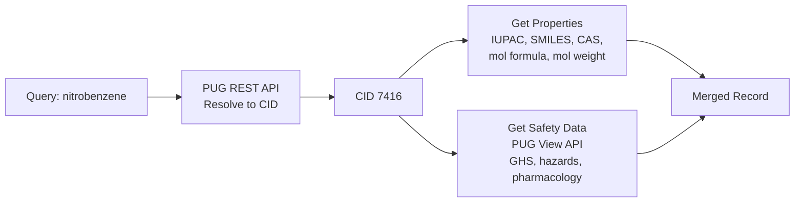
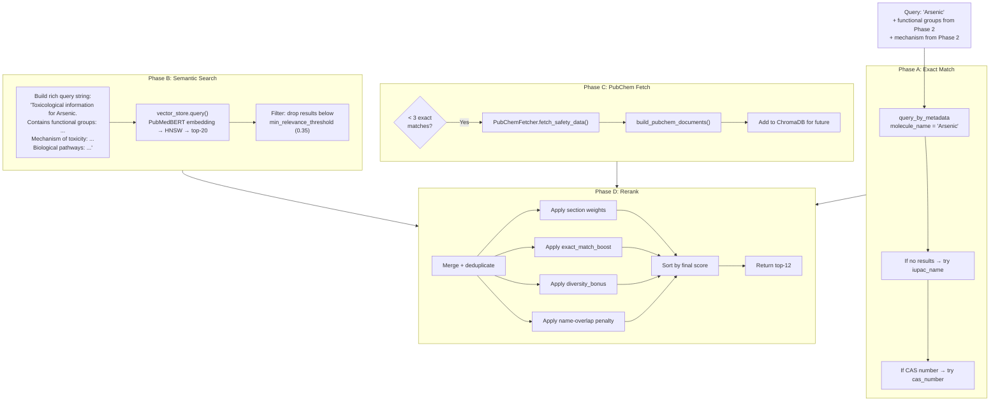
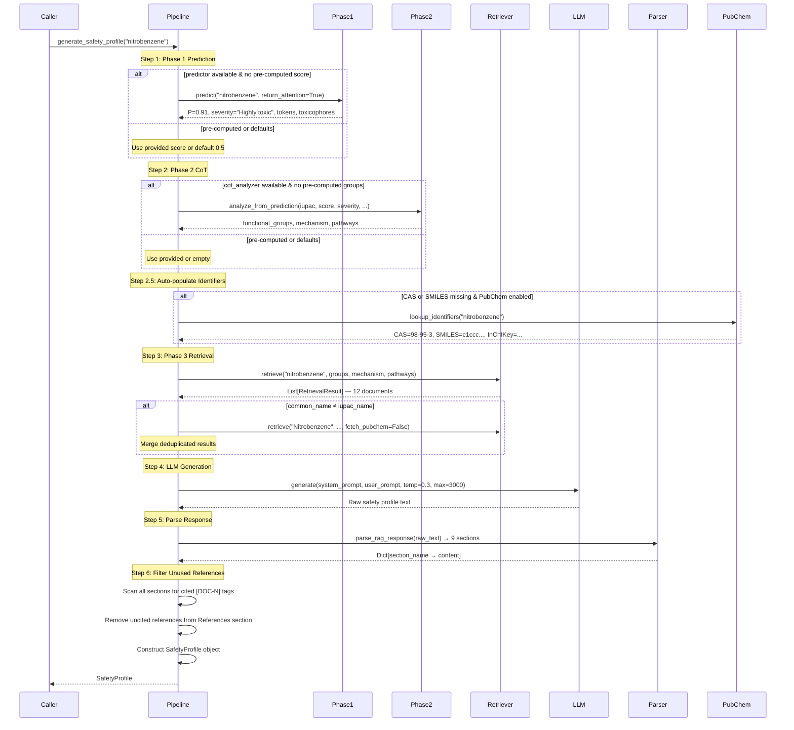
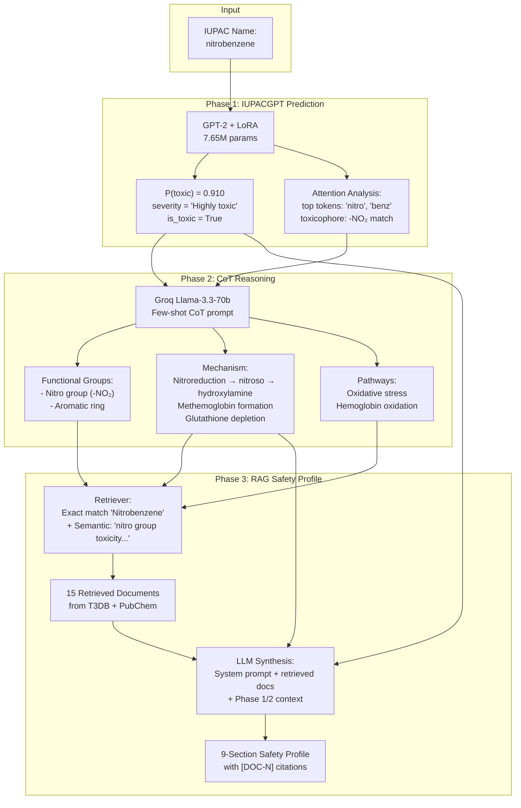

# Phase 3 RAG: In-Depth Walkthrough

## What is Phase 3 and Why Does It Exist?

ToxGuard is a 3-phase molecular toxicity pipeline. Each phase adds a layer of depth:

| Phase | Purpose | Output |
|-------|---------|--------|
| **Phase 1** — IUPACGPT | Predict *whether* a molecule is toxic | `P(toxic)`, severity label, attention tokens, toxicophore hits |
| **Phase 2** — CoT | Explain *why* it's toxic via mechanistic reasoning | Functional groups, mechanism of action, biological pathways |
| **Phase 3** — RAG | Produce a *comprehensive, cited safety profile* grounded in real databases | 9-section toxicological safety report with `[DOC-N]` citations |

### The Problem Phase 3 Solves

Phase 1 gives a number (`P(toxic) = 0.91`). Phase 2 gives a reasoning chain ("The nitro group undergoes nitroreduction to form reactive nitroso intermediates..."). But **neither of these is actionable for a safety officer, regulator, or researcher**. They need:

- What organs does it affect?
- What are the lethal doses?
- What first-aid measures are needed?
- How should it be stored?
- What is the regulatory classification?

Phase 3 bridges this gap through **Retrieval-Augmented Generation (RAG)** — retrieving real toxicological data from curated databases (T3DB, PubChem), then using an LLM (Llama-3.3-70b via Groq) to **synthesize** all available information into a structured, cited safety profile.

> [!IMPORTANT]
> Without RAG, the LLM would be forced to hallucinate dose-response data, regulatory classifications, and lethal doses from memory. RAG forces it to cite only what was actually retrieved, dramatically improving factual accuracy.

---

## Architecture Overview

```mermaid
flowchart TB
    subgraph Phase1["Phase 1: IUPACGPT"]
        A["IUPAC Name"] --> B["GPT-2 + LoRA"]
        B --> C["P(toxic), severity, attention tokens, toxicophores"]
    end

    subgraph Phase2["Phase 2: CoT Reasoning"]
        C --> D["Groq Llama-3.3-70b"]
        D --> E["Functional groups, mechanism, pathways"]
    end

    subgraph Phase3["Phase 3: RAG Pipeline"]
        subgraph KnowledgeBase["Knowledge Base Layer"]
            F["T3DB CSV\n3,512 toxins"]
            G["PubChem API\n~100M compounds"]
        end

        subgraph Ingestion["Document Ingestion"]
            H["knowledge_base.py\nBuild ToxDocuments"]
            I["ingest_t3db.py\nBatch indexer"]
        end

        subgraph VectorStore["Vector Store"]
            J["ChromaDB\n+ PubMedBERT 768-dim\n22,702 documents"]
        end

        subgraph Retrieval["Hybrid Retriever"]
            K1["Exact Match\nname / CAS / IUPAC"]
            K2["Semantic Search\nPubMedBERT similarity"]
            K3["PubChem Fetch\non-demand for unknowns"]
            K4["Reranker\nsection weights + diversity"]
        end

        subgraph Generation["LLM Synthesis"]
            L["Prompt Builder\nRAG_SYSTEM_PROMPT +\nRAG_GENERATION_PROMPT"]
            M["Groq Llama-3.3-70b\ntemperature=0.3"]
            N["Output Parser\nregex → 9 sections"]
        end

        subgraph Output["Final Output"]
            O["SafetyProfile\n9-section report"]
        end

        F --> H
        G --> K3
        H --> I
        I --> J
        C --> K1
        E --> K2
        J --> K1
        J --> K2
        K1 --> K4
        K2 --> K4
        K3 --> K4
        K4 --> L
        C --> L
        E --> L
        L --> M
        M --> N
        N --> O
    end

    style Phase1 fill:#1a1a2e,stroke:#e94560
    style Phase2 fill:#1a1a2e,stroke:#f39c12
    style Phase3 fill:#0f3460,stroke:#16a085
```



---

## File-by-File Deep Dive

The Phase 3 RAG directory contains **11 core pipeline files** organized into 5 logical layers (plus 7 evaluation/validation files covered separately):

```
Phase3-RAG/
├── __init__.py            ← Package definition & public API
├── knowledge_base.py      ← Layer 1: Document model + T3DB/PubChem builders
├── ingest_t3db.py         ← Layer 1: CLI tool to index T3DB into ChromaDB
├── fetch_pubchem.py       ← Layer 1: On-demand PubChem safety data fetcher
├── vector_store.py        ← Layer 2: ChromaDB wrapper with PubMedBERT
├── retriever.py           ← Layer 3: Hybrid retrieval (exact + semantic + rerank)
├── prompts.py             ← Layer 4: System/generation prompts + output parser
├── rag_pipeline.py        ← Layer 4: Main orchestrator connecting all phases
├── safety_profile.py      ← Layer 5: Output data model + report formatting
├── run_rag.py             ← CLI entry point for end-to-end execution
├── evaluate_rag.py        ← Evaluation metrics for generated profiles
└── chroma_db/             ← Persisted ChromaDB vector database (122 MB)
    └── chroma.sqlite3     ← 22,702 indexed documents
```

---

### 1. `__init__.py` — Package Definition & Public API

[__init__.py](file:///c:/Users/PAVAN%20K%20AITHAL/OneDrive/Desktop/Toxgaurd/Phase3-RAG/__init__.py)

**Role:** Defines the `Phase3-RAG` package, documents the overall pipeline architecture, and exports the public API.

```python
__all__ = [
    "ToxDocument",            # Data model for a single knowledge base chunk
    "build_t3db_documents",   # Builder: T3DB CSV → list of ToxDocuments
    "ToxVectorStore",         # ChromaDB wrapper
    "HybridRetriever",        # Multi-strategy retrieval engine
    "RetrievalResult",        # Single retrieval result with scores
    "SafetyProfile",          # Final 9-section output model
    "RAGPipeline",            # End-to-end orchestrator
]
```

**Key design decision:** The docstring explicitly documents the 3-phase pipeline flow and data sources, making the package self-documenting for anyone doing `import Phase3_RAG`.

---

### 2. `knowledge_base.py` — Document Model & Knowledge Base Construction

[knowledge_base.py](file:///c:/Users/PAVAN%20K%20AITHAL/OneDrive/Desktop/Toxgaurd/Phase3-RAG/knowledge_base.py) (394 lines)

**Role:** The foundational data layer. Defines the `ToxDocument` data model and provides two builder functions that convert raw data sources into indexable document chunks.

#### 2.1 The `ToxDocument` Data Model

```python
@dataclass
class ToxDocument:
    doc_id: str          # "t3db_T3D0001_mechanism" — globally unique
    molecule_name: str   # "Arsenic"
    iupac_name: str      # "arsenic" (from t3db_processed.csv)
    cas_number: str      # "7440-38-2"
    source: str          # "t3db" or "pubchem"
    section: str         # "mechanism", "symptoms", "treatment", etc.
    content: str         # The actual text — what gets embedded
    metadata: Dict       # Extra fields: t3db_id, pubchem_id, smiles
```

**Why section-based chunking?** Each T3DB toxin record has up to **9 distinct text fields** (description, mechanism, metabolism, toxicity, lethaldose, health_effects, symptoms, treatment, carcinogenicity). Rather than embedding the entire record as one monolithic document, each section becomes its own document. This is critical because:

1. **Embedding precision** — A 768-dim PubMedBERT vector captures the semantics of one topic much better than a jumble of 9 topics
2. **Section-level retrieval** — When the query is about "symptoms of arsenic poisoning", only the `symptoms` document needs to rank high, not the entire monograph
3. **Granular scoring** — The retriever can apply different weights to `mechanism` vs `description` sections

#### 2.2 T3DB Section Mapping

```python
T3DB_SECTION_MAP = {
    "description": "description",
    "mechanism_of_toxicity": "mechanism",
    "metabolism": "metabolism",
    "toxicity": "toxicity",
    "lethaldose": "lethaldose",
    "health_effects": "health_effects",
    "symptoms": "symptoms",
    "treatment": "treatment",
    "carcinogenicity": "carcinogenicity",
}
```

This maps raw T3DB CSV column names (left) to normalized section identifiers (right). The `MIN_CONTENT_LENGTH = 20` filter ensures that empty or trivial entries (like `"N/A"`, `"Not available"`) don't create noise documents.

#### 2.3 `build_t3db_documents()` — The Core Builder

This is the **most complex function** in the knowledge base layer. Its workflow:

```
all_toxin_data.csv (3,512 rows)
        │
        ├── Load t3db_processed.csv → iupac_lookup & smiles_lookup
        ├── Load target_mechanisms.csv → protein target info
        │
        ▼
For each toxin row:
   1. Extract: id, common_name, cas, pubchem_id
   2. Validate T3DB ID format (regex: ^T3D\d{4,6}$)
      - Valid → use as unique_prefix (e.g., "T3D0001")
      - Invalid (HTML artifacts, lethal-dose text) → use row counter ("r42")
   3. Look up IUPAC name from processed data
   4. For each of 9 CSV columns:
      a. Clean text (remove "Not available", "N/A", etc.)
      b. Skip if < 20 chars
      c. Enrich content with "Molecule: X (IUPAC: Y) [CAS: Z]\nSection: S\n\n..."
      d. Create ToxDocument with unique doc_id = f"t3db_{unique_prefix}_{section_name}"
   5. If target mechanisms exist → create bonus "protein_targets" document
```

> [!TIP]
> **Content enrichment** (line 228-233) is a subtle but important design pattern. By prefixing each document's content with the molecule name, IUPAC name, and section label, the PubMedBERT embedding captures not just the raw text but also the structural context. This improves retrieval quality because the embedding "knows" what molecule and what aspect it represents.

> [!WARNING]
> **The ID validation logic** (lines 176-201) was added to fix a `DuplicateIDError` bug. Some T3DB records have corrupted `id` fields containing HTML fragments or lethal-dose text instead of proper T3DB IDs. Without this fix, multiple records would generate the same doc_id, causing ChromaDB to crash.

#### 2.4 `build_pubchem_documents()` — PubChem Document Builder

Creates up to 4 document types from PubChem data:

| Section | Content |
|---------|---------|
| `ghs_classification` | GHS hazard classification (globally harmonized system) |
| `hazard_statements` | H-codes (e.g., H302: Harmful if swallowed) |
| `safety_measures` | First aid and safety information |
| `pharmacology` | Pharmacology and toxicology summary |

This function is called by the retriever when a molecule is **not found in T3DB** — PubChem serves as a fallback with ~100M compounds.

---

### 3. `ingest_t3db.py` — Batch Ingestion CLI

[ingest_t3db.py](file:///c:/Users/PAVAN%20K%20AITHAL/OneDrive/Desktop/Toxgaurd/Phase3-RAG/ingest_t3db.py) (148 lines)

**Role:** One-time CLI script to build the knowledge base from T3DB CSVs and index all documents into ChromaDB. This is the **data-preparation step** that must run before the RAG pipeline can work.

#### Execution Flow

```
$ python ingest_t3db.py
Step 1: Build document chunks from T3DB          → 22,702 ToxDocuments
Step 2: Initialize ChromaDB + PubMedBERT model    → Download ~440 MB model first time
Step 3: Index documents in batches of 200         → Upsert with deduplication
Step 4: Verification                              → Semantic + exact match tests
```

**Key CLI arguments:**

| Argument | Default | Purpose |
|----------|---------|---------|
| `--data-dir` | `../data/t3db` | Path to T3DB CSVs |
| `--processed-csv` | `../data/t3db_processed.csv` | IUPAC name lookup |
| `--db-dir` | `./chroma_db` | ChromaDB storage directory |
| `--clear` | `false` | Delete and re-index from scratch |
| `--batch-size` | `200` | Documents per ChromaDB upsert call |

**Verification tests after ingestion:**
1. **Semantic search test:** Query `"nitro group toxicity mechanism reactive metabolites"` → should return relevant nitro-compound documents
2. **Exact match test:** Query by `molecule_name = "Arsenic"` → should find all Arsenic sections

> [!NOTE]
> The current ChromaDB database is **122 MB** (chroma.sqlite3) and contains **22,702 indexed documents** from 3,512 T3DB toxins.

---

### 4. `fetch_pubchem.py` — On-Demand PubChem Safety Data

[fetch_pubchem.py](file:///c:/Users/PAVAN%20K%20AITHAL/OneDrive/Desktop/Toxgaurd/Phase3-RAG/fetch_pubchem.py) (325 lines)

**Role:** A real-time API client that fetches safety-relevant data from PubChem for any compound not in T3DB. This makes the RAG pipeline capable of handling **any molecule**, not just the 3,512 in the T3DB knowledge base.

#### The `PubChemFetcher` Class

```python
class PubChemFetcher:
    def __init__(self, timeout=15, max_retries=2):
        self._session = requests.Session()
        self._session.headers.update({
            "Accept": "application/json",
            "User-Agent": "ToxGuard-RAG/0.1 (academic research)",
        })
```

#### Three-Step Fetch Pipeline



1. **`_resolve_to_cid()`** — Resolves molecule name/CAS/SMILES to PubChem CID using PUG REST API
2. **`_get_compound_properties()`** — Gets IUPAC name, canonical SMILES, molecular formula, weight, CAS from PubChem property API + synonyms
3. **`_get_safety_data()`** — The most complex step, parsing the PubChem PUG View JSON for:
   - **Safety and Hazards** section → GHS classification, H-codes, first aid
   - **Pharmacology and Biochemistry** section → pharmacology text
   - **Toxicity** section → appended to pharmacology

#### API Design Considerations

| Feature | Implementation |
|---------|---------------|
| **Rate limiting** | 0.25s delay between requests (4 req/s, conservative vs PubChem's 5/s limit) |
| **Retry logic** | Exponential backoff on 503 (rate limited), 2 retries max |
| **Timeout** | 15s per request |
| **Text truncation** | `max_length=2000` for pharmacology, `1500` for safety, prevents token overflow |
| **CAS regex** | `^\d{2,7}-\d{2}-\d$` to extract CAS from synonym list |

> [!TIP]
> When the retriever fetches PubChem data, it also **indexes the fetched documents into ChromaDB** (retriever.py line 289). This means subsequent queries for the same molecule won't need another API call — the knowledge base grows organically over time.

---

### 5. `vector_store.py` — ChromaDB Vector Store Wrapper

[vector_store.py](file:///c:/Users/PAVAN%20K%20AITHAL/OneDrive/Desktop/Toxgaurd/Phase3-RAG/vector_store.py) (275 lines)

**Role:** The persistence and search layer. Wraps ChromaDB with a domain-specific API for adding, querying, and managing toxicological document embeddings.

#### The Embedding Model

```python
DEFAULT_EMBEDDING_MODEL = "pritamdeka/PubMedBERT-mnli-snli-scinli-scitail-mednli-stsb"
```

> [!IMPORTANT]
> **Why PubMedBERT?** This is not a generic sentence transformer like `all-MiniLM-L6-v2`. It's a **biomedical-domain BERT** from the PubMedBERT family, further fine-tuned on 5 NLI/STS datasets including medical NLI (MedNLI) and scientific NLI (SciNLI). This produces 768-dimensional embeddings that understand biomedical terminology — "nitroreduction", "cytochrome P450", "glutathione depletion" — far better than general-purpose models.

#### Lazy Initialization Pattern

```python
def _ensure_initialized(self):
    if self._client is not None:
        return
    # Initialize ChromaDB client + embedding function only when first needed
    self._client = chromadb.PersistentClient(path=self.persist_dir)
    self._embedding_fn = SentenceTransformerEmbeddingFunction(model_name=...)
    self._collection = self._client.get_or_create_collection(
        name="toxguard_knowledge_base",
        metadata={"hnsw:space": "cosine"},  # ← cosine similarity for HNSW index
    )
```

This avoids loading the 440MB PubMedBERT model at import time — it only loads when the first query or add is called.

#### Two Search Modes

**1. Semantic Similarity Search** (`query()`)
```python
def query(self, query_text: str, n_results: int = 10, where=None):
    results = self._collection.query(
        query_texts=[query_text],      # Embedded automatically by PubMedBERT
        n_results=n_results,
    )
    # Returns: [{id, content, metadata, distance, score=1-distance}, ...]
```

The query text is embedded by PubMedBERT into a 768-dim vector, then ChromaDB's HNSW index finds the nearest neighbors using cosine distance. Distance is converted to a similarity score: `score = 1 - cosine_distance`.

**2. Metadata-Filtered Retrieval** (`query_by_metadata()`)
```python
def query_by_metadata(self, where: Dict, limit: int = 50):
    results = self._collection.get(
        where=where,  # e.g., {"molecule_name": "Arsenic"}
        limit=limit,
    )
```

This is a **pure metadata lookup** — no embedding, no similarity computation. Used for exact-match retrieval when we know the molecule name, CAS number, or T3DB ID.

#### Score Semantics

| Score | Meaning |
|-------|---------|
| `1.0` | Identical embedding (exact semantic match) |
| `0.7-0.9` | Highly relevant |
| `0.5-0.7` | Moderately relevant |
| `< 0.5` | Weakly related |

---

### 6. `retriever.py` — Hybrid Retrieval Engine

[retriever.py](file:///c:/Users/PAVAN%20K%20AITHAL/OneDrive/Desktop/Toxgaurd/Phase3-RAG/retriever.py) (515 lines)

**Role:** The most architecturally sophisticated module. Implements a **4-phase hybrid retrieval strategy** that combines exact matching, semantic search, on-demand PubChem fetching, and intelligent reranking.

#### The `HybridRetriever` Class

```python
class HybridRetriever:
    def __init__(
        self,
        vector_store,
        pubchem_fetcher=None,
        semantic_top_k: int = 20,       # Retrieve 20 candidates via semantic search
        final_top_k: int = 12,          # Return top 12 after reranking
        exact_match_boost: float = 0.3, # +0.3 score for exact matches
        section_diversity_bonus: float = 0.08,  # +0.08 for first occurrence of each section
        min_relevance_threshold: float = 0.35,  # Drop semantic results below this score
    )
```

#### The 4-Phase Retrieval Pipeline



#### Phase A: Exact Match

Tries three strategies in sequence:
1. `molecule_name = query_name` — Most common, works for T3DB molecules
2. `iupac_name = query_name` — Fallback for IUPAC name queries
3. `cas_number = cas_number` — If a CAS number was provided

Exact matches get `score = 1.0` (maximum).

#### Phase B: Semantic Search

The `_build_semantic_query()` method constructs a **rich, multi-faceted** query string from Phase 2 CoT outputs:

```
Toxicological information for nitrobenzene.
Contains functional groups: nitro group, aromatic ring.
Mechanism of toxicity: nitroreduction to reactive nitroso intermediates
  that bind cellular macromolecules and deplete glutathione...
Biological pathways: oxidative stress, methemoglobin formation...
```

This query is then embedded by PubMedBERT and matched against all 22,702 documents. Results below `min_relevance_threshold = 0.35` are filtered out early, preventing low-confidence noise from entering the reranking stage. The result is that even if "nitrobenzene" isn't in T3DB by name, documents about **structurally similar molecules** with the same mechanism (e.g., 4-nitrotoluene, 2,4-dinitrophenol) will rank highly.

> [!IMPORTANT]
> **This is where Phase 2 feeds into Phase 3.** The functional groups, mechanism, and pathways from the CoT analysis directly shape what the semantic search retrieves. A molecule with a nitro group will naturally retrieve documents about other nitro-compound toxicities, even if the exact molecule isn't in the database.

#### Phase C: PubChem Fallback

Triggered only when fewer than 3 exact matches are found. This handles the long tail — the millions of molecules that aren't among the 3,512 in T3DB. Fetched documents are:
- Assigned `score = 0.85` (high, but below exact match's 1.0)
- **Permanently indexed** into ChromaDB so future queries are faster

#### Phase D: Reranking

The reranker applies a multi-factor scoring formula:

```
final_score = base_score
            + section_weight × 0.1
            + exact_match_boost (0.3) if exact match
            + section_diversity_bonus (0.08) if section not yet seen
            × name_penalty (0.5) if semantic-only with no token overlap to query
```

**Section importance weights:**

| Section | Weight | Rationale |
|---------|--------|-----------|
| `mechanism` | 1.00 | Most critical for safety understanding |
| `lethaldose` | 1.00 | Quantitative safety data (boosted) |
| `toxicity` | 0.95 | Direct toxicological data |
| `treatment` | 0.95 | Emergency response (boosted) |
| `safety_measures` | 0.95 | First aid and safety information (PubChem) |
| `health_effects` | 0.90 | Clinical relevance |
| `ghs_classification` | 0.90 | Regulatory relevance |
| `symptoms` | 0.85 | Clinical presentation |
| `hazard_statements` | 0.85 | Regulatory relevance |
| `metabolism` | 0.80 | Understanding activation/detox |
| `carcinogenicity` | 0.80 | Long-term risk |
| `pharmacology` | 0.80 | PubChem pharmacology data |
| `protein_targets` | 0.75 | Molecular mechanism |
| `description` | 0.70 | General context (lowest priority) |

The **diversity bonus** ensures that the final top-12 results cover multiple sections rather than returning 12 "mechanism" documents. The first time a `symptoms` document appears, it gets +0.08; subsequent `symptoms` documents don't.

> [!TIP]
> **Name-overlap penalty** is a noise-reduction heuristic added to combat cross-contamination in semantic retrieval. If a semantic-only result's molecule name shares no tokens with the query (e.g., querying "nitrobenzene" but retrieving a document about "cadmium"), its score is halved (×0.5). This significantly reduces wrong-molecule retrievals without affecting exact matches or genuinely related semantic hits.

#### `retrieve_with_details()` — Diagnostic Mode

A companion to `retrieve()` that returns the same ranked results **plus** full diagnostic metadata:

| Diagnostic Field | Contents |
|-----------------|----------|
| `timing_ms` | Millisecond breakdown: exact match, semantic, PubChem, rerank |
| `counts` | Document counts per retrieval phase |
| `pathway_breakdown` | How many final results came from each method |
| `sections_covered` | Which section types appear in the final set |
| `raw_semantic_scores` | Top-10 pre-rerank semantic similarity scores |
| `pre_rerank_scores` | Top-10 document scores before reranking |

This method is used by the evaluation framework (Pillar 1) for retrieval diagnostics without altering the core `retrieve()` API.

---

### 7. `prompts.py` — Prompt Templates & Output Parser

[prompts.py](file:///c:/Users/PAVAN%20K%20AITHAL/OneDrive/Desktop/Toxgaurd/Phase3-RAG/prompts.py) (237 lines)

**Role:** Contains the carefully crafted prompt engineering that turns retrieved documents into structured safety profiles, plus the regex-based parser that extracts the 9 sections from LLM output.

#### 7.1 System Prompt — The Safety Analyst Persona

```
You are an expert toxicological safety analyst. Your task is to synthesize 
comprehensive safety profiles from retrieved toxicological databases and 
chain-of-thought analysis.

CRITICAL RULES:
1. Base ALL claims on the provided RETRIEVED DOCUMENTS. Cite sources by 
   their [DOC-N] reference numbers.
2. If information is NOT available in the retrieved documents, explicitly 
   state "Data not available from retrieved sources" — do NOT speculate or 
   fabricate data.
3. For dose-response data (LD50, LC50), ONLY report values found in the 
   retrieved documents.
4. Distinguish between CONFIRMED information (from databases) and 
   INFERRED information (from mechanistic reasoning).
5. For regulatory classification, cite the specific standard (GHS, WHO, 
   EPA, IARC) and category.
6. Write in a clear, professional, safety-data-sheet style.
7. Output MUST follow the exact 9-section format provided.
```

> [!CAUTION]
> Rules 1-3 are anti-hallucination guardrails. Without them, the LLM would confidently fabricate LD50 values, regulatory classifications, and treatment protocols. The `[DOC-N]` citation requirement forces the LLM to ground every claim in a specific retrieved document, making it easy to verify accuracy.

#### 7.2 Generation Prompt Template

The `RAG_GENERATION_PROMPT` template has three major sections:

**Section 1: MOLECULE INFORMATION** — Identity + Phase 1/2 outputs
```
IUPAC Name: {iupac_name}
Common Name: {common_name}
CAS Number: {cas_number}
SMILES: {smiles}

Phase 1 Prediction: P(toxic) = {tox_score:.3f} — {severity}
Phase 2 CoT Summary:
  Functional Groups: {functional_groups}
  Mechanism: {cot_mechanism}
```

**Section 2: RETRIEVED DOCUMENTS** — The RAG context
```
RETRIEVED DOCUMENTS (15 documents from t3db, pubchem)

[DOC-1] Source: T3DB | Molecule: Arsenic | Section: mechanism | Relevance: 1.00 (exact_match)
Molecule: Arsenic (IUPAC: arsenic)
Section: mechanism

Arsenic acts as a protoplastic poison...

---

[DOC-2] Source: T3DB | Molecule: Arsenic | Section: symptoms | Relevance: 1.00 (exact_match)
...
```

**Section 3: GENERATE SAFETY PROFILE** — The 9-section output format
```
1. TOXICITY MECHANISM:
2. AFFECTED ORGANS & SYSTEMS:
3. SYMPTOMS OF EXPOSURE:
4. DOSE-RESPONSE DATA:
5. FIRST AID & EMERGENCY PROCEDURES:
6. HANDLING & STORAGE PRECAUTIONS:
7. REGULATORY CLASSIFICATION:
8. STRUCTURALLY RELATED TOXIC COMPOUNDS:
9. REFERENCES:
```

#### 7.3 `build_rag_prompt()` — Prompt Assembly

This function assembles the complete prompt by:
1. Formatting each retrieved document with a `[DOC-N]` header showing source, molecule, section, relevance score, and retrieval method
2. Truncating long documents to 1,500 chars with `... [truncated]`
3. Filling the template placeholders with Phase 1/2 outputs

#### 7.4 `parse_rag_response()` — Regex Output Parser

Extracts 9 sections from the LLM's raw text output using regex patterns that handle multiple formatting styles:

```python
# Handles:
# "1. TOXICITY MECHANISM:" (numbered)
# "TOXICITY MECHANISM:" (unnumbered)  
# "**TOXICITY MECHANISM:**" (bold markdown)
pattern = rf"(?:\d+\.?\s*)?(?:\*\*)?{escaped}(?:\*\*)?[:\s]*\n?"
```

Each section's content is captured from its header until the next section header (or end of text). The `SECTION_TO_FIELD` mapping converts parsed section names to `SafetyProfile` field names.

---

### 8. `rag_pipeline.py` — The Main Orchestrator

[rag_pipeline.py](file:///c:/Users/PAVAN%20K%20AITHAL/OneDrive/Desktop/Toxgaurd/Phase3-RAG/rag_pipeline.py) (407 lines)

**Role:** The central orchestrator that connects Phase 1, Phase 2, and Phase 3 into a single end-to-end pipeline. This is the **primary API** for external consumers.

#### The `RAGPipeline` Class

```python
class RAGPipeline:
    def __init__(
        self,
        vector_store_dir="./chroma_db",     # Path to indexed ChromaDB
        groq_api_key=None,                  # Groq API key for LLM
        groq_model="llama-3.3-70b-versatile",  # Production model
        predictor=None,                     # Optional Phase 1 ToxGuardPredictor
        cot_analyzer=None,                  # Optional Phase 2 CoTAnalyzer
        enable_pubchem=True,                # Enable PubChem fallback
        temperature=0.3,                    # LLM temperature
        max_tokens=3000,                    # Max response tokens
    )
```

#### Three Operating Modes

| Mode | Inputs Required | What Happens |
|------|----------------|-------------|
| **Full Pipeline** | `iupac_name` + `predictor` + `cot_analyzer` | Phase 1 → 2 → 3 automatically |
| **Partial** | `iupac_name` + pre-computed Phase 1/2 outputs | Phase 3 only, using provided scores |
| **RAG-only** | `iupac_name` only | Phase 3 with defaults (P=0.5, no CoT) |

#### The 6-Step `generate_safety_profile()` Flow



#### Step 2.5: Auto-populate Identifiers

A new step inserted before retrieval. If CAS number or SMILES are missing, the pipeline calls `PubChemFetcher.lookup_identifiers()` to fill them in:

```python
if self.pubchem_fetcher and (not cas_number or not smiles):
    ids = self.pubchem_fetcher.lookup_identifiers(iupac_name)
    cas_number = cas_number or ids.get("cas_number", "")
    smiles = smiles or ids.get("smiles", "")
    inchikey = inchikey or ids.get("inchikey", "")
    common_name = common_name or ids.get("name", "")
```

This ensures the LLM prompt always has complete chemical identifiers, improving both the quality of exact-match retrieval (CAS lookup) and the safety profile output.

#### Step 6: Reference Filtering

After parsing the LLM response, the pipeline **filters unused references** from the References section. It scans all 8 content sections for `[DOC-N]` tags, then removes any reference line from section 9 whose `[DOC-N]` tag was never cited. This prevents the LLM from listing all 12 retrieved documents in the references when only 7 were actually cited in the body.

#### Module Import Safety

A subtle but critical implementation detail at [lines 251-269](file:///c:/Users/PAVAN%20K%20AITHAL/OneDrive/Desktop/Toxgaurd/Phase3-RAG/rag_pipeline.py#L251-L269):

```python
try:
    from .prompts import RAG_SYSTEM_PROMPT, build_rag_prompt, ...
except ImportError:
    import importlib.util as _ilu
    _prompts_path = os.path.join(os.path.dirname(...), "prompts.py")
    _spec = _ilu.spec_from_file_location("rag_prompts", _prompts_path)
    ...
```

> [!WARNING]
> Both Phase 2 and Phase 3 have a file named `prompts.py`. When `Phase2-CoT` is on `sys.path` (needed for the LLM client), Python might import the wrong `prompts.py`. This code uses `importlib.util.spec_from_file_location()` to **force-load the correct Phase 3 prompts** by absolute path, avoiding the shadowing bug.

#### Batch Processing

`generate_batch()` processes multiple molecules sequentially with:
- Rate limiting (`delay_between=2.0` seconds between API calls)
- Incremental JSON saving (crash-safe, results preserved on failure)
- Per-molecule error handling (one failure doesn't abort the batch)

---

### 9. `safety_profile.py` — The Output Data Model

[safety_profile.py](file:///c:/Users/PAVAN%20K%20AITHAL/OneDrive/Desktop/Toxgaurd/Phase3-RAG/safety_profile.py) (180 lines)

**Role:** Defines the structured `SafetyProfile` dataclass — the **final deliverable** of the entire ToxGuard 3-phase pipeline.

#### The 9 Safety Sections

```python
@dataclass
class SafetyProfile:
    # Molecule identification
    iupac_name: str
    common_name: str
    cas_number: str
    smiles: str
    
    # Phase 1 outputs
    toxicity_score: float
    severity_label: str
    is_toxic: bool
    
    # Phase 2 CoT summary
    cot_mechanism: str
    cot_functional_groups: List[str]
    
    # Phase 3 RAG: THE 9 SECTIONS
    toxicity_mechanism: str        # How the molecule causes harm
    affected_organs: str           # Which organs/systems are affected
    symptoms_of_exposure: str      # Clinical symptoms
    dose_response: str             # LD50, LC50, dose-response data
    first_aid: str                 # Emergency procedures
    handling_precautions: str      # Storage and handling guidelines
    regulatory_classification: str # GHS, WHO, EPA, IARC categories
    related_compounds: str         # Structurally similar toxic compounds
    references: str                # [DOC-N] citation list
    
    # Metadata
    num_retrieved_docs: int
    retrieval_sources: List[str]
    llm_model: str
    llm_latency_ms: float
```

#### Output Formats

**1. One-line summary** (`summary()`)
```
Nitrobenzene: TOXIC (P=0.910) | 9/9 sections | 15 sources
```

**2. Detailed report** (`detailed_report()`) — A formatted multi-line report resembling a Safety Data Sheet:
```
========================================================================
  TOXICOLOGICAL SAFETY PROFILE: Nitrobenzene
========================================================================

  IDENTIFICATION
  ------------------------------------------------------------------------
  IUPAC Name:    nitrobenzene
  Common Name:   Nitrobenzene
  CAS Number:    98-95-3
  SMILES:        c1ccc([N+](=O)[O-])cc1

  TOXGUARD ANALYSIS (Phase 1 + 2)
  ------------------------------------------------------------------------
  Toxicity Score:  P(toxic) = 0.910
  Severity:        Highly toxic
  Classification:  TOXIC
  Functional Groups: nitro group, aromatic ring
  CoT Mechanism: nitroreduction to reactive nitroso intermediates...

  COMPREHENSIVE SAFETY PROFILE (Phase 3 RAG)
  ========================================================================

  1. TOXICITY MECHANISM
  ------------------------------------------------------------------------
    Nitrobenzene exerts toxicity primarily through...  [DOC-1] [DOC-3]
  ...
```

**3. JSON serialization** (`to_dict()` / `to_json()`)
Full serialization for storage, API responses, and batch evaluation.

**4. Deserialization** (`from_dict()`) — Reconstruct a SafetyProfile from saved JSON.

---

### 10. `run_rag.py` — CLI Entry Point

[run_rag.py](file:///c:/Users/PAVAN%20K%20AITHAL/OneDrive/Desktop/Toxgaurd/Phase3-RAG/run_rag.py) (219 lines)

**Role:** User-facing CLI for running Phase 3 from the command line. Supports single-molecule, multi-molecule, and batch-from-CSV modes.

#### Usage Examples

```bash
# Single molecule with pre-computed toxicity score
python run_rag.py "nitrobenzene" --common-name "Nitrobenzene" --score 0.91

# Multiple molecules
python run_rag.py "nitrobenzene" "arsenic trioxide" --score 0.91 0.95

# Batch from CSV (first 5 rows)
python run_rag.py --csv ../data/t3db_processed.csv --limit 5

# Save results to JSON
python run_rag.py "nitrobenzene" --score 0.91 -o results/profiles.json

# Verbose mode (full reports)
python run_rag.py "nitrobenzene" --score 0.91 -v
```

#### Severity Label Auto-Assignment

When a toxicity score is provided via `--score`, the CLI auto-assigns severity labels:

| Score Range | Severity Label |
|-------------|---------------|
| `< 0.20` | Non-toxic |
| `0.20 - 0.49` | Unlikely toxic |
| `0.50 - 0.64` | Likely toxic |
| `0.65 - 0.79` | Moderately toxic |
| `≥ 0.80` | Highly toxic |

#### `sys.path` Ordering

```python
sys.path.insert(0, CURRENT_DIR)     # Phase3-RAG FIRST — so prompts.py resolves correctly
sys.path.insert(1, PROJECT_ROOT)    # Project root second
sys.path.append(Phase2_CoT_path)    # Phase 2 LAST — avoid prompts.py shadowing
sys.path.append(Phase1_path)        # Phase 1 LAST
```

> [!NOTE]
> The path ordering is deliberately designed so that `import prompts` resolves to Phase3-RAG/prompts.py, not Phase2-CoT/prompts.py. This was a real bug that was caught and fixed during development.

---

### 11. `evaluate_rag.py` — Evaluation Framework

[evaluate_rag.py](file:///c:/Users/PAVAN%20K%20AITHAL/OneDrive/Desktop/Toxgaurd/Phase3-RAG/evaluate_rag.py) (212 lines)

**Role:** Post-hoc evaluation of generated safety profiles, measuring quality across 6 dimensions.

#### Evaluation Metrics

| Metric Category | What It Measures |
|----------------|-----------------|
| **Section Completeness** | Are all 9 sections populated? How many profiles are fully complete? |
| **Citation Quality** | Count of `[DOC-N]` references; % of profiles with at least one citation |
| **Data Gaps** | How many sections say "Data not available"? |
| **Retrieval Stats** | Average documents retrieved; source distribution (T3DB vs PubChem) |
| **Latency** | Average and max LLM generation time |
| **Toxicity Distribution** | Toxic vs non-toxic in the evaluated set |

#### Output Visualization

```
======================================================================
  PHASE 3 RAG EVALUATION REPORT
======================================================================

  Total profiles: 20

  Section Completeness:
    Fully complete: 18/20 (90%)
    Toxicity Mechanism                    ████████████████████ 100%
    Affected Organs                       ████████████████████ 100%
    Symptoms Of Exposure                  ████████████████████ 100%
    Dose Response                         ████████████████░░░░  85%
    First Aid                             ██████████████████░░  90%
    ...

  Citation Quality:
    Profiles with citations: 20 (100%)
    Avg citations per profile: 8.3

  Data Gaps:
    'Data not available' sections: 3
    Avg per profile: 0.15
```

---

## How Phase 3 Interacts with Phase 1 & Phase 2

### Data Flow: The Complete 3-Phase Pipeline



### Phase 1 → Phase 3 Integration Points

| Phase 1 Output | How Phase 3 Uses It |
|----------------|---------------------|
| `toxicity_score` | Placed in prompt as "Phase 1 Prediction: P(toxic) = 0.910" |
| `severity_label` | Used in prompt header and SafetyProfile metadata |
| `is_toxic` | Reflected in SafetyProfile.is_toxic and report classification |
| `top_tokens` | Passed through to Phase 2 for CoT analysis |
| `toxicophore_hits` | Passed through to Phase 2 for CoT analysis |

### Phase 2 → Phase 3 Integration Points

| Phase 2 Output | How Phase 3 Uses It |
|----------------|---------------------|
| `functional_groups` | 1) Placed in prompt for LLM context<br>2) Used to build semantic search query<br>3) Stored in SafetyProfile.cot_functional_groups |
| `mechanism_of_action` | 1) First 200 chars used in semantic query<br>2) First 300 chars in LLM prompt<br>3) First 500 chars in SafetyProfile.cot_mechanism |
| `biological_pathways` | First 150 chars used in semantic query |

> [!IMPORTANT]
> **The semantic query enrichment is the key architectural insight.** Without Phase 2, the semantic search would only match on molecule name. With Phase 2, it matches on *mechanistic similarity* — a novel molecule with a nitro group will retrieve toxicological data about ALL nitro compounds in the database, even if it's never been seen before.

### LLM Client Reuse

Phase 3 does **not** have its own LLM client. It imports `GroqLLMClient` from Phase 2:

```python
# In rag_pipeline.py
from llm_client import GroqLLMClient  # Phase 2's client
self._llm = GroqLLMClient(
    api_key=self._groq_api_key,
    model="llama-3.3-70b-versatile",
)
```

This avoids code duplication and ensures consistent LLM behavior (retry logic, logging, model resolution) across Phase 2 and Phase 3.

---

## The MolRAG Reference Architecture

The `__init__.py` docstring mentions `MolRAG` as a reference. The system's architecture follows principles from molecular RAG research:

1. **Domain-specific embeddings** (PubMedBERT vs generic) — Critical for biomedical term understanding
2. **Hybrid retrieval** (exact + semantic) — Exact match for known molecules, semantic for novel ones
3. **Section-based chunking** — Instead of full-document embeddings, split by topic for precision
4. **Grounded generation** — LLM output must cite specific retrieved documents
5. **Multi-source knowledge** — T3DB (curated, high-quality) + PubChem (broad, on-demand)

---

## Summary Statistics

| Metric | Value |
|--------|-------|
| Core pipeline files | 11 Python files |
| Total lines of code (core) | ~3,100 lines |
| Knowledge base size | 22,702 documents from 3,512 T3DB toxins |
| ChromaDB database size | 122 MB (SQLite3) |
| Embedding model | PubMedBERT (768-dim, ~440 MB) |
| Embedding space | Cosine similarity in HNSW index |
| LLM for generation | Llama-3.3-70b-versatile via Groq API |
| Output format | 9-section structured safety profile |
| Data sources | T3DB (offline/indexed) + PubChem (online/on-demand) |
| Retrieval strategy | 4-phase: exact match → semantic → PubChem → rerank |
| Final retrieval count | Top-12 documents after reranking |
| Relevance threshold | 0.35 minimum for semantic results |
