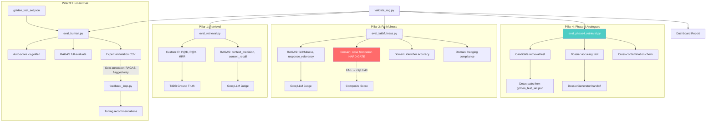

# ToxGuard RAG Validation Framework (RAGAS-Powered)

Validate the ToxGuard RAG pipeline across **four pillars** using the **RAGAS** framework as the backbone for faithfulness and retrieval quality evaluation. Covers **Phase 3** (direct molecule retrieval) and **Phase 4** (structural-analogy retrieval for RL-generated detoxification candidates).

## Background

The current `evaluate_rag.py` only checks surface metrics (section completeness, citation counts, latency). It does **not** answer:

1. **Is the retriever pulling the right documents?** — No IR metrics
2. **Is the LLM faithful to what was retrieved?** — No hallucination detection
3. **Do domain experts agree with the outputs?** — No golden test set
4. **Does the retriever work for Phase 4's novel candidate queries?** — No structural-analogy retrieval tests

### Why RAGAS?

[RAGAS](https://docs.ragas.io/) is the industry-standard framework for RAG evaluation. Instead of rolling custom claim-attribution logic, we use RAGAS's battle-tested:

- **Faithfulness**: LLM-based claim decomposition → NLI verification against retrieved context
- **Context Precision**: Are the retrieved documents actually relevant? (LLM-judged)
- **Context Recall**: Did we retrieve all the information needed to answer? (LLM-judged against ground truth)
- **Answer Relevancy**: Is the generated profile relevant to the query?

RAGAS runs its evaluation through an LLM judge — we'll wire it to **Groq (Llama-3.3-70b)** via `langchain-groq`, reusing our existing API key.

### Phase 3 vs Phase 4 Query Modes

> [!IMPORTANT]
> Phase 3 and Phase 4 use the RAG in fundamentally different ways. The evaluation must cover both.

| Aspect | Phase 3 | Phase 4 |
|---|---|---|
| **Query type** | Known molecule name ("nitrobenzene") | Novel candidate variant ("aminobenzene" — a proposed detoxified form of nitrobenzene) |
| **What's in T3DB?** | Often yes — exact match or close analogue | Often **no** — candidate is AI-generated, never existed in T3DB |
| **Retrieval goal** | Full toxicological profile for the queried molecule | Toxicological profile for the **structural analogue** (the parent or a known similar) |
| **Failure mode** | Wrong molecule docs or missing sections | **Retrieves nothing useful** because no exact match exists; semantic retrieval must bridge the structural gap to find the analogue's toxicology |
| **Critical test** | P@K, R@K, MRR on known molecules | Can the retriever find the parent molecule's docs when queried with a structurally similar variant that has a different name? |

Phase 4's `detox_dossier.py` calls `generate_safety_profile()` for both the seed (known toxic) and the candidate (novel proposed molecule). The seed query is identical to Phase 3. The **candidate query** is the gap — the candidate may not exist in T3DB, and the retriever must fall back to semantic search to find relevant analogues.

## User Review Required

> [!IMPORTANT]
> **New dependencies**: `ragas`, `langchain-groq`, `datasets` (HuggingFace). These are eval-only dependencies, not production. Confirm this is acceptable.

> [!IMPORTANT]
> **API cost**: RAGAS uses LLM calls for evaluation. Per molecule, faithfulness makes ~5-8 LLM calls (claim decomposition + NLI for each section). Running 40 golden molecules ≈ 200-320 Groq API calls. Groq's free tier allows 30 req/min on Llama-3.3-70b.

> [!IMPORTANT]
> **Embeddings for RAGAS**: RAGAS needs an embedding model for `answer_relevancy`. We'll wrap our existing **PubMedBERT** model via `LangchainEmbeddingsWrapper` — domain-relevant and already loaded. *(Q1 resolved: PubMedBERT confirmed.)*

---

## Resolved Open Questions

> [!NOTE]
> **Q1 — Embeddings**: ✅ **PubMedBERT** confirmed. Wrap via `sentence-transformers` into RAGAS's embeddings interface.

> [!NOTE]
> **Q2 — Novel/Rare compounds**: ✅ **Auto-select from PubChem** — specifically, compounds that have a T3DB structurally similar analogue but are not themselves in T3DB. This tests whether the semantic retriever can bridge the structural gap, which is exactly what Phase 4 demands. Better than random rare compounds.

> [!NOTE]
> **Q3 — Annotator count**: ✅ **Solo annotator** — inter-annotator agreement metrics are meaningless with one person. Use RAGAS scores as the primary signal. Reserve human annotation for RAGAS-flagged failure cases only — a much better use of a single expert's time.

---

## Proposed Changes

### New Dependencies

```
# Add to requirements.txt (eval section)
ragas>=0.2.0
langchain-groq>=0.2.0
datasets>=2.14.0
```

---

### Pillar 1 — Retrieval Quality Metrics

#### [NEW] `Phase3-RAG/eval_retrieval.py`

Measures whether the retriever surfaces the right documents. Two layers:

**Layer A — Custom IR Metrics (offline, no LLM)**

Uses T3DB ground truth: for a molecule in T3DB, the "relevant" set is all document chunks belonging to that molecule (by `molecule_name` metadata).

| Metric | Formula | What it tells you |
|---|---|---|
| **Precision@K** | `\|relevant ∩ top-K\| / K` | Of K docs retrieved, how many belong to the right molecule? |
| **Recall@K** | `\|relevant ∩ top-K\| / \|relevant\|` | Of all relevant docs in the KB, how many did we find? |
| **MRR** | `1 / rank_of_first_relevant` | How quickly does the first correct document appear? |

**Layer B — RAGAS Context Metrics (LLM-judged)**

Uses RAGAS `context_precision` and `context_recall` to LLM-judge retrieval quality against ground-truth answers.

> [!IMPORTANT]
> **`response` field must use full profile text**, not a single section. Otherwise RAGAS only judges whether retrieved docs support the mechanism section, missing whether they support organs, symptoms, regulatory classification, etc.

```python
from ragas.metrics import LLMContextPrecisionWithoutReference, LLMContextRecall
from ragas import SingleTurnSample

# For each golden molecule, construct a SingleTurnSample:
sample = SingleTurnSample(
    user_input=f"Generate toxicological safety profile for {mol_name}",
    retrieved_contexts=[doc.content for doc in retrieved_docs],
    response=full_profile_text,  # FULL profile — all sections concatenated
    reference=golden_entry["ground_truth_summary"],  # Full ground truth reference
)

# Score
precision_score = await context_precision.single_turn_ascore(sample)
recall_score = await context_recall.single_turn_ascore(sample)
```

#### Design

```
eval_retrieval.py
├── build_relevance_judgments(t3db_csv, vector_store)
│   → For each T3DB molecule → collect all doc_ids that belong to it
│   → Returns Dict[molecule_name → Set[doc_id]]
│
├── compute_ir_metrics(retriever, mol_name, relevant_ids, K=12)
│   → Run retriever.retrieve(query_name=mol_name)
│   → Compute P@K, R@K, MRR against relevant_ids
│   → Return per-molecule metrics
│
├── compute_ragas_context_metrics(samples, llm, embeddings)
│   → Run RAGAS context_precision + context_recall on golden set
│   → Uses FULL profile text as response (not single section)
│   → Returns RAGAS scores per molecule
│
├── evaluate_batch(retriever, molecules, relevance_map, K=12)
│   → Aggregate IR metrics + optional RAGAS context metrics
│   → Stratified by: exact_match / semantic / pubchem_only / phase4_analogue
│
├── analyze_failure_modes(results)
│   → Wrong-molecule retrievals, section coverage gaps,
│     exact-match vs semantic performance split,
│     phase4 analogue retrieval gaps
│
└── main()
    CLI: python eval_retrieval.py --db-dir ./chroma_db --k 12
         python eval_retrieval.py --db-dir ./chroma_db --ragas  # adds RAGAS layer
         python eval_retrieval.py --db-dir ./chroma_db --phase4 # adds Phase 4 analogue tests
```

---

### Pillar 2 — LLM Faithfulness (RAGAS-Powered)

#### [NEW] `Phase3-RAG/eval_faithfulness.py`

Uses **RAGAS `Faithfulness`** as the primary hallucination detector, supplemented by domain-specific checks for toxicological data fabrication.

#### How RAGAS Faithfulness Works

```
Step 1: Claim Decomposition
  "Nitrobenzene causes methemoglobinemia via oxidation of hemoglobin [DOC-3]"
  → Claim 1: "Nitrobenzene causes methemoglobinemia"
  → Claim 2: "Nitrobenzene oxidizes hemoglobin"

Step 2: NLI Verification (per claim)
  For each claim, check if ANY retrieved context supports it:
  → Claim 1 vs DOC-3 content → SUPPORTED ✓
  → Claim 2 vs DOC-3 content → SUPPORTED ✓

Step 3: Score
  Faithfulness = # supported claims / # total claims
```

#### Implementation

```python
from langchain_groq import ChatGroq
from ragas.llms import LangchainLLMWrapper
from ragas.embeddings import HuggingfaceEmbeddings  # or wrap our PubMedBERT
from ragas.metrics import Faithfulness, ResponseRelevancy
from ragas import SingleTurnSample

# Setup: reuse Groq + our existing PubMedBERT
groq_llm = ChatGroq(model="llama-3.3-70b-versatile", api_key=GROQ_API_KEY)
ragas_llm = LangchainLLMWrapper(groq_llm)

faithfulness_metric = Faithfulness(llm=ragas_llm)
relevancy_metric = ResponseRelevancy(llm=ragas_llm, embeddings=ragas_embeddings)

# For each generated profile — ALWAYS use full profile text:
sample = SingleTurnSample(
    user_input="Generate toxicological safety profile for Nitrobenzene",
    retrieved_contexts=[doc.content for doc in retrieved_docs],
    response=full_profile_text,  # ALL sections concatenated
)

faith_score = await faithfulness_metric.single_turn_ascore(sample)
relevancy_score = await relevancy_metric.single_turn_ascore(sample)
```

#### Domain-Specific Supplements (on top of RAGAS)

RAGAS gives us general faithfulness. We add **ToxGuard-specific** checks:

> [!CAUTION]
> **Dose fabrication is a hard gate.** A fabricated LD50 in a toxicologist-facing tool is more dangerous than a low faithfulness score on a mechanism description. If dose fabrication check fails, the composite score is **capped at 0.40 maximum** regardless of RAGAS score. This prevents a profile with invented LD50 values from passing validation just because it describes mechanisms accurately.

```
eval_faithfulness.py
├── ragas_faithfulness(profile, retrieved_docs, llm)
│   → Core RAGAS faithfulness + response_relevancy scores
│   → Uses FULL profile text as response
│
├── check_dose_fabrication(profile, retrieved_docs)
│   → CRITICAL HARD GATE: Regex-extract all LD50/LC50/NOAEL values from profile
│   → Cross-reference each value against retrieved doc text
│   → Any value NOT found in docs → flagged as FABRICATED
│   → If fabricated → composite score CAPPED at 0.40 max
│   → Returns: (passed: bool, fabricated_values: list)
│
├── check_identifier_accuracy(profile, input_data)
│   → Verify CAS numbers, SMILES in output match input/retrieved data
│   → Flag any invented identifiers
│
├── check_hedging_compliance(profile, retrieved_docs)
│   → Sections with no supporting doc data should say "Data not available"
│   → If they state facts instead → hedging violation
│
├── compute_composite_score(ragas_scores, domain_scores)
│   → HARD GATE: if dose_fabrication.passed == False:
│       composite = min(0.40, weighted_score)
│   → Weighted components (when gate passes):
│       60% RAGAS faithfulness
│       20% dose fabrication (0 or 1)
│       10% identifier accuracy
│       10% hedging compliance
│
└── main()
    CLI: python eval_faithfulness.py --profiles profiles.json --db-dir ./chroma_db
         python eval_faithfulness.py --profiles profiles.json --no-llm  # domain checks only, no RAGAS
```

#### Output Metrics

| Metric | Source | Target |
|---|---|---|
| **RAGAS Faithfulness** | RAGAS (claim decomposition + NLI) | ≥ 0.80 |
| **RAGAS Response Relevancy** | RAGAS (embedding similarity) | ≥ 0.75 |
| **Dose Fabrication Rate** | Custom (regex + text search) — **HARD GATE** | 0% (any failure caps composite at 0.40) |
| **Identifier Accuracy** | Custom (CAS/SMILES verification) | ≥ 95% |
| **Hedging Compliance** | Custom (gap detection) | ≥ 90% |
| **Composite Faithfulness** | Weighted average (gated) | ≥ 0.80 |

---

### Pillar 3 — Human Evaluation & Golden Test Set

#### [NEW] `Phase3-RAG/golden_test_set.json`

**40 curated molecules** with expert-annotated expected outputs — expanded from 30 to include Phase 4 detoxification pairs.

```json
{
  "version": "2.0",
  "molecules": [
    {
      "id": "GT-001",
      "tier": "exact_match",
      "iupac_name": "nitrobenzene",
      "common_name": "Nitrobenzene",
      "cas_number": "98-95-3",
      "expected": {
        "mechanism_keywords": ["methemoglobin", "hemoglobin", "oxidative"],
        "target_organs": ["liver", "blood", "kidney"],
        "ld50_values": ["640 mg/kg", "oral", "rat"],
        "ghs_category": ["Acute Tox. 3", "H301"],
        "expected_retrieval_method": "exact_match",
        "ground_truth_summary": "Nitrobenzene is a toxic aromatic compound that causes methemoglobinemia through oxidation of hemoglobin. Primary target organs are blood, liver, and kidneys. Oral LD50 in rats is approximately 640 mg/kg."
      }
    },
    {
      "id": "GT-P4-001",
      "tier": "phase4_detox_pair",
      "seed_iupac_name": "nitrobenzene",
      "candidate_iupac_name": "aniline",
      "seed_cas": "98-95-3",
      "candidate_cas": "62-53-3",
      "expected": {
        "seed_retrieval": "exact_match",
        "candidate_retrieval": "semantic_analogue",
        "candidate_should_retrieve_analogue": "nitrobenzene",
        "candidate_mechanism_keywords": ["methemoglobin", "aromatic amine", "N-hydroxylation"],
        "candidate_target_organs": ["blood", "spleen", "liver"],
        "structural_relationship": "reduction of nitro to amine",
        "ground_truth_summary": "Aniline is a known detoxification product of nitrobenzene (nitro→amine). RAG should retrieve nitrobenzene/aromatic amine toxicology data for aniline via semantic similarity, since aniline shares methemoglobin-forming potential through N-hydroxylation."
      }
    }
  ]
}
```

**Proposed 40-molecule composition:**

| Tier | Count | Examples | Tests |
|---|---|---|---|
| **Exact Match** (T3DB known) | 10 | Arsenic, Lead, Mercury, Nitrobenzene, Benzene, Formaldehyde, Methanol, Ethylene glycol, Cyanide, Atrazine | Retriever Phase A |
| **Semantic Analogue** | 10 | 2,4-Dinitrotoluene, Chlorobenzene, Aniline, Toluene diisocyanate, Acrolein, Paraquat, Dioxin, PCBs, Vinyl chloride, Acrylonitrile | Retriever Phase B |
| **Novel/Rare** (PubChem analogues) | 10 | Auto-selected: PubChem compounds with a T3DB structurally similar analogue but not themselves in T3DB | Retriever Phase C — tests semantic gap-bridging |
| **Phase 4 Detox Pairs** | 10 | nitrobenzene→aniline, benzene→cyclohexane, formaldehyde→methanol, acrolein→allyl alcohol, toluene diisocyanate→toluenediamine, + 5 more known detoxification pairs | Retriever Phase D — tests structural-analogy retrieval |

#### [NEW] `Phase3-RAG/eval_human.py`

```
eval_human.py
├── run_golden_test(pipeline, golden_set_path, output_dir)
│   → Generate profiles for all 40 golden molecules
│   → Save profiles + retrieved docs for review
│
├── auto_score_against_golden(profile, golden_entry)
│   → Keyword coverage: expected mechanism_keywords in output?
│   → Organ coverage: expected target_organs mentioned?
│   → LD50 accuracy: reported values match expected?
│   → GHS match: regulatory classification correct?
│
├── auto_score_phase4_pair(seed_profile, candidate_profile, golden_pair)
│   → Did retriever find analogue docs for the candidate?
│   → Does candidate profile reference parent/analogue toxicology?
│   → Structural relationship explained?
│   → Candidate mechanism keywords present?
│
├── run_ragas_evaluation(profiles, golden_set, llm, embeddings)
│   → Build RAGAS Dataset from profiles + golden ground truths
│   → Run full RAGAS evaluate() with:
│     faithfulness, answer_relevancy, context_precision, context_recall
│   → Returns per-molecule and aggregate RAGAS scores
│
├── generate_annotation_sheet(profiles, auto_scores, ragas_scores, output_path)
│   → Export CSV for domain expert — focus on RAGAS-flagged failures:
│     molecule | section | generated_text | ragas_faith | auto_score |
│     expert_rating(1-5) | expert_notes | failure_type
│   → Failure types: hallucination, omission, wrong_molecule,
│     dosage_error, inappropriate_first_aid, analogue_retrieval_failure
│   → Solo annotator: expert only reviews RAGAS-flagged failures (≤ 0.70 faith)
│
└── generate_feedback_report(annotations)
    → Which retriever pathway failed most?
    → Which sections hallucinate most?
    → Phase 4 analogue retrieval success rate
    → Prompt improvements suggested
```

#### [NEW] `Phase3-RAG/feedback_loop.py`

```
feedback_loop.py
├── load_annotations(annotations_dir)
│   → Load expert annotation CSVs
│
├── identify_retrieval_failures(annotations)
│   → Molecules with "wrong_molecule" or "omission" flags
│   → Phase 4 analogue retrieval failures
│   → Suggest retriever parameter tuning:
│     min_relevance_threshold, section_diversity_bonus, exact_match_boost
│
├── identify_generation_failures(annotations)
│   → Sections with "hallucination" flags
│   → Suggest prompt engineering changes
│   → Suggest temperature reduction for factual sections
│
├── generate_tuning_report(annotations, output_path)
│   → Structured JSON report with:
│     retriever_params, prompt_changes, kb_gaps, reranking_weights
│
└── main()
    CLI: python feedback_loop.py --annotations annotations/ --output tuning_report.json
```

---

### Pillar 4 — Phase 4 Structural-Analogy Retrieval Tests

> [!WARNING]
> **This is the most critical gap the original plan missed.** Phase 4 (RL detoxification) uses the RAG in a fundamentally different query mode than Phase 3. Phase 3 queries by molecule name ("retrieve docs for nitrobenzene"). Phase 4 queries by structural analogy ("retrieve docs for a candidate variant of nitrobenzene that doesn't exist in T3DB"). The existing golden test set and IR metrics were designed entirely around exact-match and semantic retrieval of known molecules — they will not catch retrieval failures for Phase 4's novel candidate structures.

#### [NEW] `Phase3-RAG/eval_phase4_retrieval.py`

Dedicated evaluation of whether the RAG correctly supports Phase 4's `detox_dossier.py` workflow.

**Test Protocol:**

For each known detoxification pair (e.g., nitrobenzene → aniline):

1. **Seed retrieval test**: Query RAG with seed molecule name → verify exact match finds parent docs (same as Pillar 1)
2. **Candidate retrieval test**: Query RAG with candidate molecule name → verify semantic search finds the **analogue's** toxicology docs (not just "no data found")
3. **Dossier generation test**: Run `DossierGenerator._analyze_molecule()` on the candidate → verify the RAG-generated profile contains relevant information from the analogue
4. **Cross-reference test**: Does the candidate profile's dose/mechanism data come from the analogue (correct) or from an unrelated molecule (wrong)?

```
eval_phase4_retrieval.py
├── load_detox_pairs(golden_set_path)
│   → Load Phase 4 detox pair entries from golden_test_set.json
│   → Returns List[DetoxPair] with seed/candidate IUPAC, expected analogues
│
├── test_candidate_retrieval(retriever, candidate_name, expected_analogue)
│   → Run retriever.retrieve(query_name=candidate_name)
│   → Check: did any retrieved docs belong to expected_analogue molecule?
│   → Check: is the expected_analogue in top-3 retrieved molecule names?
│   → Returns: (analogue_found: bool, analogue_rank: int, retrieved_molecules: list)
│
├── test_dossier_accuracy(dossier_gen, detox_pair, golden_entry)
│   → Generate dossier for the candidate molecule
│   → Verify candidate's RAG profile contains expected mechanism keywords
│   → Verify candidate's RAG profile references parent toxicology
│   → Check for cross-contamination (data from wrong molecule)
│
├── compute_phase4_metrics(results)
│   → Analogue Retrieval Rate: % of candidates where correct analogue was found
│   → Analogue Rank (MRR): mean rank of first analogue doc in retrieved set
│   → Dossier Accuracy: % of candidate profiles with correct mechanism keywords
│   → Cross-contamination Rate: % of profiles citing data from wrong molecule
│
├── analyze_semantic_gap(retriever, seed_smiles, candidate_smiles)
│   → Compute Tanimoto similarity between seed and candidate
│   → Compute embedding similarity of their RAG queries
│   → Identify if retrieval failure correlates with structural distance
│
└── main()
    CLI: python eval_phase4_retrieval.py --db-dir ./chroma_db --golden golden_test_set.json
         python eval_phase4_retrieval.py --db-dir ./chroma_db --golden golden_test_set.json --no-llm
```

#### Phase 4 Output Metrics

| Metric | Formula | Target |
|---|---|---|
| **Analogue Retrieval Rate** | % of candidates where the correct analogue's docs were retrieved | ≥ 70% |
| **Analogue MRR** | 1 / rank_of_first_analogue_doc | ≥ 0.50 |
| **Dossier Keyword Accuracy** | % of candidate profiles containing expected mechanism keywords from analogue | ≥ 65% |
| **Cross-contamination Rate** | % of profiles citing data from an unrelated molecule | ≤ 10% |

#### Known Detoxification Pairs for Testing

These are well-documented chemical transformations where both parent and product have known toxicology:

| Seed (Toxic) | Candidate (Detoxified) | Transformation | Why it tests Phase 4 |
|---|---|---|---|
| Nitrobenzene | Aniline | Nitro → Amine reduction | Aniline is in T3DB; tests if RAG finds aromatic amine toxicology |
| Benzene | Cyclohexane | Aromatic → Saturated | Cyclohexane is much less toxic; tests scaffold change retrieval |
| Formaldehyde | Methanol | Aldehyde → Alcohol | Both in T3DB; tests if retriever bridges related molecules |
| Acrolein | Allyl alcohol | α,β-unsaturated → Allylic alcohol | Tests conjugated system removal retrieval |
| Vinyl chloride | Ethylene | Halide removal | Tests halogenated → non-halogenated retrieval |
| Carbon tetrachloride | Chloroform | Poly-halide → Mono-halide reduction | Both in T3DB; tests degree-of-halogenation retrieval |
| Toluene diisocyanate | Toluenediamine | Isocyanate → Amine | Tests reactive group removal |
| Phosgene | Carbon dioxide | Carbonyl chloride → Oxide | Extreme detoxification; tests retrieval under large structural shift |
| Chloroform | Dichloromethane | Progressive dehalogenation | Tests if retriever handles stepwise structural changes |
| Methyl isocyanate | Methylamine | Isocyanate → Amine | Bhopal-relevant pair; well-documented toxicology contrast |

---

### Integration: Unified Runner

#### [NEW] `Phase3-RAG/validate_rag.py`

Renamed from `validate_phase3.py` to reflect that it now covers Phase 3 **and** Phase 4.

```python
"""
Usage:
    python validate_rag.py --all                     # Full 4-pillar validation
    python validate_rag.py --retrieval               # Pillar 1 only
    python validate_rag.py --faithfulness             # Pillar 2 (RAGAS + domain)
    python validate_rag.py --golden                   # Pillar 3
    python validate_rag.py --phase4                   # Pillar 4 (Phase 4 analogue tests)
    python validate_rag.py --retrieval --no-ragas     # Pillar 1: IR metrics only, no LLM
    python validate_rag.py --faithfulness --no-llm    # Pillar 2: domain checks only, no RAGAS
    python validate_rag.py --no-llm                   # All pillars, skip ALL LLM calls (CI/CD mode)
"""
```

> [!IMPORTANT]
> **`--no-llm` is distinct from `--no-ragas`.** `--no-ragas` only skips RAGAS in Pillar 1. `--no-llm` skips **all** LLM calls across **all** pillars — both RAGAS calls in Pillar 1 and RAGAS faithfulness/relevancy in Pillar 2. This enables CI/CD or quick sanity checks on a new RAG build using only offline metrics: Pillar 1 IR metrics (P@K, R@K, MRR) + Pillar 2 domain-specific checks (dose fabrication, identifier accuracy, hedging) + Pillar 4 analogue retrieval rate.

#### Dashboard Output

```
══════════════════════════════════════════════════════════════════
  TOXGUARD RAG — VALIDATION REPORT (RAGAS-Powered)
══════════════════════════════════════════════════════════════════

  PILLAR 1: RETRIEVAL QUALITY
  ─────────────────────────────────────────────────────
  Custom IR Metrics (offline):
    Precision@12     : 0.847    ✓  (≥ 0.70)
    Recall@12        : 0.923    ✓  (≥ 0.80)
    MRR              : 0.961    ✓  (≥ 0.85)

  RAGAS Context Metrics (LLM-judged):
    Context Precision : 0.891    ✓  (≥ 0.75)
    Context Recall    : 0.856    ✓  (≥ 0.75)

  PILLAR 2: LLM FAITHFULNESS
  ─────────────────────────────────────────────────────
  RAGAS Scores:
    Faithfulness      : 0.847    ✓  (≥ 0.80)
    Response Relevancy: 0.812    ✓  (≥ 0.75)

  Domain-Specific Checks:
    Dose Fabrication  :  0.0%   ✓  HARD GATE (any fail → cap 0.40)
    Identifier Accuracy: 97.3%  ✓  (≥ 95%)
    Hedging Compliance : 93.0%  ✓  (≥ 90%)

    Composite (gated) : 0.851    ✓  (≥ 0.80)

  PILLAR 3: GOLDEN TEST SET
  ─────────────────────────────────────────────────────
  Auto-Scored (40 molecules):
    Keyword Coverage  : 84.0%   ✓  (≥ 75%)
    Organ Coverage    : 90.0%   ✓  (≥ 80%)
    LD50 Accuracy     : 76.7%   ⚠  (≥ 80%)
    GHS Match         : 80.0%   ✓  (≥ 75%)

  Expert Annotations: Solo annotator — reviewing RAGAS-flagged failures only

  PILLAR 4: PHASE 4 ANALOGUE RETRIEVAL
  ─────────────────────────────────────────────────────
  Detox Pairs Tested: 10
    Analogue Retrieval Rate : 70.0%   ✓  (≥ 70%)
    Analogue MRR            : 0.583   ✓  (≥ 0.50)
    Dossier Keyword Accuracy: 68.0%   ✓  (≥ 65%)
    Cross-contamination     :  5.0%   ✓  (≤ 10%)

══════════════════════════════════════════════════════════════════
```

---

### Modifications to Existing Files

#### [MODIFY] [retriever.py](file:///c:/Users/PAVAN%20K%20AITHAL/OneDrive/Desktop/Toxgaurd/Phase3-RAG/retriever.py)

- Add `retrieve_with_details()` method that returns retrieval metadata (pathway used, raw scores before reranking, timing) needed for Pillar 1 diagnostics
- No changes to core retrieval logic

#### [MODIFY] [evaluate_rag.py](file:///c:/Users/PAVAN%20K%20AITHAL/OneDrive/Desktop/Toxgaurd/Phase3-RAG/evaluate_rag.py)

- Add `--validate` flag to trigger the full 4-pillar validation via `validate_rag.py`
- Existing surface metrics remain as "Pillar 0" quick-check

#### [MODIFY] [requirements.txt](file:///c:/Users/PAVAN%20K%20AITHAL/OneDrive/Desktop/Toxgaurd/requirements.txt)

- Add `ragas>=0.2.0`, `langchain-groq>=0.2.0`, `datasets>=2.14.0` under an `# eval` section

---

## Architecture Diagram



---

## Summary of New Files

| File | Pillar | Description |
|---|---|---|
| `eval_retrieval.py` | 1 | P@K, R@K, MRR + RAGAS context metrics |
| `eval_faithfulness.py` | 2 | RAGAS faithfulness + domain checks (dose fabrication hard gate) |
| `eval_phase4_retrieval.py` | 4 | Phase 4 analogue retrieval + dossier accuracy |
| `golden_test_set.json` | 3+4 | 40-molecule curated test set (30 Phase 3 + 10 Phase 4 detox pairs) |
| `eval_human.py` | 3 | Auto-scoring + expert annotation (solo annotator, RAGAS-flagged only) |
| `feedback_loop.py` | 3 | Expert annotations → tuning recommendations |
| `validate_rag.py` | All | Unified orchestrator with dashboard + `--no-llm` CI/CD mode |

## CLI Flag Matrix

| Flag | Pillar 1 IR | Pillar 1 RAGAS | Pillar 2 Domain | Pillar 2 RAGAS | Pillar 3 | Pillar 4 |
|---|---|---|---|---|---|---|
| `--all` | ✓ | ✓ | ✓ | ✓ | ✓ | ✓ |
| `--retrieval` | ✓ | ✓ | | | | |
| `--retrieval --no-ragas` | ✓ | | | | | |
| `--faithfulness` | | | ✓ | ✓ | | |
| `--faithfulness --no-llm` | | | ✓ | | | |
| `--golden` | | | | | ✓ | |
| `--phase4` | | | | | | ✓ |
| `--no-llm` | ✓ | | ✓ | | ✓ (auto-score only) | ✓ (retrieval only) |

## Verification Plan

### Automated Tests

1. `python eval_retrieval.py --db-dir ./chroma_db --k 12` on 50 T3DB molecules → P@12 ≥ 0.70, R@12 ≥ 0.80
2. `python eval_faithfulness.py --profiles golden_profiles.json` → RAGAS faithfulness ≥ 0.80, dose fabrication = 0%
3. `python eval_human.py --golden golden_test_set.json` → keyword coverage ≥ 75%
4. `python eval_phase4_retrieval.py --db-dir ./chroma_db --golden golden_test_set.json` → analogue retrieval rate ≥ 70%
5. `python validate_rag.py --all` → dashboard renders all 4 pillars with pass/fail
6. `python validate_rag.py --no-llm` → CI/CD mode: only offline metrics, no Groq calls

### Manual Verification

- Expert reviews annotation sheet for RAGAS-flagged failures only (solo annotator workflow)
- Verify feedback_loop produces actionable tuning recommendations
- Verify Phase 4 detox pair dossiers contain correct analogue toxicology
