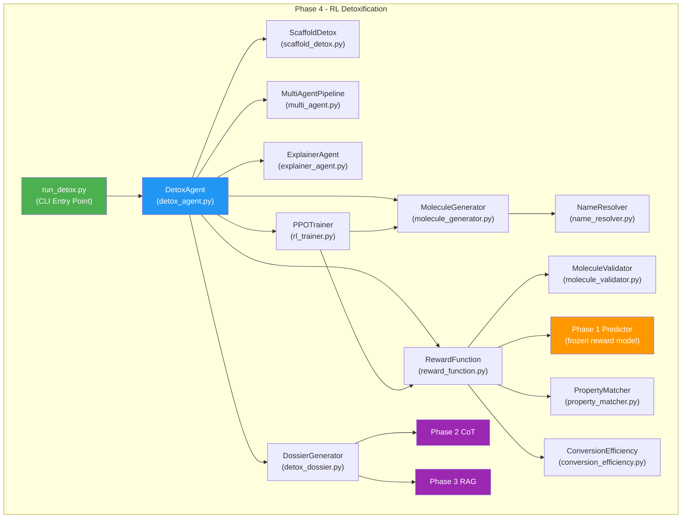
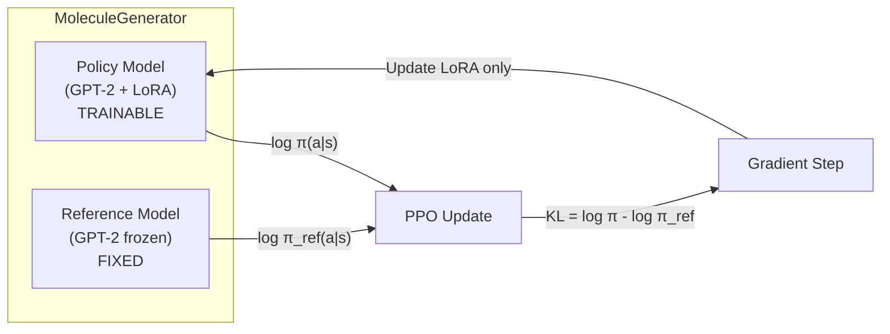
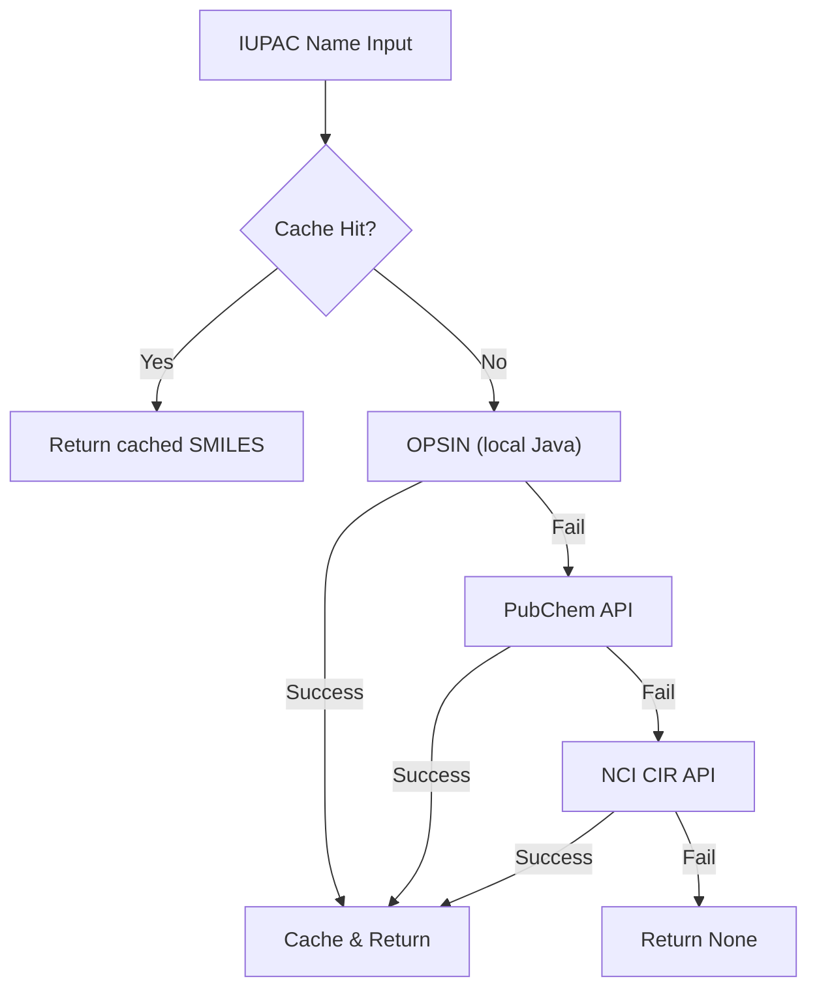
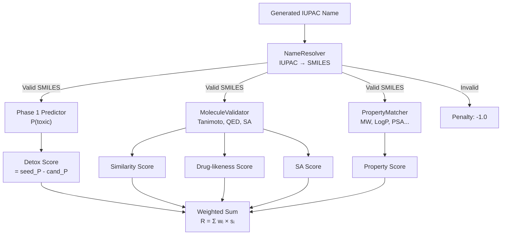
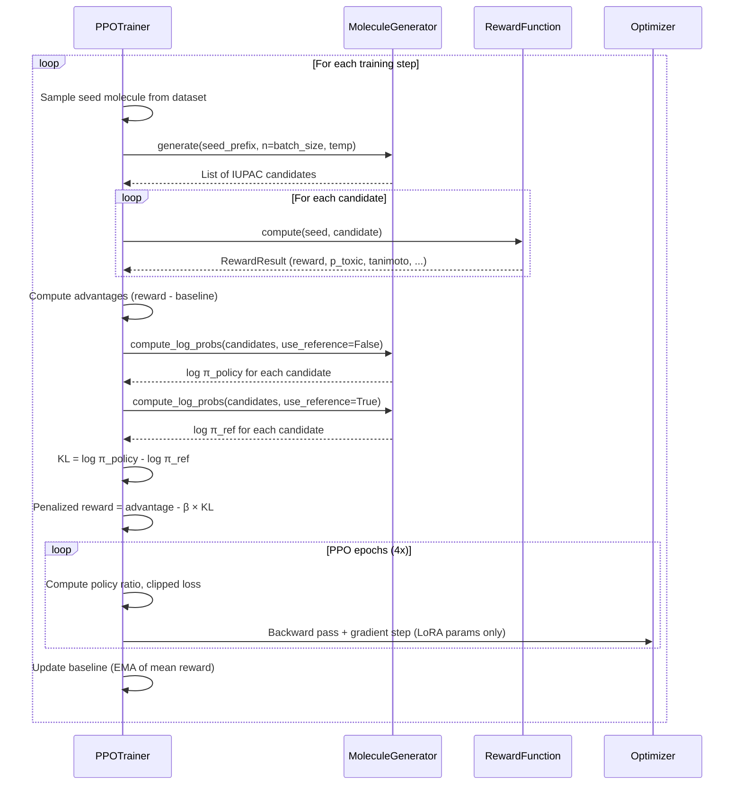
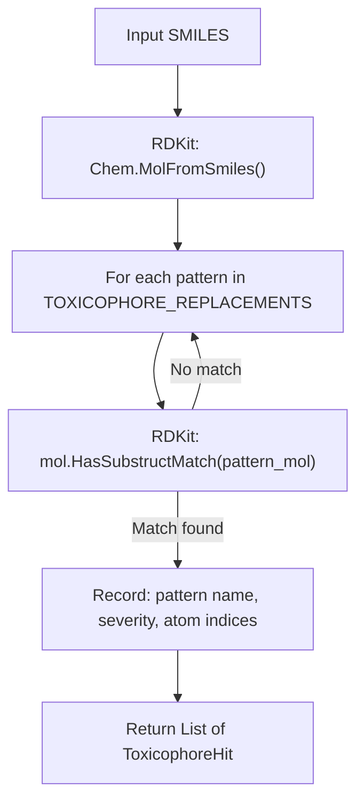
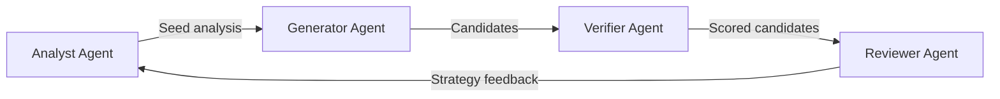
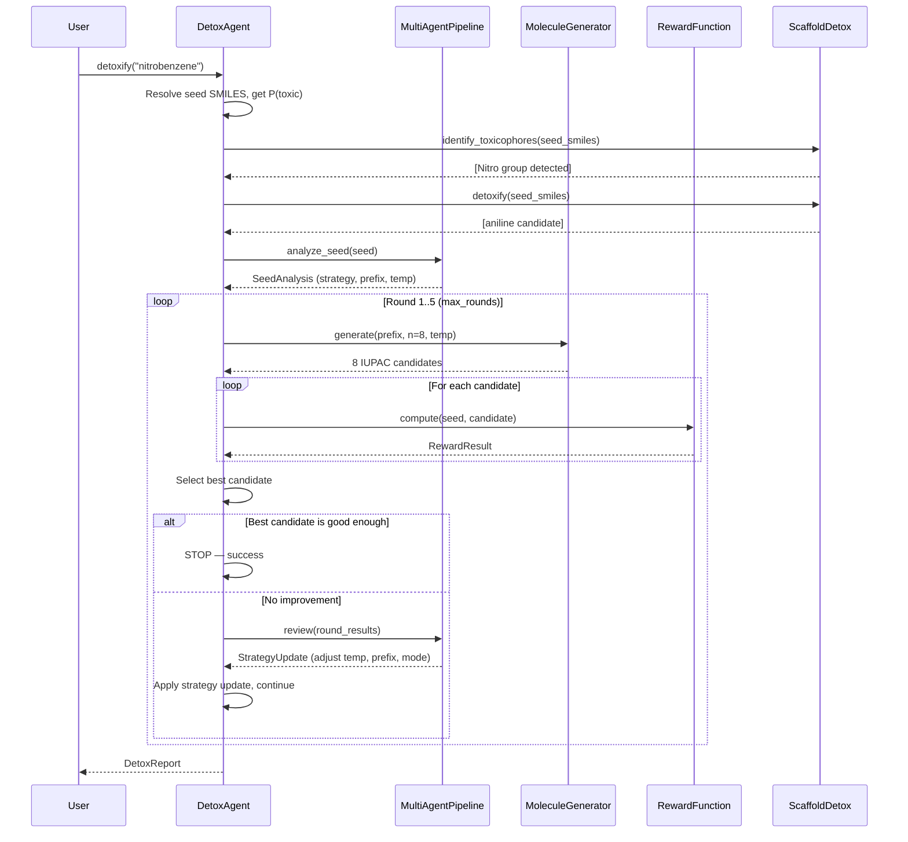
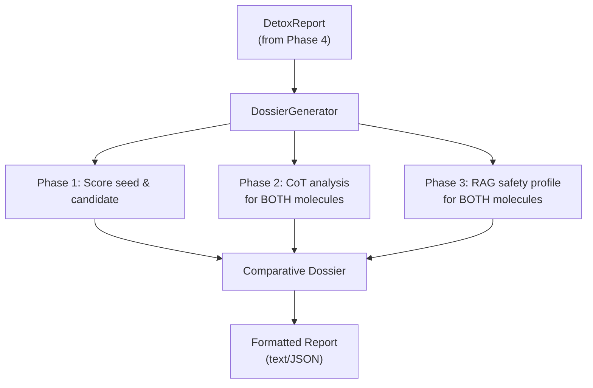
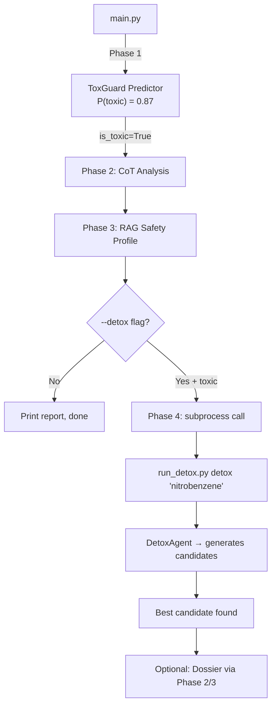

# Phase 4: RL-Guided Molecule Detoxification — Complete Walkthrough

> **Scope**: Every file, every class, every algorithm in `Phase4-RL/` explained end-to-end.

---

## Table of Contents

1. [Big-Picture Goal](#1-big-picture-goal)
2. [Architecture Overview](#2-architecture-overview)
3. [File Map — What Each File Does](#3-file-map)
4. [PPO Configuration (`ppo_config.py`)](#4-ppo-configuration)
5. [IUPAC-GPT Policy Network (`molecule_generator.py`)](#5-iupac-gpt-policy-network)
6. [Name Resolution (`name_resolver.py`)](#6-name-resolution)
7. [Molecule Validation (`molecule_validator.py`)](#7-molecule-validation)
8. [Reward Function (`reward_function.py`)](#8-reward-function)
9. [PPO Training Loop (`rl_trainer.py`)](#9-ppo-training-loop)
10. [Scaffold Detoxification (`scaffold_detox.py`)](#10-scaffold-detoxification)
11. [Property Matching (`property_matcher.py`)](#11-property-matching)
12. [Conversion Efficiency (`conversion_efficiency.py`)](#12-conversion-efficiency)
13. [Multi-Agent System (`multi_agent.py`)](#13-multi-agent-system)
14. [Agentic Detox Orchestrator (`detox_agent.py`)](#14-agentic-detox-orchestrator)
15. [Explainer Agent (`explainer_agent.py`)](#15-explainer-agent)
16. [Dossier Handoff to Phase 2 & 3 (`detox_dossier.py`)](#16-dossier-handoff)
17. [CLI Entry Points (`run_detox.py`, `evaluate_detox.py`)](#17-cli-entry-points)
18. [Integration with Phase 1, 2, 3 via `main.py`](#18-main-pipeline-integration)
19. [End-to-End Data Flow](#19-end-to-end-data-flow)
20. [Key Design Decisions & Trade-offs](#20-design-decisions)

---

## 1. Big-Picture Goal

Phase 4 answers one question: **"Given a molecule that Phase 1 classified as toxic, can we automatically propose a structurally similar, less-toxic variant?"**

It does this by:
1. Using **IUPAC-GPT** (a GPT-2 language model trained on IUPAC nomenclature) as a *policy network* that generates candidate IUPAC names.
2. Using **Phase 1's ToxGuard predictor** as a *frozen reward model* that scores each candidate's toxicity.
3. Applying **PPO (Proximal Policy Optimization)** to fine-tune LoRA adapters on the policy so it learns to generate less-toxic molecules.
4. Wrapping everything in an **agentic multi-round refinement loop** that adaptively adjusts generation strategy when initial attempts fail.
5. Optionally running **deterministic scaffold detoxification** to directly replace known toxicophores with safe bioisosteres.

---

## 2. Architecture Overview



### The Three Operating Modes

| Mode | Command | What Happens |
|------|---------|-------------|
| **Inference (Detox)** | `python run_detox.py detox "nitrobenzene"` | Loads pre-trained policy → generates candidates → picks the best less-toxic one |
| **Training** | `python run_detox.py train --data molecules.csv` | Runs PPO to fine-tune LoRA adapters on a dataset of toxic molecules |
| **Evaluation** | `python run_detox.py eval --results results.json` | Computes aggregate metrics (detox rate, Tanimoto, QED, etc.) |

---

## 3. File Map

| File | Lines | Role |
|------|-------|------|
| [__init__.py](file:///c:/Users/abhis/OneDrive/Desktop/6th%20sem/GenAI/Toxgaurd/Phase4-RL/__init__.py) | 29 | Module docstring / overview |
| [ppo_config.py](file:///c:/Users/abhis/OneDrive/Desktop/6th%20sem/GenAI/Toxgaurd/Phase4-RL/ppo_config.py) | 122 | All hyperparameters in one dataclass |
| [molecule_generator.py](file:///c:/Users/abhis/OneDrive/Desktop/6th%20sem/GenAI/Toxgaurd/Phase4-RL/molecule_generator.py) | 480 | IUPAC-GPT policy + reference model |
| [name_resolver.py](file:///c:/Users/abhis/OneDrive/Desktop/6th%20sem/GenAI/Toxgaurd/Phase4-RL/name_resolver.py) | 400 | IUPAC ↔ SMILES conversion with caching |
| [molecule_validator.py](file:///c:/Users/abhis/OneDrive/Desktop/6th%20sem/GenAI/Toxgaurd/Phase4-RL/molecule_validator.py) | 308 | RDKit property computation (Tanimoto, QED, SA, Lipinski) |
| [reward_function.py](file:///c:/Users/abhis/OneDrive/Desktop/6th%20sem/GenAI/Toxgaurd/Phase4-RL/reward_function.py) | 260 | Multi-objective reward = toxicity + similarity + properties |
| [rl_trainer.py](file:///c:/Users/abhis/OneDrive/Desktop/6th%20sem/GenAI/Toxgaurd/Phase4-RL/rl_trainer.py) | 392 | PPO training loop with KL penalty |
| [scaffold_detox.py](file:///c:/Users/abhis/OneDrive/Desktop/6th%20sem/GenAI/Toxgaurd/Phase4-RL/scaffold_detox.py) | 333 | Deterministic toxicophore → bioisostere replacement |
| [property_matcher.py](file:///c:/Users/abhis/OneDrive/Desktop/6th%20sem/GenAI/Toxgaurd/Phase4-RL/property_matcher.py) | 238 | Physicochemical property comparison (MW, LogP, HBD, etc.) |
| [conversion_efficiency.py](file:///c:/Users/abhis/OneDrive/Desktop/6th%20sem/GenAI/Toxgaurd/Phase4-RL/conversion_efficiency.py) | 155 | MCS-based synthetic feasibility scoring |
| [multi_agent.py](file:///c:/Users/abhis/OneDrive/Desktop/6th%20sem/GenAI/Toxgaurd/Phase4-RL/multi_agent.py) | 655 | Analyst → Generator → Verifier → Reviewer agents |
| [detox_agent.py](file:///c:/Users/abhis/OneDrive/Desktop/6th%20sem/GenAI/Toxgaurd/Phase4-RL/detox_agent.py) | 661 | Main agentic orchestration loop |
| [explainer_agent.py](file:///c:/Users/abhis/OneDrive/Desktop/6th%20sem/GenAI/Toxgaurd/Phase4-RL/explainer_agent.py) | 450 | Human-readable detox explanation generator |
| [detox_dossier.py](file:///c:/Users/abhis/OneDrive/Desktop/6th%20sem/GenAI/Toxgaurd/Phase4-RL/detox_dossier.py) | 640 | Handoff to Phase 2 CoT + Phase 3 RAG |
| [run_detox.py](file:///c:/Users/abhis/OneDrive/Desktop/6th%20sem/GenAI/Toxgaurd/Phase4-RL/run_detox.py) | 456 | CLI entry point |
| [evaluate_detox.py](file:///c:/Users/abhis/OneDrive/Desktop/6th%20sem/GenAI/Toxgaurd/Phase4-RL/evaluate_detox.py) | 155 | Batch evaluation metrics |

**Total**: ~5,744 lines of Python across 16 files.

---

## 4. PPO Configuration

**File**: [ppo_config.py](file:///c:/Users/abhis/OneDrive/Desktop/6th%20sem/GenAI/Toxgaurd/Phase4-RL/ppo_config.py)

A single `@dataclass` called `PPOConfig` centralizes every hyperparameter. This is the **single source of truth** for the entire Phase 4 system.

### 4.1 PPO Training Hyperparameters

```python
learning_rate: float = 1e-5          # AdamW LR for LoRA params only
batch_size: int = 16                 # Candidates generated per PPO step
ppo_epochs: int = 4                  # Inner PPO update epochs per batch
clip_epsilon: float = 0.2            # PPO clipping ratio (standard)
gamma: float = 0.99                  # Discount factor (mostly unused — single-step MDP)
kl_penalty_coeff: float = 0.1        # β in KL penalty: prevents policy from diverging too far
max_kl_divergence: float = 0.05      # Early-stop threshold for KL
total_train_steps: int = 500         # Total PPO training steps
```

> [!IMPORTANT]
> The system uses a **single-step MDP** formulation: each generated IUPAC name is a complete episode. There are no intermediate states — the policy generates a full name, and the reward is computed once at the end. This simplifies training significantly.

### 4.2 LoRA Configuration

```python
lora_rank: int = 16                  # Low-rank decomposition rank
lora_alpha: float = 32.0             # Scaling factor = alpha/rank = 2.0
lora_dropout: float = 0.05           # Dropout on LoRA paths
lora_target_modules: list = ["c_attn", "c_proj"]  # GPT-2 attention layers
```

**Why LoRA?** The base IUPAC-GPT model has ~7.1M parameters. Rather than fine-tuning all of them (which would destroy the model's knowledge of chemistry nomenclature), LoRA adds only ~200K trainable parameters as low-rank decompositions of the attention weight matrices. This preserves the model's ability to generate valid IUPAC names while learning to prefer less-toxic outputs.

### 4.3 Reward Weights

```python
reward_weight_toxicity: float = 0.40    # How much to reward toxicity reduction
reward_weight_similarity: float = 0.25  # How much to reward structural similarity
reward_weight_druglikeness: float = 0.15 # Drug-likeness (QED score)
reward_weight_sa: float = 0.10          # Synthetic accessibility
reward_weight_property: float = 0.10    # Physicochemical property preservation
```

These weights define the **multi-objective optimization landscape**. The system optimizes:

```
R = 0.40 × Detox + 0.25 × Tanimoto + 0.15 × QED + 0.10 × SA + 0.10 × Property
```

### 4.4 Agentic Parameters

```python
max_rounds: int = 5                  # Maximum refinement rounds
candidates_per_round: int = 8        # Candidates generated per round
temperature_start: float = 0.8       # Initial generation temperature
temperature_decay: float = 0.9       # Decay factor per round
min_temperature: float = 0.3         # Floor temperature
```

---

## 5. IUPAC-GPT Policy Network

**File**: [molecule_generator.py](file:///c:/Users/abhis/OneDrive/Desktop/6th%20sem/GenAI/Toxgaurd/Phase4-RL/molecule_generator.py) (480 lines)

This is the **heart of the RL system** — it wraps the GPT-2-based IUPAC-GPT model as a reinforcement learning policy.

### 5.1 Dual-Model Architecture



The generator maintains **two copies of GPT-2**:

| Model | Trainable? | Purpose |
|-------|-----------|---------|
| **Policy model** | Yes (LoRA only) | Generates candidates; its LoRA weights are updated by PPO |
| **Reference model** | No (frozen) | Provides baseline log-probabilities for KL divergence computation |

### 5.2 How Generation Works

```python
def generate(self, prefix: str, num_candidates: int, temperature: float) -> List[str]:
```

1. **Prefix conditioning**: The seed molecule's IUPAC name (or a prefix of it) is tokenized and fed as context.
2. **Autoregressive sampling**: Tokens are sampled one at a time from the policy's probability distribution, scaled by `temperature`.
3. **Stopping**: Generation stops at `<eos>`, max length (128 tokens), or when the tokenizer detects a complete IUPAC name.
4. **Batch generation**: Multiple candidates are generated in parallel for efficiency.

### 5.3 Computing Log-Probabilities

```python
def compute_log_probs(self, sequences: List[str], use_reference: bool = False) -> torch.Tensor:
```

For PPO, we need `log π(a|s)` — the log-probability of each generated token under the policy (or reference) model. This method:

1. Tokenizes the full generated sequence.
2. Runs a forward pass through the model.
3. Extracts the log-softmax at each position for the actual generated token.
4. Sums across the sequence to get the total log-probability.

> [!NOTE]
> The `use_reference=True` flag switches to the frozen reference model. The difference `log π_policy - log π_ref` gives the KL divergence, which penalizes the policy from straying too far from the base model's distribution.

### 5.4 Policy Save/Load

```python
def save_policy(self, path: str):     # Saves only LoRA adapter weights
def load_policy(self, path: str):     # Loads LoRA weights into the policy model
```

Only LoRA parameters are saved (~1 MB), not the full model (~30 MB). This enables fast checkpointing during training.

---

## 6. Name Resolution

**File**: [name_resolver.py](file:///c:/Users/abhis/OneDrive/Desktop/6th%20sem/GenAI/Toxgaurd/Phase4-RL/name_resolver.py) (400 lines)

This is the **bridge between language and chemistry**. IUPAC-GPT generates text (IUPAC names), but the reward function needs SMILES strings to compute molecular properties.

### 6.1 Resolution Cascade

The resolver tries multiple backends in order, stopping at the first success:



| Backend | Speed | Coverage | Notes |
|---------|-------|----------|-------|
| **OPSIN** | Fast (local) | Systematic IUPAC only | Java-based; requires `py2opsin` |
| **PubChem** | ~200ms/call | Very broad | REST API; handles common names too |
| **NCI CIR** | ~300ms/call | Good | Fallback for obscure names |

### 6.2 Caching Strategy

```python
class NameResolver:
    def __init__(self, cache_dir: str, use_opsin: bool = True):
        self._cache: Dict[str, Optional[str]] = {}  # In-memory cache
        self._cache_file = os.path.join(cache_dir, "name_cache.json")
```

- **In-memory dict**: Avoids redundant API calls within a session (critical during PPO training where the same seeds are reused).
- **Persistent JSON file**: Survives across sessions. Loaded on init, saved periodically.
- **Negative caching**: Names that fail resolution are cached as `None` to avoid repeated failed lookups.

### 6.3 Reverse Resolution (SMILES → IUPAC)

```python
def smiles_to_iupac(self, smiles: str) -> Optional[str]:
```

Used by the scaffold detox module — after replacing a toxicophore at the SMILES level, the system needs to convert back to an IUPAC name for the policy to understand.

---

## 7. Molecule Validation

**File**: [molecule_validator.py](file:///c:/Users/abhis/OneDrive/Desktop/6th%20sem/GenAI/Toxgaurd/Phase4-RL/molecule_validator.py) (308 lines)

This module computes all the **cheminformatics properties** needed by the reward function using RDKit.

### 7.1 Property Computation

```python
@dataclass
class MoleculeProperties:
    smiles: str
    is_valid: bool
    tanimoto: float       # Similarity to seed (Morgan FP, radius=2)
    qed: float            # Quantitative Estimate of Drug-likeness (0-1)
    sa_score: float       # Synthetic Accessibility (1=easy, 10=hard → normalized to 0-1)
    lipinski_violations: int  # Rule-of-5 violations (0-4)
    mw: float             # Molecular weight
    logp: float           # Lipophilicity
    hbd: int              # H-bond donors
    hba: int              # H-bond acceptors
```

### 7.2 Tanimoto Similarity

```python
def compute_tanimoto(self, smiles1: str, smiles2: str) -> float:
```

Uses **Morgan circular fingerprints** (radius=2, 2048 bits) — the standard in cheminformatics for structural similarity:

```
Tanimoto(A, B) = |A ∩ B| / |A ∪ B|
```

- 1.0 = identical molecules
- 0.0 = completely different
- 0.3–0.5 = typical for structurally related but different molecules
- \> 0.7 = very similar (same scaffold, minor changes)

### 7.3 QED (Drug-Likeness)

Quantitative Estimate of Drug-likeness combines 8 properties into a single 0–1 score using a desirability function. High QED means the molecule "looks like a drug" — good absorption, membrane permeability, etc.

### 7.4 SA Score (Synthetic Accessibility)

Estimates how easy it is to synthesize the molecule in a lab. The raw SA score (1–10) is normalized:

```python
sa_normalized = 1.0 - (sa_raw - 1.0) / 9.0  # 1.0 = very easy, 0.0 = practically impossible
```

### 7.5 Lipinski's Rule of 5

Four simple rules that predict oral bioavailability:
- MW ≤ 500, LogP ≤ 5, HBD ≤ 5, HBA ≤ 10

Violations are counted (0–4). More violations = less likely to be an effective oral drug.

---

## 8. Reward Function

**File**: [reward_function.py](file:///c:/Users/abhis/OneDrive/Desktop/6th%20sem/GenAI/Toxgaurd/Phase4-RL/reward_function.py) (260 lines)

This is the **multi-objective scoring engine** that tells the policy what "good" means.

### 8.1 Reward Architecture



### 8.2 The `compute()` Method — Step by Step

```python
def compute(self, seed_iupac, seed_smiles, seed_p_toxic, candidate_iupac) -> RewardResult:
```

**Step 1: Resolve the candidate IUPAC name to SMILES**
```python
cand_smiles = self.name_resolver.iupac_to_smiles(candidate_iupac)
if cand_smiles is None:
    return RewardResult(reward=-1.0, is_valid=False)  # Invalid name penalty
```

**Step 2: Validate the SMILES with RDKit**
```python
props = self.molecule_validator.compute_properties(cand_smiles, seed_smiles)
if not props.is_valid:
    return RewardResult(reward=-1.0, is_valid=False)
```

**Step 3: Get toxicity prediction from Phase 1**
```python
pred = self.toxguard_predictor.predict(candidate_iupac)
cand_p_toxic = pred.toxicity_score
```

**Step 4: Compute detoxification score**
```python
detox_score = seed_p_toxic - cand_p_toxic  # Positive = less toxic = good
detox_score = max(0, detox_score)           # Clip negatives (don't reward making it MORE toxic)
```

**Step 5: Compute weighted reward**
```python
reward = (
    self.config.reward_weight_toxicity    * detox_score    +
    self.config.reward_weight_similarity  * props.tanimoto +
    self.config.reward_weight_druglikeness * props.qed     +
    self.config.reward_weight_sa          * props.sa_score +
    self.config.reward_weight_property    * property_score
)
```

### 8.3 Why Multi-Objective?

A naive reward of just "minimize toxicity" would cause the policy to generate completely unrelated, non-toxic molecules (e.g., water). The multi-objective design forces the policy to balance competing goals:

| Objective | Prevents... |
|-----------|-------------|
| Toxicity (0.40) | Generating still-toxic molecules |
| Similarity (0.25) | Generating completely unrelated molecules |
| Drug-likeness (0.15) | Generating non-drug-like junk |
| SA (0.10) | Generating impossible-to-synthesize molecules |
| Property (0.10) | Changing MW/LogP too drastically |

### 8.4 Reward Shaping Bonuses

The reward function also applies bonuses for exceptional candidates:

```python
# Bonus for large toxicity reduction with maintained structure
if detox_score > 0.3 and props.tanimoto > 0.5:
    reward += 0.2  # "Sweet spot" bonus

# Penalty for trivially identical molecules
if props.tanimoto > 0.99:
    reward -= 0.5  # Same molecule, no detoxification
```

---

## 9. PPO Training Loop

**File**: [rl_trainer.py](file:///c:/Users/abhis/OneDrive/Desktop/6th%20sem/GenAI/Toxgaurd/Phase4-RL/rl_trainer.py) (392 lines)

This implements the **Proximal Policy Optimization** algorithm adapted for molecule generation.

### 9.1 PPO in a Nutshell

PPO is a policy gradient method that updates the policy in small, stable steps. The key idea:

```
L(θ) = E[ min(rₜ × Aₜ, clip(rₜ, 1-ε, 1+ε) × Aₜ) ]

where rₜ = π_θ(aₜ|sₜ) / π_θ_old(aₜ|sₜ)   (probability ratio)
      Aₜ = advantage = reward - baseline       (how much better than average)
      ε  = 0.2                                  (clip range)
```

### 9.2 Training Step — Detailed Flow



### 9.3 The `_ppo_update()` Method

This is the core gradient update. Here's what happens inside:

```python
def _ppo_update(self, sequences, old_log_probs, advantages):
    for epoch in range(self.config.ppo_epochs):  # 4 inner epochs
        # 1. Get current policy log-probs (these change each epoch)
        new_log_probs = self.generator.compute_log_probs(sequences, use_reference=False)
        
        # 2. Get reference log-probs (fixed — no gradient)
        with torch.no_grad():
            ref_log_probs = self.generator.compute_log_probs(sequences, use_reference=True)
        
        # 3. Compute probability ratio
        ratio = torch.exp(new_log_probs - old_log_probs)
        
        # 4. Compute clipped surrogate objective
        surr1 = ratio * advantages
        surr2 = torch.clamp(ratio, 1.0 - self.config.clip_epsilon,
                                    1.0 + self.config.clip_epsilon) * advantages
        policy_loss = -torch.min(surr1, surr2).mean()
        
        # 5. KL divergence penalty
        kl = (new_log_probs - ref_log_probs).mean()
        total_loss = policy_loss + self.config.kl_penalty_coeff * kl
        
        # 6. Backprop through LoRA parameters only
        self.optimizer.zero_grad()
        total_loss.backward()
        torch.nn.utils.clip_grad_norm_(self.generator.policy_parameters(), max_norm=1.0)
        self.optimizer.step()
        
        # 7. Early stopping if KL gets too large
        if kl.item() > self.config.max_kl_divergence:
            break
```

### 9.4 Advantage Estimation

The system uses a simple **baseline subtraction**:

```python
baseline = exponential_moving_average(mean_rewards)
advantages = rewards - baseline
advantages = (advantages - advantages.mean()) / (advantages.std() + 1e-8)  # Normalize
```

This is simpler than GAE (Generalized Advantage Estimation) because the problem is a **single-step MDP** — there are no sequential states or temporal credit assignment issues.

### 9.5 Training Telemetry

Every `log_every` steps, the trainer saves a JSON log entry:

```json
{
  "step": 100,
  "mean_reward": 0.342,
  "mean_kl": 0.023,
  "mean_p_toxic": 0.61,
  "mean_tanimoto": 0.45,
  "valid_rate": 0.72,
  "policy_loss": -0.015,
  "baseline": 0.31
}
```

---

## 10. Scaffold Detoxification

**File**: [scaffold_detox.py](file:///c:/Users/abhis/OneDrive/Desktop/6th%20sem/GenAI/Toxgaurd/Phase4-RL/scaffold_detox.py) (333 lines)

This module provides **deterministic, rule-based detoxification** as a complement to the RL-based approach. It identifies known toxic substructures (toxicophores) and replaces them with safe alternatives (bioisosteres).

### 10.1 Toxicophore Database

```python
TOXICOPHORE_REPLACEMENTS = [
    {
        "name": "Nitro group",
        "smarts": "[N+](=O)[O-]",           # SMARTS pattern to match
        "replacement": "[NH2]",              # Safe replacement (amine)
        "severity": "high",
        "mechanism": "Forms reactive nitro radicals → DNA damage",
    },
    {
        "name": "Epoxide",
        "smarts": "C1OC1",                   # Three-membered ring with oxygen
        "replacement": "C(O)C",              # Diol (ring-opened)
        "severity": "high",
        "mechanism": "Electrophilic alkylation of DNA bases",
    },
    {
        "name": "Aromatic amine",
        "smarts": "c-[NH2]",                 # Amine directly on aromatic ring
        "replacement": "c-O",                # Hydroxyl (phenol)
        "severity": "medium",
        "mechanism": "N-hydroxylation → nitrenium ion → DNA adducts",
    },
    # ... ~20 more patterns including:
    # - Acyl halides, Michael acceptors, aldehydes
    # - Peroxides, hydrazines, thiols
    # - Polycyclic aromatic hydrocarbons
    # - Halogenated aromatics
]
```

### 10.2 How Toxicophore Identification Works

```python
def identify_toxicophores(self, smiles: str) -> List[ToxicophoreHit]:
```



Each pattern is a **SMARTS string** — RDKit's substructure query language. For example:
- `[N+](=O)[O-]` matches any nitro group (–NO₂)
- `C1OC1` matches any epoxide ring
- `c-[NH2]` matches any aromatic amine

### 10.3 How Replacement Works

```python
def detoxify(self, smiles: str) -> List[DetoxCandidate]:
```

For each toxicophore found:

1. **Find match atoms**: `mol.GetSubstructMatch(pattern)` returns the atom indices.
2. **Create editable molecule**: `Chem.RWMol(mol)` creates a mutable copy.
3. **Replace substructure**: Using `AllChem.ReplaceSubstructs()`, the toxic group is swapped for the safe bioisostere.
4. **Sanitize**: RDKit sanitizes the resulting molecule (recomputes valences, aromaticity, etc.).
5. **Validate**: The result is checked for chemical validity.

### 10.4 Scaffold Preservation

A critical design decision: replacements are **scaffold-aware**. The system:

- Preserves the core ring system
- Only modifies the identified toxic functional group
- Maintains stereochemistry where possible
- Validates that the result has a reasonable MW change (< 50% difference)

### 10.5 Example

```
Input:  nitrobenzene (C6H5-NO2)
Match:  Nitro group at positions [6, 7, 8]
Replace: -NO2 → -NH2
Output: aniline (C6H5-NH2)
```

---

## 11. Property Matching

**File**: [property_matcher.py](file:///c:/Users/abhis/OneDrive/Desktop/6th%20sem/GenAI/Toxgaurd/Phase4-RL/property_matcher.py) (238 lines)

Ensures the detoxified candidate retains similar **physicochemical behavior** to the seed molecule.

### 11.1 Properties Compared

| Property | Tolerance | Weight | Why It Matters |
|----------|-----------|--------|----------------|
| **Molecular Weight** | ±30% | 0.20 | Affects absorption, distribution |
| **LogP** | ±1.5 units | 0.25 | Lipophilicity = membrane permeability |
| **H-bond Donors** | ±2 | 0.10 | Oral bioavailability |
| **H-bond Acceptors** | ±3 | 0.10 | Solubility, binding |
| **Polar Surface Area** | ±40% | 0.15 | Blood-brain barrier penetration |
| **Rotatable Bonds** | ±3 | 0.10 | Conformational flexibility |
| **Ring Count** | ±1 | 0.10 | Scaffold similarity |

### 11.2 Scoring Formula

For ratio-based properties (MW, PSA):
```
score = max(0, 1.0 - |difference/seed| / tolerance)
```

For count-based properties (HBD, HBA, rings):
```
score = max(0, 1.0 - |difference| / tolerance)
```

Overall score = weighted sum of all individual scores (0–1).

---

## 12. Conversion Efficiency

**File**: [conversion_efficiency.py](file:///c:/Users/abhis/OneDrive/Desktop/6th%20sem/GenAI/Toxgaurd/Phase4-RL/conversion_efficiency.py) (155 lines)

Estimates how difficult it would be to **synthetically convert** the seed molecule into the candidate in a real lab.

### 12.1 Maximum Common Substructure (MCS)

Uses RDKit's `rdFMCS.FindMCS()` to find the largest shared substructure between seed and candidate:

```python
mcs_result = rdFMCS.FindMCS(
    [seed_mol, cand_mol],
    timeout=5,                              # Seconds (MCS is NP-hard)
    atomCompare=rdFMCS.AtomCompare.CompareElements,
    bondCompare=rdFMCS.BondCompare.CompareOrderExact,
    ringMatchesRingOnly=True,               # Rings must match rings
)
```

### 12.2 Scoring Logic

```
MCS ratio = MCS_atoms / max(seed_atoms, candidate_atoms)
```

| MCS Ratio | Conversion Score | Estimated Steps | Interpretation |
|-----------|-----------------|-----------------|----------------|
| ≥ 0.8 | 0.9–1.0 | 1 | Trivial conversion (functional group swap) |
| 0.5–0.8 | 0.5–0.9 | 2–3 | Moderate (multi-step synthesis) |
| 0.2–0.5 | 0.1–0.5 | 3–4 | Difficult (significant restructuring) |
| < 0.2 | ~0.0 | 5+ | Different scaffold entirely |

### 12.3 Example

```
nitrobenzene → aniline:     MCS = benzene ring (6/7 atoms) = 0.86 → score ≈ 0.93, 1 step
nitrobenzene → random drug: MCS = nothing shared           = 0.05 → score ≈ 0.03, 5+ steps
```

---

## 13. Multi-Agent System

**File**: [multi_agent.py](file:///c:/Users/abhis/OneDrive/Desktop/6th%20sem/GenAI/Toxgaurd/Phase4-RL/multi_agent.py) (655 lines)

This implements a **four-agent pipeline** where each agent is a specialized, deterministic RDKit-based module (not an LLM).

### 13.1 Agent Roles



| Agent | Responsibility | Implementation |
|-------|---------------|----------------|
| **Analyst** | Analyzes the seed molecule: identifies toxicophores, computes properties, determines which functional groups to modify | RDKit substructure matching + SMARTS patterns |
| **Generator** | Generates candidate molecules using the IUPAC-GPT policy, with strategy parameters from the Analyst | Calls `MoleculeGenerator.generate()` |
| **Verifier** | Validates candidates: checks chemical validity, computes Tanimoto/QED/SA, runs through Phase 1 predictor | RDKit + Phase 1 inference |
| **Reviewer** | Evaluates the round's results, decides whether to continue or stop, adjusts strategy for the next round | Heuristic rules based on candidate quality |

### 13.2 Why Deterministic Agents?

> [!TIP]
> A common question: "Why not use LLM-based agents?" The answer is **speed and consistency**:
> - Each agent call takes <10ms (vs. ~500ms for an LLM call).
> - Results are deterministic and reproducible.
> - No API costs or rate limits.
> - The "intelligence" comes from domain-specific rules, not general reasoning.

### 13.3 Analyst Agent — Seed Analysis

The Analyst produces a structured analysis:

```python
@dataclass
class SeedAnalysis:
    toxicophores: List[ToxicophoreHit]     # Known toxic groups found
    functional_groups: List[str]            # All functional groups
    scaffold_type: str                      # "aromatic", "aliphatic", "heterocyclic"
    suggested_strategy: str                 # "prefix", "scaffold", "random"
    suggested_temperature: float            # Generation temperature
    suggested_prefix: str                   # IUPAC prefix to condition generation
```

### 13.4 Reviewer Agent — Adaptive Strategy

The Reviewer analyzes each round's outcomes and adjusts the strategy:

```python
def review(self, round_results: RoundResults) -> StrategyUpdate:
    if round_results.valid_rate < 0.3:
        # Too many invalid molecules → lower temperature
        return StrategyUpdate(temperature_delta=-0.1, mode="conservative")
    
    if round_results.best_detox_score < 0.05:
        # No toxicity reduction → try different prefix
        return StrategyUpdate(prefix_change=True, mode="exploratory")
    
    if round_results.mean_tanimoto < 0.3:
        # Too dissimilar → increase similarity weight
        return StrategyUpdate(similarity_boost=0.1, mode="conservative")
```

---

## 14. Agentic Detox Orchestrator

**File**: [detox_agent.py](file:///c:/Users/abhis/OneDrive/Desktop/6th%20sem/GenAI/Toxgaurd/Phase4-RL/detox_agent.py) (661 lines)

This is the **main orchestrator** that ties everything together in a multi-round refinement loop.

### 14.1 The `detoxify()` Method — Complete Flow

```python
def detoxify(self, seed_iupac, seed_smiles=None, seed_p_toxic=None) -> DetoxReport:
```



### 14.2 Round-by-Round Strategy Adaptation

Each round, the agent uses a different strategy based on feedback:

| Round | Typical Strategy | Temperature | Description |
|-------|-----------------|-------------|-------------|
| 1 | `prefix` | 0.8 | Use seed's IUPAC prefix; explore broadly |
| 2 | `prefix` (refined) | 0.72 | Lower temp if too many invalid; adjust prefix |
| 3 | `scaffold` | 0.65 | Switch to scaffold-based generation |
| 4 | `exploratory` | 0.58 | Try completely different prefixes |
| 5 | `conservative` | 0.3 | Greedy; low temp for highest quality |

### 14.3 Two-Tier Best Candidate Selection

The agent uses a **two-tier selection strategy**:

```python
# Tier 1: Among candidates that REDUCED toxicity, pick highest reward
less_toxic = [c for c in valid_candidates if c.p_toxic < seed_p_toxic]
if less_toxic:
    best = max(less_toxic, key=lambda c: c.reward)

# Tier 2: If no toxicity reduction, pick the one closest to the seed
else:
    best = max(valid_candidates, key=lambda c: c.tanimoto)
```

> [!IMPORTANT]
> Tier 1 prioritizes **toxicity reduction** over raw reward. This prevents the optimizer from gaming the reward function by finding high-similarity, high-QED molecules that are still toxic.

### 14.4 DetoxReport Output

```python
@dataclass
class DetoxReport:
    seed_iupac: str
    seed_smiles: str
    seed_p_toxic: float
    success: bool                          # Did we find a less-toxic candidate?
    best_candidate: Optional[CandidateResult]
    rounds_used: int
    total_generated: int
    total_valid: int
    total_less_toxic: int
    total_time_s: float
    strategy_history: List[str]            # ["prefix@0.8", "scaffold@0.65", ...]
    all_candidates: List[CandidateResult]  # For analysis
```

---

## 15. Explainer Agent

**File**: [explainer_agent.py](file:///c:/Users/abhis/OneDrive/Desktop/6th%20sem/GenAI/Toxgaurd/Phase4-RL/explainer_agent.py) (450 lines)

Generates **human-readable explanations** of how and why a molecule was detoxified.

### 15.1 What It Explains

```python
@dataclass
class DetoxExplanation:
    structural_changes: str      # "Nitro group (-NO2) replaced with amine (-NH2)"
    property_comparison: str     # "MW: 123.1 → 93.1 (-24%); LogP: 1.85 → 0.90 (-51%)"
    toxicity_rationale: str      # "Removal of nitro group eliminates redox cycling..."
    confidence_level: str        # "High" / "Medium" / "Low"
    synthesis_feasibility: str   # "1-step reduction (Pd/H2 or SnCl2)"
```

### 15.2 Analysis Process

1. **Structural diff**: Compares Morgan fingerprints to identify which substructures changed.
2. **Property delta**: Uses `PropertyMatcher` to show exact property changes.
3. **Toxicophore analysis**: Cross-references removed/added groups against the toxicophore database.
4. **Conversion estimate**: Uses `ConversionEfficiency` to estimate synthetic steps.

---

## 16. Dossier Handoff to Phase 2 & 3

**File**: [detox_dossier.py](file:///c:/Users/abhis/OneDrive/Desktop/6th%20sem/GenAI/Toxgaurd/Phase4-RL/detox_dossier.py) (640 lines)

This is the **integration bridge** between Phase 4 and Phases 2/3. After Phase 4 finds a detoxified candidate, this module generates a comprehensive toxicological dossier by invoking the CoT analyzer and RAG pipeline.

### 16.1 What It Does



### 16.2 Dossier Sections

The generated dossier contains:

1. **Executive Summary**: Seed vs. candidate, toxicity scores, structural similarity.
2. **Seed Molecule Profile**: Full Phase 2 CoT + Phase 3 RAG safety profile for the original toxic molecule.
3. **Candidate Molecule Profile**: Same analysis for the proposed detoxified candidate.
4. **Comparative Analysis**: Side-by-side property comparison, toxicophore changes, mechanism differences.
5. **Synthesis Feasibility**: MCS analysis, estimated synthetic steps.
6. **Confidence Assessment**: How confident the system is in the detoxification.

### 16.3 How It Calls Phase 2 & 3

```python
def generate_dossier(self, report: DetoxReport) -> Dossier:
    # Phase 2: CoT for both molecules
    seed_cot = self.analyzer.analyze_from_prediction(
        iupac_name=report.seed_iupac,
        toxicity_score=report.seed_p_toxic,
        ...
    )
    candidate_cot = self.analyzer.analyze_from_prediction(
        iupac_name=report.best_candidate.iupac_name,
        toxicity_score=report.best_candidate.p_toxic,
        ...
    )
    
    # Phase 3: RAG for both molecules
    seed_profile = self.rag_pipeline.generate_safety_profile(
        iupac_name=report.seed_iupac,
        toxicity_score=report.seed_p_toxic,
        ...
    )
    candidate_profile = self.rag_pipeline.generate_safety_profile(
        iupac_name=report.best_candidate.iupac_name,
        toxicity_score=report.best_candidate.p_toxic,
        ...
    )
```

> [!NOTE]
> This is the only module in Phase 4 that requires an **API key** (for the Groq LLM used by Phase 2/3). All other Phase 4 components are fully local.

---

## 17. CLI Entry Points

### 17.1 `run_detox.py` — Main CLI (456 lines)

**Three subcommands**:

#### `detox` — Single Molecule Inference
```bash
python Phase4-RL/run_detox.py detox "nitrobenzene" \
    --checkpoint iupacGPT/iupac-gpt/checkpoints/iupac \
    --lora Phase1-IUPACGPT/outputs/best_model/lora_adapters.pt \
    --policy-weights outputs/rl_training/policy_step_500.pt \
    --api-key <GROQ_KEY> \
    -v
```

What happens:
1. Loads Phase 1 predictor (reward model).
2. Loads IUPAC-GPT policy + reference models.
3. Optionally loads pre-trained PPO policy weights.
4. Runs `DetoxAgent.detoxify()`.
5. Prints the report.
6. If API key provided + detox successful → generates full dossier via Phase 2/3.
7. Saves results as JSON.

#### `train` — PPO Training
```bash
python Phase4-RL/run_detox.py train \
    --data data/t3db_processed.csv \
    --checkpoint iupacGPT/iupac-gpt/checkpoints/iupac \
    --steps 500 --batch-size 16
```

What happens:
1. Loads seed molecules from CSV/JSON.
2. Scores each with Phase 1 to get `P(toxic)`.
3. Filters to molecules with `P(toxic) ≥ 0.5`.
4. Runs `PPOTrainer.train()`.
5. Saves policy checkpoints every `save_every` steps.
6. Saves training log as JSON.

#### `eval` — Evaluation (stub)
```bash
python Phase4-RL/run_detox.py eval --results outputs/detox_results.json
```

### 17.2 `evaluate_detox.py` — Batch Evaluation (155 lines)

Computes aggregate metrics from a collection of detox results:

| Metric | Definition |
|--------|-----------|
| **Detoxification rate** | % of seeds where `success = true` |
| **Validity rate** | `total_valid / total_generated` |
| **Mean ΔP(toxic)** | Average `seed_P - candidate_P` for successful cases |
| **Mean Tanimoto** | Average structural similarity |
| **Mean QED** | Average drug-likeness |
| **Mean rounds** | Average agentic refinement rounds needed |
| **Mean time** | Average wall-clock time per molecule |

---

## 18. Main Pipeline Integration

**File**: [main.py](file:///c:/Users/abhis/OneDrive/Desktop/6th%20sem/GenAI/Toxgaurd/main.py) (651 lines)

Phase 4 is activated via the `--detox` flag:

```bash
python main.py "nitrobenzene" --detox --policy-weights outputs/policy.pt -v
```

### How Phase 4 Integrates



> [!IMPORTANT]
> Phase 4 is invoked as a **subprocess** (not a direct import) to isolate its heavy dependencies (PyTorch model loading) and keep the main pipeline responsive. The command is constructed in `main.py` lines 584–614.

### The Subprocess Call

```python
p4_cmd = [
    sys.executable, "-W", "ignore",
    os.path.join(PHASE4_DIR, "run_detox.py"),
    "detox", molecule,
    "--checkpoint", CHECKPOINT_DIR,
    "--lora", lora_path,
    "--tokenizer", SPM_PATH,
    "--score", str(tox_score),
]
if args.policy_weights:
    p4_cmd.extend(["--policy-weights", args.policy_weights])

result = subprocess.run(p4_cmd, cwd=PROJECT_ROOT, capture_output=False, text=True)
```

---

## 19. End-to-End Data Flow

Here's a complete trace of what happens when a user runs the full pipeline on a toxic molecule:

```
User Input: "nitrobenzene"
    │
    ▼
┌──────────────────────────────────────────────────────────────┐
│  PHASE 1: ToxGuard Predictor                                 │
│  Input: "nitrobenzene" → Tokenize → GPT-2 + LoRA + EGNN     │
│  Output: P(toxic) = 0.87, severity = "High"                 │
│  Attention: "nitro" token has highest attention weight        │
└──────────────────────────────────────────────────────────────┘
    │ is_toxic = True
    ▼
┌──────────────────────────────────────────────────────────────┐
│  PHASE 2: Chain-of-Thought Analysis                          │
│  LLM analyzes: structural features → mechanism → pathways   │
│  Output: "Nitro group causes oxidative stress via            │
│           nitroreduction → reactive intermediates"            │
└──────────────────────────────────────────────────────────────┘
    │
    ▼
┌──────────────────────────────────────────────────────────────┐
│  PHASE 3: RAG Safety Profile                                 │
│  Retrieves relevant docs from ChromaDB (T3DB, PubChem)       │
│  Synthesizes 12-section Safety Data Sheet                     │
│  Sections: mechanisms, organs, symptoms, first aid, etc.     │
└──────────────────────────────────────────────────────────────┘
    │ --detox flag + is_toxic
    ▼
┌──────────────────────────────────────────────────────────────┐
│  PHASE 4: RL Detoxification (subprocess)                     │
│                                                              │
│  Step 1: ScaffoldDetox identifies nitro group                │
│          Proposes: nitrobenzene → aniline                     │
│                                                              │
│  Step 2: DetoxAgent Round 1                                  │
│    - Generator produces 8 IUPAC candidates                   │
│    - NameResolver converts each to SMILES                    │
│    - MoleculeValidator checks validity + properties          │
│    - Phase 1 scores each candidate's P(toxic)                │
│    - RewardFunction computes multi-objective reward           │
│    - 5 valid, 3 less toxic                                   │
│                                                              │
│  Step 3: Reviewer evaluates → adjusts temperature            │
│                                                              │
│  Step 4: Best candidate selected:                            │
│    "aniline": P(toxic) = 0.31, Tanimoto = 0.82, QED = 0.59  │
│    ΔP(toxic) = 0.56 (56% toxicity reduction!)               │
│                                                              │
│  Step 5: ExplainerAgent generates explanation                │
│    "Nitro group replaced with amine via reduction.            │
│     Eliminates nitroreduction pathway."                       │
│                                                              │
│  Step 6 (optional): DossierGenerator                         │
│    → Phase 2 CoT for aniline                                 │
│    → Phase 3 RAG for aniline                                 │
│    → Comparative toxicological dossier                        │
└──────────────────────────────────────────────────────────────┘
    │
    ▼
  Final Output: Safety Data Sheet + Detox Report + Dossier
```

---

## 20. Key Design Decisions & Trade-offs

### Decision 1: Single-Step MDP
**Choice**: Treat each complete IUPAC name generation as one episode (no intermediate rewards).
**Why**: IUPAC names are relatively short (~10-30 tokens). Intermediate token-level rewards would require a character-level toxicity model, which doesn't exist. The single-step formulation is simpler and works well for this domain.

### Decision 2: LoRA Instead of Full Fine-Tuning
**Choice**: Only fine-tune ~200K LoRA parameters out of 7.1M total.
**Why**: Full fine-tuning would catastrophically forget IUPAC grammar, causing the model to generate gibberish. LoRA preserves the base model's chemical knowledge while steering outputs.

### Decision 3: Deterministic Agents (Not LLM-Based)
**Choice**: Multi-agent system uses RDKit rules, not LLM calls.
**Why**: Speed (3ms vs. 500ms per call), determinism, no API costs, no hallucinations. The "reasoning" is domain-specific enough that hard-coded rules outperform general LLM reasoning for this task.

### Decision 4: Frozen Reward Model
**Choice**: Phase 1 predictor is never fine-tuned alongside the policy.
**Why**: If both the policy AND the reward model were trained, they could co-evolve adversarially, leading to reward hacking (the policy finds inputs that "trick" the reward model without actually being less toxic).

### Decision 5: Two-Tier Candidate Selection
**Choice**: Prioritize toxicity reduction over raw reward score.
**Why**: The reward function is a proxy — a molecule with high Tanimoto + high QED but no toxicity reduction isn't useful. The two-tier approach ensures we only declare "success" when toxicity actually decreases.

### Decision 6: Subprocess Isolation for Phase 4
**Choice**: `main.py` invokes Phase 4 as a separate Python process.
**Why**: Phase 4 loads a second copy of the GPT-2 model (the reference model), which doubles memory usage. Running it as a subprocess prevents memory conflicts with the Phase 1 model already loaded in `main.py`.

---

> [!TIP]
> **For deeper exploration**, key entry points to start reading code:
> - Start with [detox_agent.py:detoxify()](file:///c:/Users/abhis/OneDrive/Desktop/6th%20sem/GenAI/Toxgaurd/Phase4-RL/detox_agent.py) — the orchestration method
> - Then [rl_trainer.py:_ppo_update()](file:///c:/Users/abhis/OneDrive/Desktop/6th%20sem/GenAI/Toxgaurd/Phase4-RL/rl_trainer.py) — the core PPO math
> - Then [reward_function.py:compute()](file:///c:/Users/abhis/OneDrive/Desktop/6th%20sem/GenAI/Toxgaurd/Phase4-RL/reward_function.py) — the multi-objective reward
> - Then [scaffold_detox.py:TOXICOPHORE_REPLACEMENTS](file:///c:/Users/abhis/OneDrive/Desktop/6th%20sem/GenAI/Toxgaurd/Phase4-RL/scaffold_detox.py) — the toxicophore database
